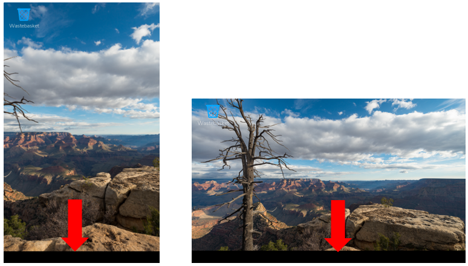
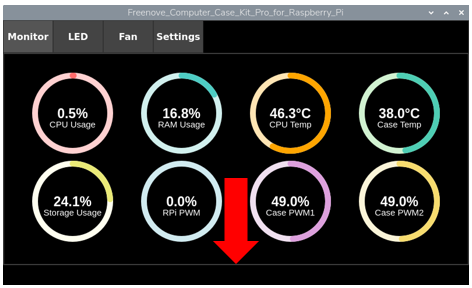
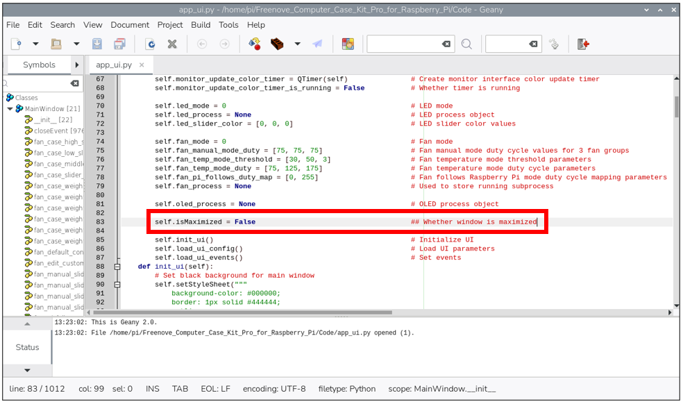

##############################################################################
Issue 1: Black bars at the bottom of the DSI screen
##############################################################################

At the time of this writing, compatibility issues associated with the latest Raspberry Pi OS release ("Trixie") have been observed. Once an official update addressing these issues is available, we will promptly update our resources and discontinue the relevant troubleshooting notes here

Description
*****************************************************************

After completing the settings in section 3.1.8, a black bar appears at the bottom of the DSI screen. This issue occurs in both landscape and portrait modes, and it is consistently located at the bottom of the current display orientation.

When you embed the accompanying control software into the DSI screen, the bottom portion of the software may not be displayed completely. This is because our control software is rendered starting from below the system status bar.

Solution
*****************************************************************

Open the **app_ui.py** file located in **the Freenove_Computer_Case_Kit_Pro_for_Raspberry_Pi/Code** directory. Find the line that says **self.isMaximized = False**, and :red:`change False to True` to fix the issue.

