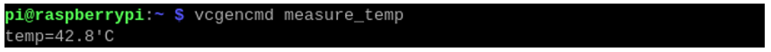
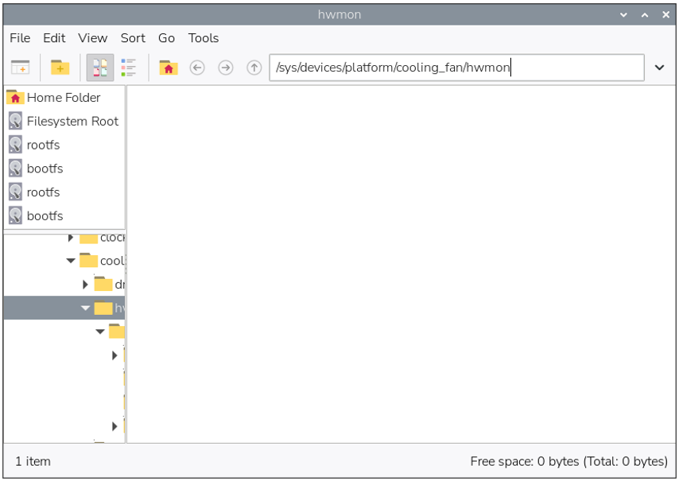
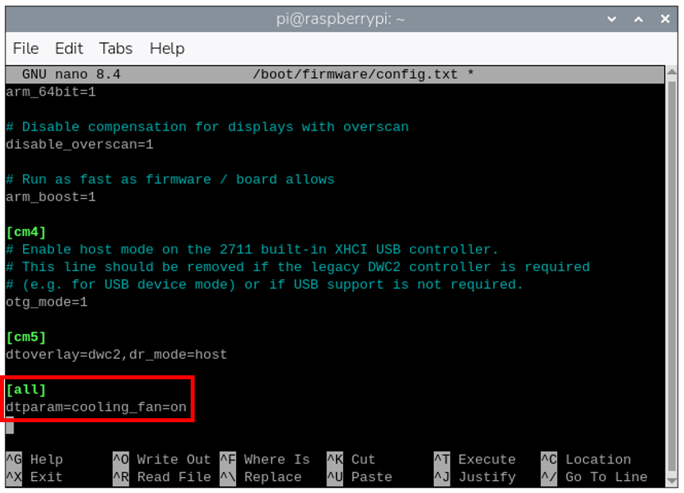

##############################################################################
Issue 3: Fans Not Work
##############################################################################

At the time of this writing, compatibility issues associated with the latest Raspberry Pi OS release ("Trixie") have been observed. Once an official update addressing these issues is available, we will promptly update our resources and discontinue the relevant troubleshooting notes here

Description
*************************************

When the cooling tower fan is connected to PI FAN 1, it operates under direct control of the Raspberry Pi. In Follow RPi mode, the case fans' rotation is managed by the GPIO board, which reads the Raspberry Pi's fan interface PWM value in real time.

If the cooling tower fan does not spin, or if all fans fail to spin in Follow RPi mode, the issue may be caused by one of the following:

1. Temperature Not Reaching Threshold: The fan is designed to activate only when a certain temperature is reached. Use the command ``vcgencmd measure_temp`` to check the current temperature. The Raspberry Pi fan control activates at 50°C.

2. Missing or Incomplete System Files: The hwmon4 file in the directory **/sys/devices/platform/cooling_fan/hwmon/** may be missing, or the files within it may be incomplete. This prevents the system from reading the PWM value from the Raspberry Pi's fan interface. Please verify that the files in this directory are intact.

Solution
************************************

For Case 1: No action is required. The fan will start automatically once the temperature rises above the 50°C threshold.

For Case 2: Follow the steps below to ensure the required system files are loaded correctly:

Open the terminal and execute ``sudo nano /boot/firmware/config.txt`` to edit the configuration file. Add the line ``dtparam=cooling_fan=on`` to the end of the file. Press “Ctrl+O” to save, then ”Ctrl+X” to exit the editor.

**Reboot the Raspberry Pi** for the changes to take effect.

