##############################################################################
Chapter 1 Introduction to Main Components 
##############################################################################

In this chapter, we will mainly introduce the main components of this case and their functionalities.

1.1 Introduction to Freenove Case Adapter for Raspberry Pi
****************************************************************

In this tutorial, we name this component as **Audio-Video Board**.

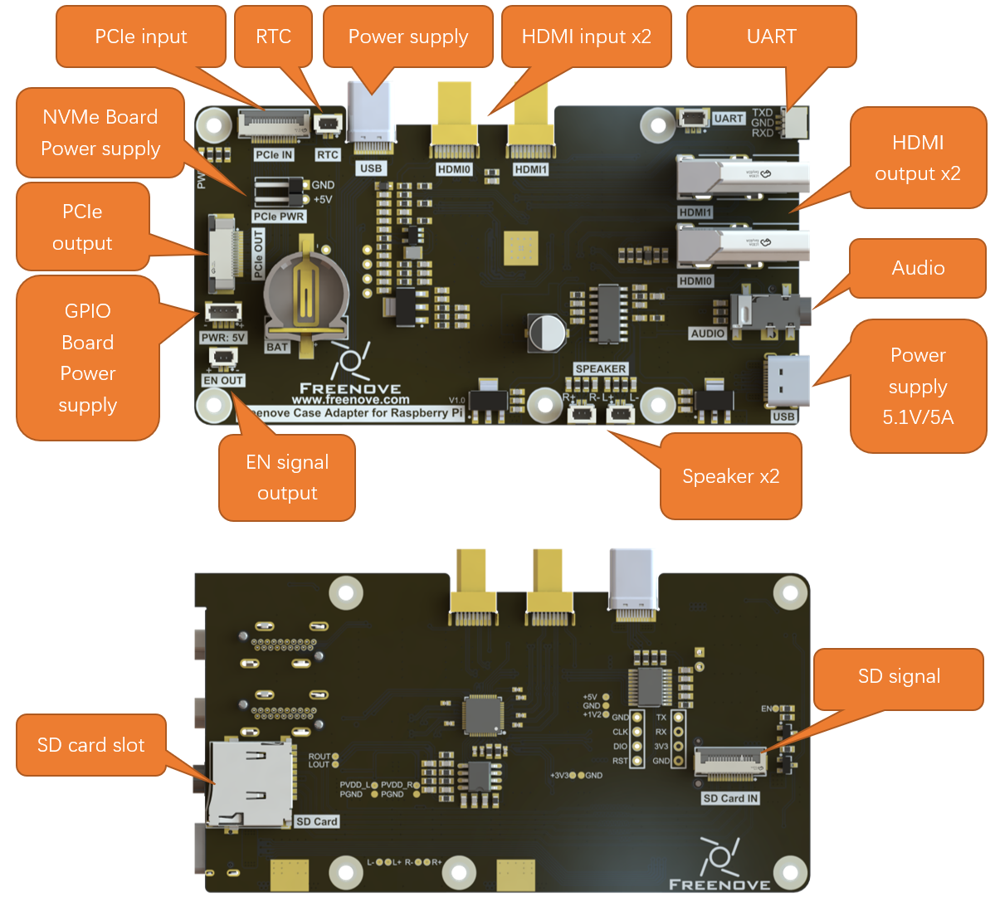

The Audio-Video Board is specifically designed for the Raspberry Pi 5, aiming to transform it into a fully functional home computer. This board integrates a wide range of interfaces, significantly expanding its native capabilities. Key features includes a PCIe adapter port, an RTC interface, a Type-C power supply interface, dual HDMI adapter ports, a UART adapter port, a 3.5mm JACK audio interface, dual speaker connectors, an EN (Enable) signal interface, a power interface for the GPIO Board, a power interface for the NVMe adapter board, and an SD card slot.

3.5mm JACK Audio Interface
====================================

In the RPi 5 design, the traditional 3.5mm audio output interface has been removed, and audio signals are now solely output through HDMI. To address this, we have developed an audio separation circuit on the Case Adapter Board. This circuit enables audio to be output via the 3.5mm audio interface on the board, You can use the external 3.5mm TRS headphone jack on the Raspberry Pi 5 to listen to audio output. For proper functionality, ensure your headphone connector is compatible. Below is an explanation of common jack types:

.. table::
    :class: table-line
    :align: center
    
    +--------------------------+--------+---------------+
    | |Chapter01_01|           | Tip    | Left Channel  |
    |                          +--------+---------------+
    |                          | Ring   | Right Channel |
    |                          +--------+---------------+
    |                          | Sleeve | GND           |
    +---------+----------------+--------+---------------+
    | OMTP    | |Chapter01_02| | Tip    | Left Channel  |
    |         |                +--------+---------------+
    |         |                | Ring1  | Right Channel |
    |         |                +--------+---------------+
    |         |                | Ring2  | MIC           |
    |         |                +--------+---------------+
    |         |                | Sleeve | GND           |
    +---------+----------------+--------+---------------+
    | CTIA    | |Chapter01_03| | Tip    | Left Channel  |
    |         |                +--------+---------------+
    |         |                | Ring1  | Right Channel |
    |         |                +--------+---------------+
    |         |                | Ring2  | GND           |
    |         |                +--------+---------------+
    |         |                | Sleeve | MIC           |
    +---------+----------------+--------+---------------+

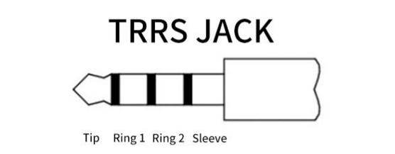
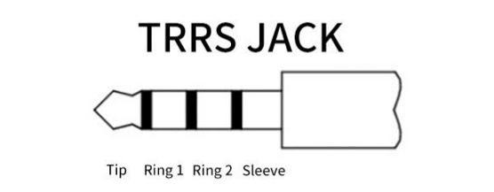

Speaker Interface
====================================

Additionally, we have designed an audio amplification circuit. With this circuit, you can control the two speakers, each with an impedance of 4Ω and a power rating of 3W。

PCIe Interface
====================================

This interface adapts the PCIe interface from the RPi 5 to the Audio-Video Board, enabling convenient connection to 1/2/4-slot NVMe adapter boards. To ensure stability during high-power SSD operation or when multiple SSDs are running simultaneously, an additional 2-pin independent power supply interface has been integrated onto the board. This design effectively prevents potential device damage caused by power insufficiency and guarantees the stable operation of your NVMe storage system.

EN OUT
====================================

This signal is used to control the power to both the Audio-Video Board and the GPIO Board. When the Raspberry Pi 5 is shut down, it automatically cuts off power and lighting, achieving high energy efficiency and complete silence.

SD Card Slot
====================================

This interface adapts the Raspberry Pi 5's SD card slot to the case interface area, achieving a unified layout where all ports are located on the same side. The design strictly complies with the SDR104 transmission protocol, ensuring full compatibility with official Raspberry Pi SD cards and delivering bus speeds of up to 104 MB/s.

https://www.raspberrypi.com/documentation/accessories/sd-cards.html#content

https://www.sdcard.org/developers/sd-standard-overview/bus-speed-default-speed-high-speed-uhs-sd-express/

RTC Interface
====================================

To enhance the accuracy of the Raspberry Pi's clock, it is advisable to add a battery to the RTC. For this purpose, we have installed a battery holder on the board. If you decide to add a battery, we recommend either purchasing a rechargeable lithium-manganese button-cell battery (with dimensions of 1220 and a voltage of 3V) or an official battery.

https://www.raspberrypi.com/documentation/computers/raspberry-pi.html#real-time-clock-rtc

:combo:`red font-bolder:Due to the addition of audio processing capabilities, multiple lighting effects, an enhanced cooling system, and multiple NVMe interfaces (supporting additional SSDs), the overall power consumption during operation has increased. Therefore, only the official 5.1V/5A power adapter (or compatible models with equivalent specifications) should be used to ensure stable system performance.`

1.2 Introduction to Freenove Case GPIO Adapter for Raspberry Pi
**********************************************************************

In this tutorial, we name this model as **GPIO Board**.

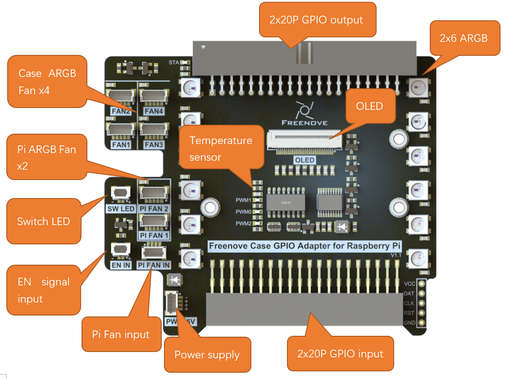

The GPIO Board extends all GPIO pins of the Raspberry Pi 5 to the exterior of the case, significantly simplifying the connection and debugging of external devices. Additionally, the board is highly integrated with multiple control functions, including interfaces for 2×6 ARGB LEDs and 6 ARGB fans, supporting customizable lighting modes. It also features onboard connectors for an OLED display and an EN (Enable) power control interface, further enhancing system expandability and power management capabilities.

ARGB
====================================

The board features 2x6 onboard ARGB LEDs, which operate synchronously in two channels. Via I²C communication, users can switch between multiple preset lighting modes and individually control each LED, enabling highly customizable dynamic lighting effects.

Case ARGB Fan
====================================

The case is equipped with four ARGB fan headers, whose lighting effects are synchronized with the onboard ARGB LEDs. The system supports two-channel independent PWM control, allowing users to precisely adjust fan speeds via I²C communication and monitor real-time RPM data for each fan. This enables efficient thermal management while maintaining unified visual aesthetics.

Pi ARGB Fan
====================================

Pi FAN 1: It is controlled directy by Raspberry Pi 5. For details, see: https://www.raspberrypi.com/documentation/computers/raspberry-pi.html#fan-cases

Pi FAN 2: It is controlled by GPIO board. The way to control it is the same as the aforementioned Case ARGB Fans.

EN IN (Enable Input)
====================================

This interface connects to the EN_OUT port on the Audio-Video Board to synchronize the power state of the entire system. When the Raspberry Pi is shut down, it automatically cuts off all power to the GPIO Board, effectively eliminating standby power consumption and ensuring that all connected devices (such as lighting) are completely turned off.

Temperature sensor
====================================

Equipped with athe temperature sensor, the system monitors the internal temperature in real-time and linearly adjusts the fan speed based on the temperature data, achieving automatic closed-loop control of the cooling system. At the same time, users can view precise temperature readings at any time to clearly monitor the internal operating status of the case.

1.3 Introduction to Freenove Power Button Board for Raspberry Pi
**********************************************************************

In this tutorial, we name this model as **Switch Board**.

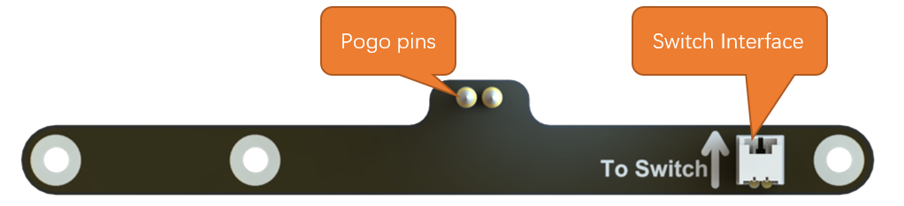

The Switch Board connects to the J2 interface of the Raspberry Pi 5 via pogo pins, enabling the use of a custom power button. A 12mm power button with an indicator light is included, offering identical functionality to the onboard power button of the Raspberry Pi 5. For detailed specifications and usage of the power button, please refer to the Raspberry Pi official documentation: 

https://www.raspberrypi.com/documentation/computers/raspberry-pi.html#power-button

1.4 Introduction to Freenove M.2 NVMe Adapter Series for Raspberry Pi
************************************************************************

The Raspberry Pi 5 includes a PCIe x1 slot that is certified for PCIe Gen 2.0, providing a theoretical maximum throughput of 5GT/sec, which roughly translates to 500MB/sec for read and write operations. Although this slot is not officially certified for PCIe Gen 3.0, it is possible to force the use of Gen 3.0 for potentially higher speeds.

The PCIe consortium states that the speed of PCIe Gen 3.0 x1 is up to 8GT/sec, which translates to approximately 985MB/sec.

https://en.wikipedia.org/wiki/PCI_Express#Comparison_table

https://www.raspberrypi.com/documentation/computers/raspberry-pi.html#pcie-gen-3-0

SSDs generally provide significantly faster read and write speeds compared to SD cards and USB drives, which can notably elevate the user experience when operating the Raspberry Pi 5.

1.4.1 Freenove M.2 NVMe Adapter for Raspberry Pi
================================================================

In this tutorial, we name this model as **NVMe Adapter Board**.

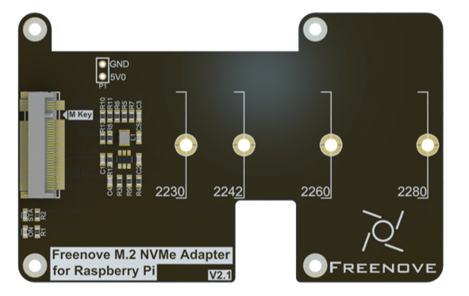

Here are its key features:

* **Interface Type:** M.2 with M-Key

* **Supported Protocol:** NVMe

* **PCIe Channel:** PCIe 3.0 x1(Compatible with PCIe 2.0)

* **Compatible Sizes:** 2230, 2242, 2260, 2280

* **Power Supply:** 3.3V, up to 3A (maximum)

* **Indicator Lights:** Includes both power and SSD status LEDs.

1.4.2 Freenove Dual M.2 Nvme Adapter for Raspberry Pi
================================================================

This model has four NVMe SSD interface, supporting up to 2 NVMe SSDs to run simultaneously. In this tutorial, we name this model as **Dual-NVMe Adapter Board**.

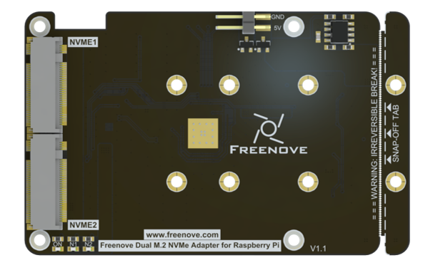

Here are its key features:

* **Interface Type:** 2x M.2 with M-Key

* **Supported Protocol:** NVMe

* **PCIe Channel:** PCIe 2.0 x2

* **Compatible Sizes:** 2230, 2242, 2260, 2280

* **Power Supply:** 3.3V, up to 3A (maximum)

* **Indicator Lights:** Includes both power and x2 SSD status LEDs.

1.4.3 Freenove Quad M.2 Nvme Adapter for Raspberry Pi
================================================================

This model has four NVMe SSD interface, supporting up to 4 NVMe SSDs to run simultaneously. In this tutorial, we name this model as **Quad-NVMe Adapter Board**.

Here are its key features:

* **Interface Type:** 4x M.2 with M-Key

* **Supported Protocol:** NVMe

* **PCIe Channel:** PCIe 2.0 x4

* **Compatible Sizes:** 2230, 2242, 2260, 2280

* **Power Supply:** 3.3V, up to 3A (maximum)

* **Indicator Lights:** Includes both power and x4 SSD status LEDs. 

1.5 Introduction to Raspberry Pi 5(RPi 5)
************************************************

At the time of this writing, this product only supports RPi5. The following shows the physical and model figures of an RPi 5.

.. table::
    :class: table-line
    :align: center
    
    +-----------------------------------------+----------------------------------+
    | Practicality picture of Raspberry Pi 5: | Model diagram of Raspberry Pi 5: |
    |                                         |                                  |
    | |Chapter01_08|                          | |Chapter01_09|                   |
    +-----------------------------------------+----------------------------------+

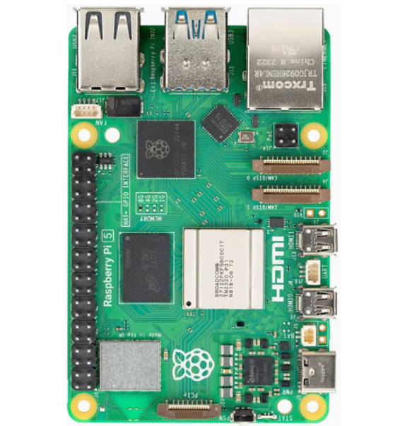
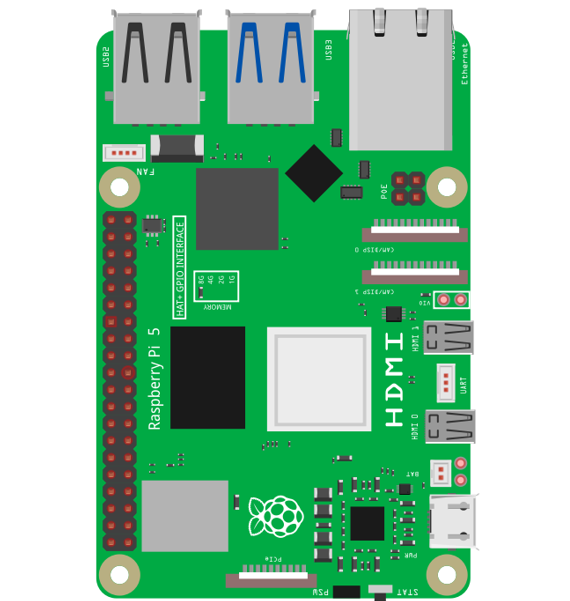

Hardware interface diagram of RPi 5 is shown below: 

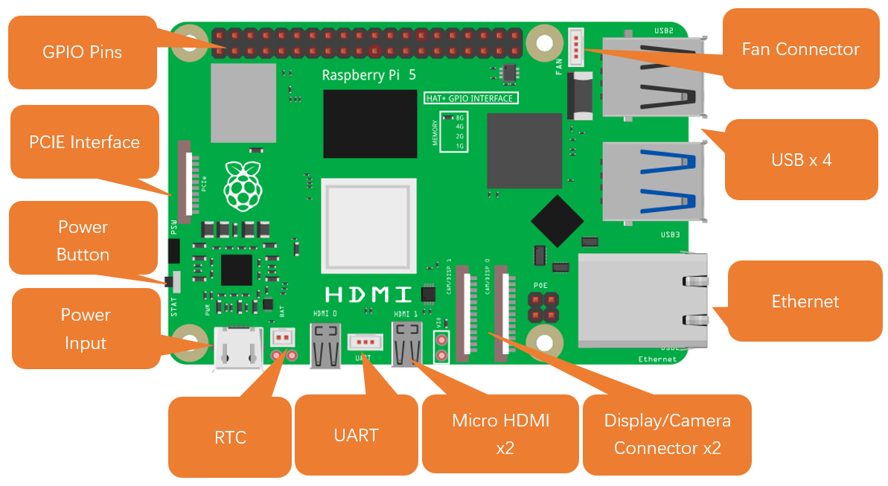

GPIO
=======================

GPIO: General purpose input/output. We will introduce the specific feature of the pins on the Raspberry Pi and how you can utilize them in all sorts of ways in your projects. Most RPi Module pins can be used as either an input or output, depending on your program and its functions. When programming the GPIO pins, there are three different ways to reference them: GPIO numbering, physical numbering, WiringPi GPIO Numbering.

BCM GPIO Numbering
=======================

The Raspberry Pi CPU uses Broadcom (BCM) processing chips BCM2835, BCM2836 or BCM2837. GPIO pin numbers are assigned by the processing chip manufacturer and are how the computer recognizes each pin. The pin numbers themselves do not make sense or have meaning, as they are only a form of identification. Since their numeric values and physical locations have no specific order, there is no way to remember them, so you will need to have a printed reference or a reference board that fits over the pins. 

Each pin is defined as below:

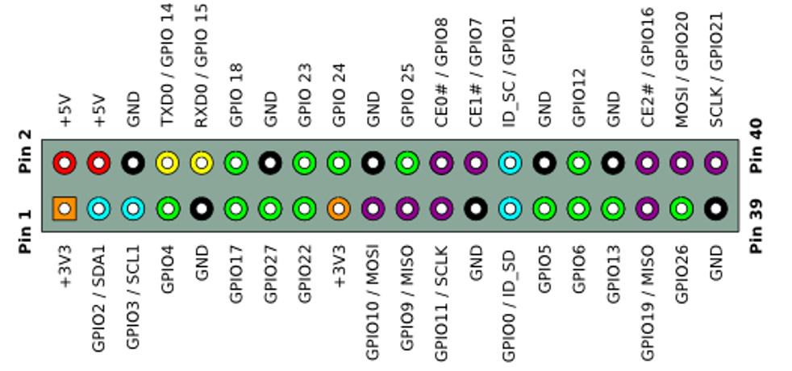

For more details about pin definition of GPIO, please refer to https://pinout.xyz/

Power requirements of various versions of Raspberry Pi are shown in following table:

.. table::
    :class: zebra
    :align: center
    
    +-------------------------+----------------------------------+----------------------------------------------------+-----------------------------------------------+
    | Product                 | Recommended PSU current capacity | Maximum total USB peripheral current draw          | Typical bare-board active current consumption |
    +=========================+==================================+====================================================+===============================================+
    | Raspberry Pi Model A    | 700mA                            | 500mA                                              | 200mA                                         |
    +-------------------------+----------------------------------+----------------------------------------------------+-----------------------------------------------+
    | Raspberry Pi Model B    | 1.2A                             | 500mA                                              | 500mA                                         |
    +-------------------------+----------------------------------+----------------------------------------------------+-----------------------------------------------+
    | Raspberry Pi Model A+   | 700mA                            | 500mA                                              | 180mA                                         |
    +-------------------------+----------------------------------+----------------------------------------------------+-----------------------------------------------+
    | Raspberry Pi Model B+   | 1.8A                             | 600mA/1.2A (switchable)                            | 330mA                                         |
    +-------------------------+----------------------------------+----------------------------------------------------+-----------------------------------------------+
    | Raspberry Pi 2 Model B  | 1.8A                             | 600mA/1.2A (switchable)                            | 350mA                                         |
    +-------------------------+----------------------------------+----------------------------------------------------+-----------------------------------------------+
    | Raspberry Pi 3 Model B  | 2.5A                             | 1.2A                                               | 400mA                                         |
    +-------------------------+----------------------------------+----------------------------------------------------+-----------------------------------------------+
    | Raspberry Pi 3 Model A+ | 2.5A                             | Limited by PSU, board, and connector ratings only. | 350mA                                         |
    +-------------------------+----------------------------------+----------------------------------------------------+-----------------------------------------------+
    | Raspberry Pi 3 Model B+ | 2.5A                             | 1.2A                                               | 500mA                                         |
    +-------------------------+----------------------------------+----------------------------------------------------+-----------------------------------------------+
    | Raspberry Pi 4 Model B  | 3.0A                             | 1.2A                                               | 600mA                                         |
    +-------------------------+----------------------------------+----------------------------------------------------+-----------------------------------------------+
    | Raspberry Pi 5 Model B  | 5.0A                             | 1.6A (600mA if using a 3A power supply)            | 800mA                                         |
    +-------------------------+----------------------------------+----------------------------------------------------+-----------------------------------------------+
    | Raspberry Pi Zero W     | 1.2A                             | Limited by PSU, board, and connector ratings only. | 150mA                                         |
    +-------------------------+----------------------------------+----------------------------------------------------+-----------------------------------------------+
    | Raspberry Pi Zero       | 1.2A                             | Limited by PSU, board, and connector ratings only  | 100mA                                         |
    +-------------------------+----------------------------------+----------------------------------------------------+-----------------------------------------------+

For more details, please refer to 

https://www.raspberrypi.com/documentation/computers/raspberry-pi.html#power-supply

In this product, the Raspberry Pi 5 is used and it must be powered by a 5.1V/5A power supply. Insufficient power may cause various functions to operate abnormally, or even permanently damage your Raspberry Pi 5. Therefore, we strongly recommend using a 5.1V/5A power supply to ensure optimal performance and avoid potential hardware failure