##############################################################################
Chapter 2 Case Assembly
##############################################################################

It is recommended to assemble and use the Freenove Computer Case Kit Pro for Raspberry Pi according to this tutorial. Otherwise, it may lead to incorrect device installation or damage. Please check all the parts again. If there are any incorrect or missing parts in your kit, **please feel free to contact us at** support@freenove.com

**Ensure the device is powered off before assembly.**

**Use of the Screwdriver Bit Holder**

.. table::
    :align: center
    :class: table-line
    
    +-----------------------------------------------------------------------------------------------+
    | When installing the brass standoff, simply place it directly into the bit holder.             |
    |                                                                                               |
    | |Chapter02_00|                                                                                |
    +-----------------------------------------------------------------------------------------------+
    | When installing the M3.7x10 Countersunk Head Screws, please use the PH2 hexagonal cross-bit.  |
    |                                                                                               |
    | |Chapter02_01|                                                                                |
    +-----------------------------------------------------------------------------------------------+
    | When installing other screws, please use the PH0 hexagonal cross-bit                          |
    |                                                                                               |
    | |Chapter02_02|                                                                                |
    +-----------------------------------------------------------------------------------------------+

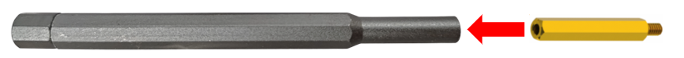
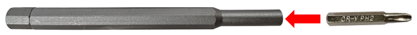
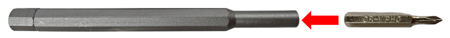

**Overall Wiring Diagram**

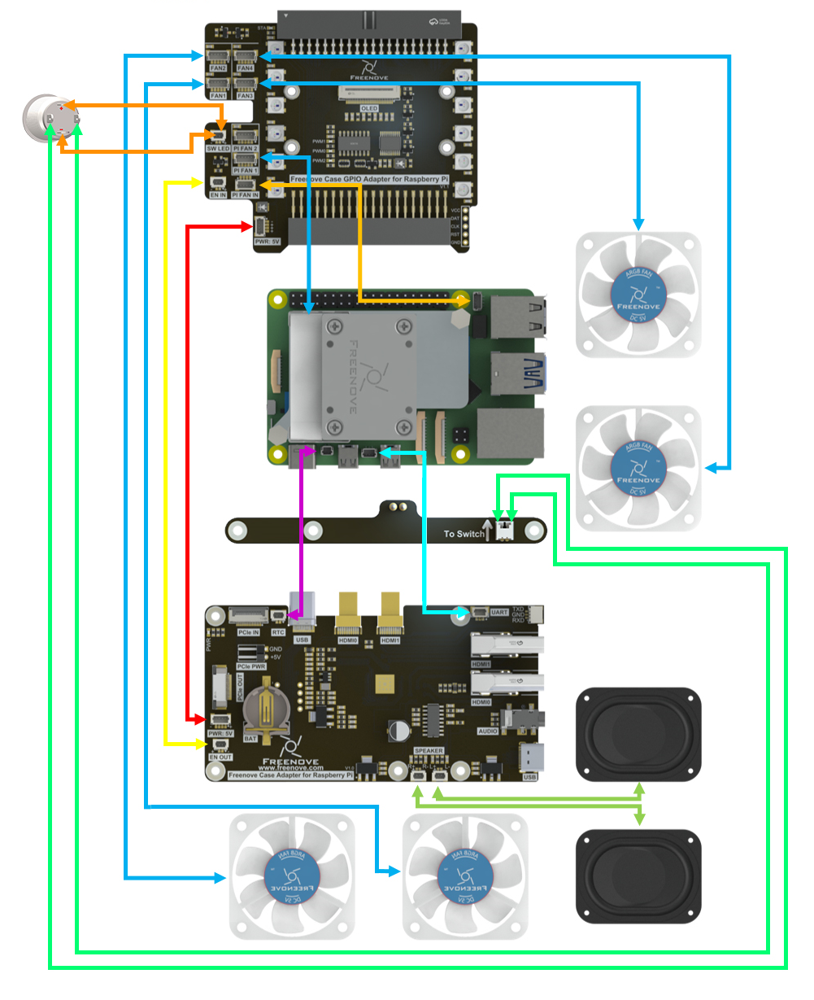

2.1 Assmbly of Speakers, Fans, and the Power Button
**************************************************************

2.1.1 Assembling Speakers
======================================

.. table::
    :align: center
    :class: table-line
    
    +---------------------------------------------------------------------------------------------------------------------------------------+
    | Step 1: Remove the white protective film from the speaker and the speaker's acrylic pad.                                              |
    |                                                                                                                                       |
    | |Chapter02_04|                                                                                                                        |
    +---------------------------------------------------------------------------------------------------------------------------------------+
    | Step 2: Align the speaker acrylic pad with the speaker and attach them together.                                                      |
    |                                                                                                                                       |
    | |Chapter02_05|                                                                                                                        |
    +---------------------------------------------------------------------------------------------------------------------------------------+
    | Step 3: Mount the two speakers to the case from the outside with M2x6 Countersunk Head Screws.                                        |
    |                                                                                                                                       |
    | |Chapter02_06|                                                                                                                        |
    +---------------------------------------------------------------------------------------------------------------------------------------+
    | Note: When installing, ensure the speaker orientation matches the diagram below, with the twisted pair located near the case housing. |
    |                                                                                                                                       |
    | |Chapter02_07|                                                                                                                        |
    +---------------------------------------------------------------------------------------------------------------------------------------+

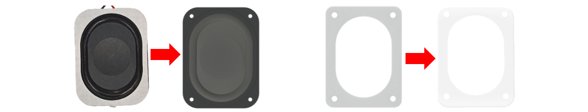

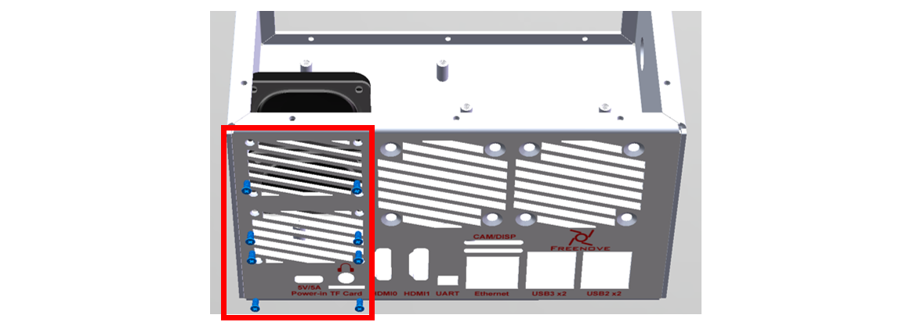
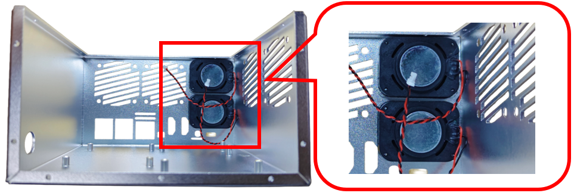

2.1.2 Assembling Fans
=======================================

.. table::
    :align: center
    :class: table-line
    
    +--------------------------------------------------------------------------------------------------------------------------------------------------------------------------------------------------------------------------------------------------------------------------------------------------------------------------------------------------------------------------------------------------------------------------------------------------------------+
    | :red:`Airflow Direction Description:`                                                                                                                                                                                                                                                                                                                                                                                                                        |
    |                                                                                                                                                                                                                                                                                                                                                                                                                                                              |
    | :red:`The side facing the user directly, where the full fan blades are visible, is the air intake.`                                                                                                                                                                                                                                                                                                                                                          |
    |                                                                                                                                                                                                                                                                                                                                                                                                                                                              |
    | :red:`The side with the motor frame and protective grille is the air outlet.`                                                                                                                                                                                                                                                                                                                                                                                |
    |                                                                                                                                                                                                                                                                                                                                                                                                                                                              |
    | |Chapter02_08|                                                                                                                                                                                                                                                                                                                                                                                                                                               |
    +--------------------------------------------------------------------------------------------------------------------------------------------------------------------------------------------------------------------------------------------------------------------------------------------------------------------------------------------------------------------------------------------------------------------------------------------------------------+
    | Step 1: Install the case fan. Place the dust filter between the fan and the case. Secure the fan using four M3.7x10 countersunk head screws from the outside of the case. Note: During installation, ensure the fan's airflow direction is correct – it should draw cool air in from the bottom of the case and exhaust hot air from the right side. This creates a consistent airflow, effectively lowering the internal operating temperature of the case. |
    |                                                                                                                                                                                                                                                                                                                                                                                                                                                              |
    | |Chapter02_09|                                                                                                                                                                                                                                                                                                                                                                                                                                               |
    +--------------------------------------------------------------------------------------------------------------------------------------------------------------------------------------------------------------------------------------------------------------------------------------------------------------------------------------------------------------------------------------------------------------------------------------------------------------+
    | Step 2: Secure the fan cable to the case frame using masking tape. Route the connector to the center of the case for easy connection to the GPIO board, thus maintaining a tidy interior.                                                                                                                                                                                                                                                                    |
    |                                                                                                                                                                                                                                                                                                                                                                                                                                                              |
    | |Chapter02_10|                                                                                                                                                                                                                                                                                                                                                                                                                                               |
    +--------------------------------------------------------------------------------------------------------------------------------------------------------------------------------------------------------------------------------------------------------------------------------------------------------------------------------------------------------------------------------------------------------------------------------------------------------------+

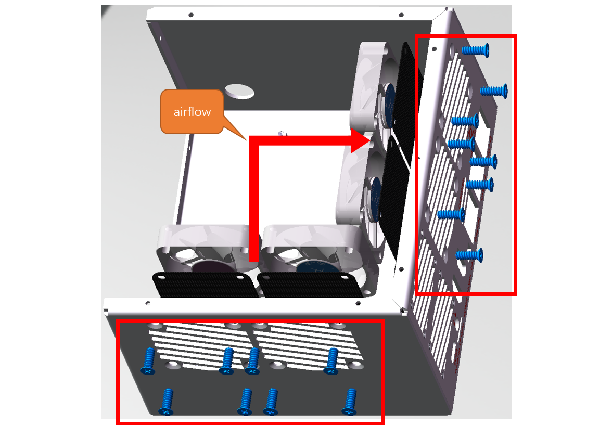
.. |Chapter02_10| image:: ../_static/imgs/2_Case_Assembly/Chapter02_10.png

2.1.3 Installing the Power Button
=======================================

.. table::
    :align: center
    :class: table-line
    
    +-----------------------------------------------------------------------------------------------------------------------------------------+
    | Step 1: Insert the Black Sealing Gasket into the 12mm LED Power Button.                                                                 |
    |                                                                                                                                         |
    | |Chapter02_11|                                                                                                                          |
    +-----------------------------------------------------------------------------------------------------------------------------------------+
    | Step 2: Install the 12mm LED Power Button into the circular hole on the top of the case, and secure it from the inside with an M12 nut. |
    |                                                                                                                                         |
    | |Chapter02_12|                                                                                                                          |
    +-----------------------------------------------------------------------------------------------------------------------------------------+

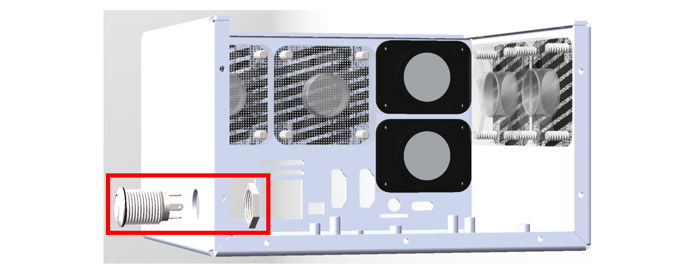

2.2 Installing Electronic Parts and Connecting Cables
**********************************************************

2.2.1 Installing the Tower Cooler
===========================================

.. table::
    :align: center
    :class: table-line
    
    +--------------------------------------------------------------------------------------------------------------------------------------------------------------------------------------------------------------------------------------------------------------------------------------------------------------------------------------------------+
    | Step 1: For users buying the variants equipped with a **4.3-inch touchscreen (FNK0107P\Q\R\U\V\W)** and those who want to use the camera with this kit, please connect the DSI cable and the camera cable to the Raspberry Pi’s **CAM/DISP** interface. (:combo:`red font-bolder:The red arrow below indicates the orientation of the contacts)` |
    |                                                                                                                                                                                                                                                                                                                                                  |
    | |Chapter02_13|                                                                                                                                                                                                                                                                                                                                   |
    |                                                                                                                                                                                                                                                                                                                                                  |
    | :red:`Note: The installation of a tower cooler may make it difficult to access the CAM/DISP interface. If your model includes a 4.3-inch screen (FNK0107P/Q/R/U/V/W) or if you need to connect a device (such as a camera) to this interface, you must connect the cable before installing the cooler. Otherwise, you may skip this step.`       |
    +--------------------------------------------------------------------------------------------------------------------------------------------------------------------------------------------------------------------------------------------------------------------------------------------------------------------------------------------------+
    | Step 2: Identify the five thermal pads by size and apply each one to its corresponding chip on the RPi 5. (:red:`Important: Ensure you remove the protective film from both sides of each pad to guarantee optimal thermal conductivity.`)                                                                                                       |
    |                                                                                                                                                                                                                                                                                                                                                  |
    | |Chapter02_14|                                                                                                                                                                                                                                                                                                                                   |
    +--------------------------------------------------------------------------------------------------------------------------------------------------------------------------------------------------------------------------------------------------------------------------------------------------------------------------------------------------+
    | Steps 3: Fix the Tower Cooler to RPi 5 with the Nylon standoffs.                                                                                                                                                                                                                                                                                 |
    |                                                                                                                                                                                                                                                                                                                                                  |
    | |Chapter02_15|                                                                                                                                                                                                                                                                                                                                   |
    +--------------------------------------------------------------------------------------------------------------------------------------------------------------------------------------------------------------------------------------------------------------------------------------------------------------------------------------------------+

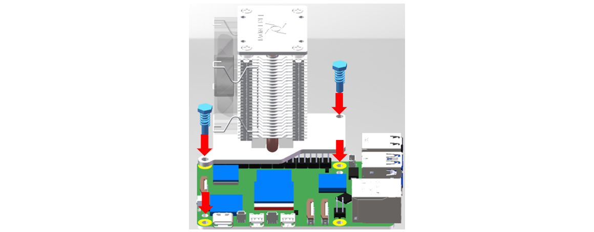

2.2.2 Installing Audio-Video Board
===========================================

.. table::
    :align: center
    :class: table-line
    
    +--------------------------------------------------------------------------------------------------------------------------------------------------------------------------------------------------------------------------------------------------------------+
    | Step 1: Align the Type-C and HDMI ports of the Raspberry Pi 5 and the Audio-Video Board, then insert the Audio-Video Board into the Raspberry Pi 5.                                                                                                          |
    |                                                                                                                                                                                                                                                              |
    | |Chapter02_16|                                                                                                                                                                                                                                               |
    +--------------------------------------------------------------------------------------------------------------------------------------------------------------------------------------------------------------------------------------------------------------+
    | Step 2: Insert the **To Pi** end of the SD Card to 0.5mm-16P FPC cable to the **RPi 5's SD card slot**, then connect the **To Adapter** end to the **SD Card IN interface** on te Audio-Video Board. (:red:`Contacts bottom`)                                |
    |                                                                                                                                                                                                                                                              |
    | |Chapter02_17|                                                                                                                                                                                                                                               |
    +--------------------------------------------------------------------------------------------------------------------------------------------------------------------------------------------------------------------------------------------------------------+
    | Step 3: Insert one end of the reverse straight cable to the RPi 5's **PCIe interface** (:red:`the contacts facing RPi 5’s internal`), then connect the other end to the **PCIe IN interface** on the Audio-Video Board (:red:`the contacts facing the PCB`). |
    |                                                                                                                                                                                                                                                              |
    | |Chapter02_18|                                                                                                                                                                                                                                               |
    +--------------------------------------------------------------------------------------------------------------------------------------------------------------------------------------------------------------------------------------------------------------+
    | Step 4: Connect the **RTC interface** between the RPi 5 and the Audio-Video Board using a 5cm SH1.0mm 2-pin cable. Then, connect their **UART interface** using a 5cm SH1.0mm 3-pin cable.                                                                   |
    |                                                                                                                                                                                                                                                              |
    | |Chapter02_19|                                                                                                                                                                                                                                               |
    +--------------------------------------------------------------------------------------------------------------------------------------------------------------------------------------------------------------------------------------------------------------+

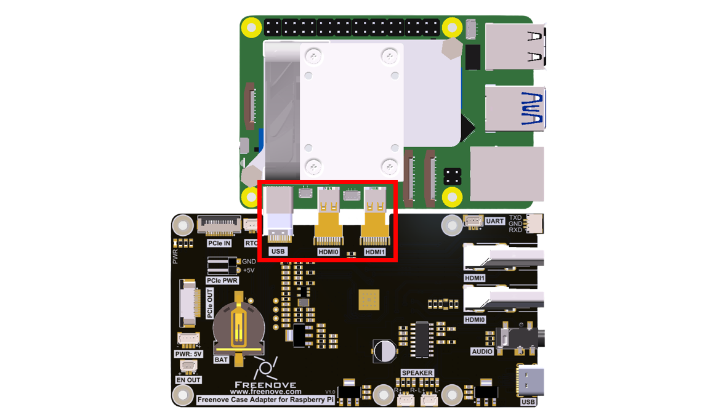
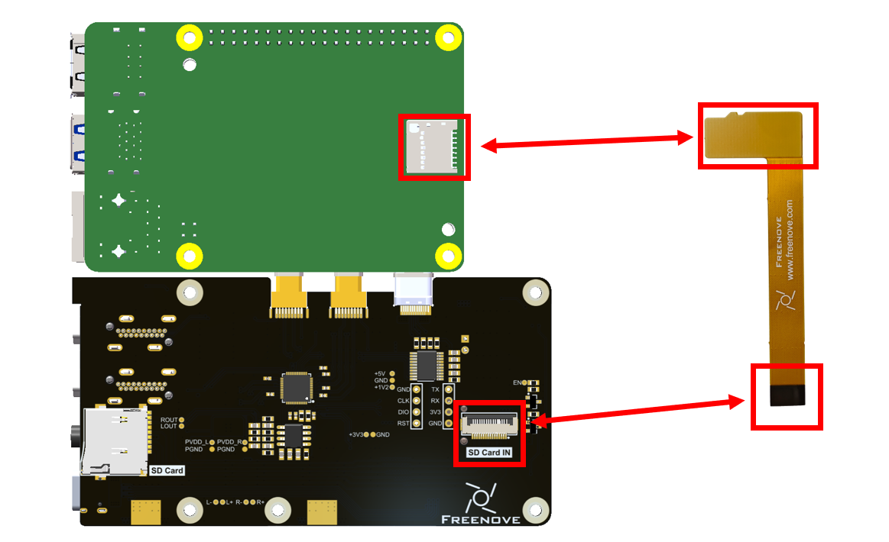
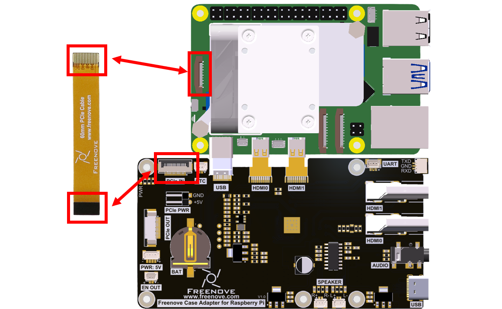
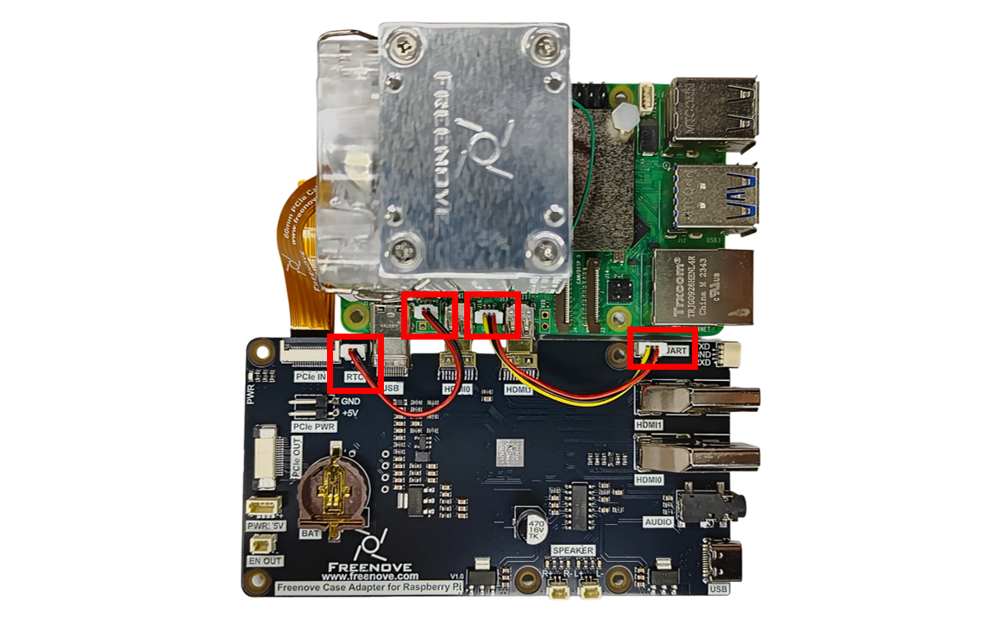

2.2.3 Installing the GPIO Board
===========================================

.. table::
    :align: center
    :class: table-line
    
    +---------------------------------------------------------------------------------------------------------------------------------------------------------------------------------------------------------------------------------------------------------------------------------------------------------------------------------------------------------------------------------------------------------------------------------------------------------------------------------------------------------------------------------------+
    | Step 1: Connect the flex cable of the 0.96-inch OLED display to the OLED interface on the GPIO Board, :red:`with the contacts facing the PCB`.                                                                                                                                                                                                                                                                                                                                                                                        |
    |                                                                                                                                                                                                                                                                                                                                                                                                                                                                                                                                       |
    | |Chapter02_20|                                                                                                                                                                                                                                                                                                                                                                                                                                                                                                                        |
    |                                                                                                                                                                                                                                                                                                                                                                                                                                                                                                                                       |
    | :red:`Important: The display glass is fragile - please exercise extreme caution during installation.`                                                                                                                                                                                                                                                                                                                                                                                                                                 |
    +---------------------------------------------------------------------------------------------------------------------------------------------------------------------------------------------------------------------------------------------------------------------------------------------------------------------------------------------------------------------------------------------------------------------------------------------------------------------------------------------------------------------------------------+
    | Step 2: Secure the LED light diffusion plate to the GPIO board's threaded insert with M2.5x5 countersunk head screws.                                                                                                                                                                                                                                                                                                                                                                                                                 |
    |                                                                                                                                                                                                                                                                                                                                                                                                                                                                                                                                       |
    | |Chapter02_21|                                                                                                                                                                                                                                                                                                                                                                                                                                                                                                                        |
    +---------------------------------------------------------------------------------------------------------------------------------------------------------------------------------------------------------------------------------------------------------------------------------------------------------------------------------------------------------------------------------------------------------------------------------------------------------------------------------------------------------------------------------------+
    | Step 3: Connect the 15cm SH1.0mm 4-pin cable to the FAN (J17) interface on the RPi 5. (:red:`Ensure the red wire connects to the terminal marked '+'.`)                                                                                                                                                                                                                                                                                                                                                                               |
    |                                                                                                                                                                                                                                                                                                                                                                                                                                                                                                                                       |
    | |Chapter02_22|                                                                                                                                                                                                                                                                                                                                                                                                                                                                                                                        |
    +---------------------------------------------------------------------------------------------------------------------------------------------------------------------------------------------------------------------------------------------------------------------------------------------------------------------------------------------------------------------------------------------------------------------------------------------------------------------------------------------------------------------------------------+
    | Step 4: Align the **female header** of the GPIO Board with the **GPIO header** on the RPi 5, then press the GPIO Board down to insert it.                                                                                                                                                                                                                                                                                                                                                                                             |
    |                                                                                                                                                                                                                                                                                                                                                                                                                                                                                                                                       |
    | |Chapter02_23|                                                                                                                                                                                                                                                                                                                                                                                                                                                                                                                        |
    +---------------------------------------------------------------------------------------------------------------------------------------------------------------------------------------------------------------------------------------------------------------------------------------------------------------------------------------------------------------------------------------------------------------------------------------------------------------------------------------------------------------------------------------+
    | Step 5: Connect the other end of the 15cm SH1.0mm 4-pin cable to the "**PI FAN IN**" interface on the GPIO Board. (:red:`Caution: Do not connect it to the "PWR:5V" interface, as this may damage the components. The red wire must go to the terminal marked '+'.`)                                                                                                                                                                                                                                                                  |
    |                                                                                                                                                                                                                                                                                                                                                                                                                                                                                                                                       |
    | |Chapter02_24|                                                                                                                                                                                                                                                                                                                                                                                                                                                                                                                        |
    +---------------------------------------------------------------------------------------------------------------------------------------------------------------------------------------------------------------------------------------------------------------------------------------------------------------------------------------------------------------------------------------------------------------------------------------------------------------------------------------------------------------------------------------+
    | Step 6: Route the fan cable of the tower cooler around the bottom of the RPi 5 to the back of the GPIO Board, then insert it into either the **PI FAN 1 or PI FAN 2** interface. We recommend connecting it to the PI FAN 1 interface. For differences between the interfaces, please click :ref:`here <fnk0107/codes/tutorial/1_introduction_to_main_components_:pi argb fan>`. (:red:`Note: Align the red wire with the '+' mark and insert carefully to avoid bending the pins. Use tweezers to gently straighten any bent pins.`) |
    |                                                                                                                                                                                                                                                                                                                                                                                                                                                                                                                                       |
    | |Chapter02_25|                                                                                                                                                                                                                                                                                                                                                                                                                                                                                                                        |
    +---------------------------------------------------------------------------------------------------------------------------------------------------------------------------------------------------------------------------------------------------------------------------------------------------------------------------------------------------------------------------------------------------------------------------------------------------------------------------------------------------------------------------------------+
    | Step 7: Use the 15cm SH1.0mm 2-pin cable. Connect one end to the **EN IN interface** on the GPIO Board and the other end to the **EN OUT interface** on the Audio-Video Board. (:red:`Note: The red wire must be aligned with the terminal marked '+'.`)                                                                                                                                                                                                                                                                              |
    |                                                                                                                                                                                                                                                                                                                                                                                                                                                                                                                                       |
    | |Chapter02_26|                                                                                                                                                                                                                                                                                                                                                                                                                                                                                                                        |
    +---------------------------------------------------------------------------------------------------------------------------------------------------------------------------------------------------------------------------------------------------------------------------------------------------------------------------------------------------------------------------------------------------------------------------------------------------------------------------------------------------------------------------------------+
    | Step 8: Use the 15cm SH1.0mm 4-pin cable. Connect one end to the **PWR: 5V interface** on the GPIO Board and the other end to **the PWR: 5V interface** on the Audio-Video Board. (:red:`Note: The red wire must be aligned with the terminal marked '+'`).                                                                                                                                                                                                                                                                           |
    |                                                                                                                                                                                                                                                                                                                                                                                                                                                                                                                                       |
    | |Chapter02_27|                                                                                                                                                                                                                                                                                                                                                                                                                                                                                                                        |
    +---------------------------------------------------------------------------------------------------------------------------------------------------------------------------------------------------------------------------------------------------------------------------------------------------------------------------------------------------------------------------------------------------------------------------------------------------------------------------------------------------------------------------------------+
    | Step 9: For a clean installation, use masking tape to manage loose cables by securing them to the back or bottom of the PCB.                                                                                                                                                                                                                                                                                                                                                                                                          |
    |                                                                                                                                                                                                                                                                                                                                                                                                                                                                                                                                       |
    | |Chapter02_28|                                                                                                                                                                                                                                                                                                                                                                                                                                                                                                                        |
    +---------------------------------------------------------------------------------------------------------------------------------------------------------------------------------------------------------------------------------------------------------------------------------------------------------------------------------------------------------------------------------------------------------------------------------------------------------------------------------------------------------------------------------------+

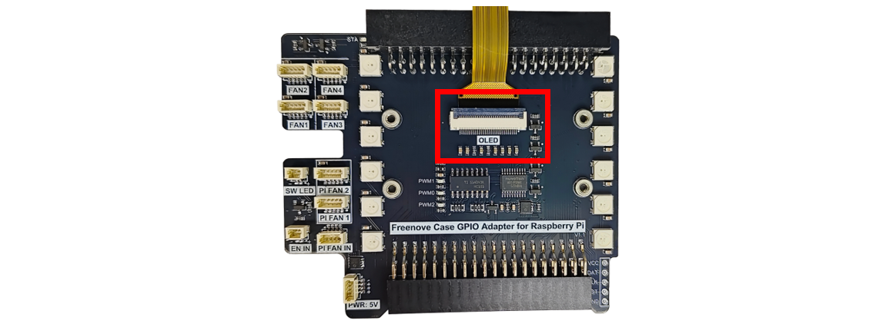
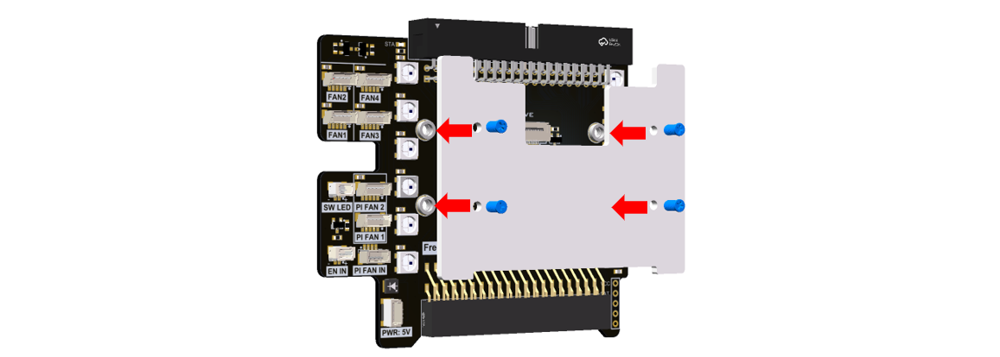
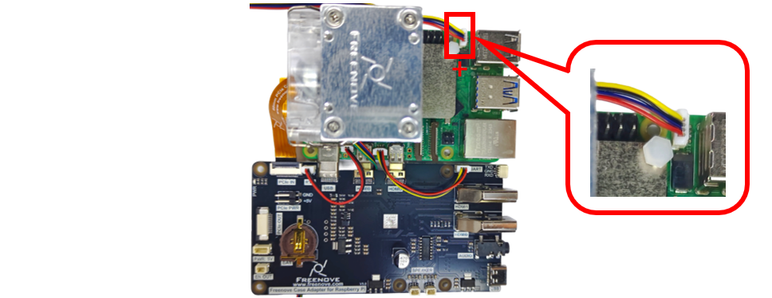
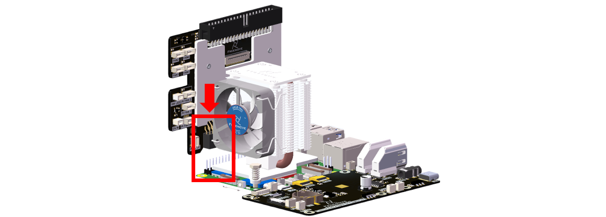
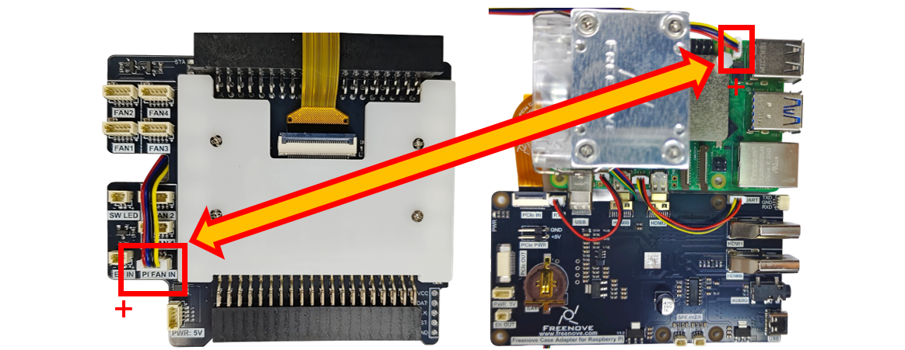
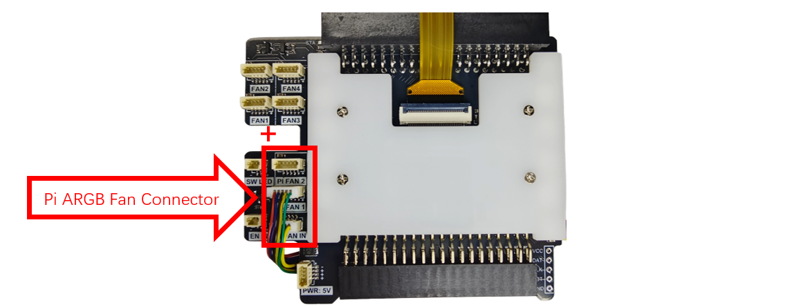
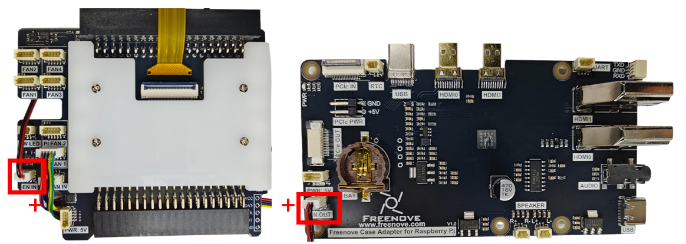
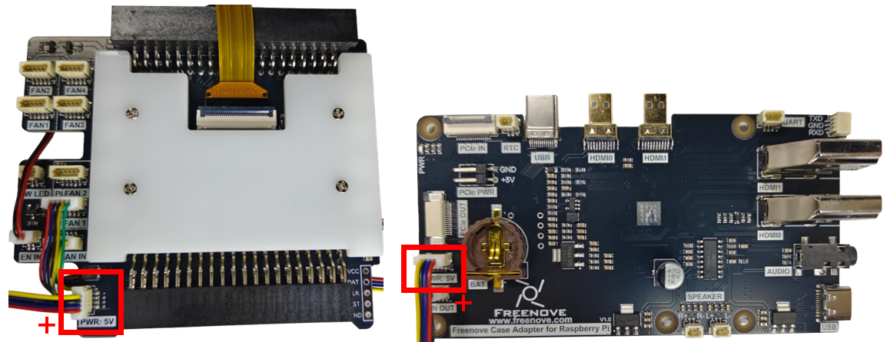
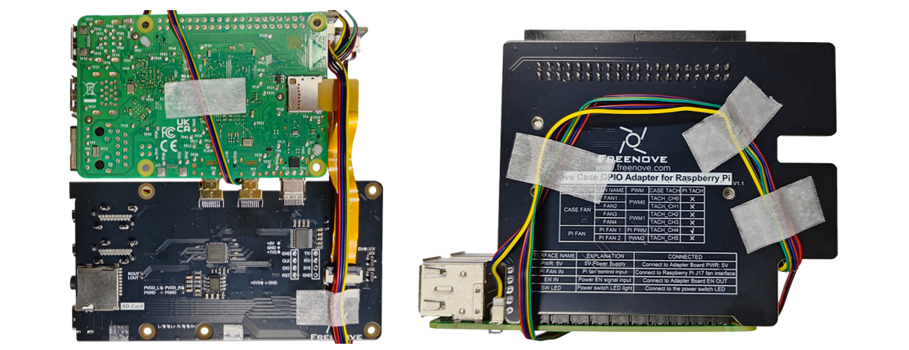

2.2.4 Installing to the Case Shell
=========================================

.. table::
    :align: center
    :class: table-line
    
    +----------------------------------------------------------------------------------------------------------------------------------------------------------------------------------------------------------------------------------------------------------------+
    | Step 1: Place the pre-assembled modules (RPi 5, Audio-Video Board, and GPIO Board) into the case. Align it with all the mounting posts, and then use M2.5x5 countersunk head screws to secure them to the case.                                                |
    |                                                                                                                                                                                                                                                                |
    | |Chapter02_29|                                                                                                                                                                                                                                                 |
    |                                                                                                                                                                                                                                                                |
    | If there is insufficient operating space while installing the screw near the RPi 5's FAN (J17) interface, you can gently lift the GPIO Board on this side slightly upward. After the screw installation is complete, press it back into its original position. |
    |                                                                                                                                                                                                                                                                |
    | |Chapter02_30|                                                                                                                                                                                                                                                 |
    |                                                                                                                                                                                                                                                                |
    | Use the M2.5x14+4 brass standoffs to secure the side of the Audio-Video Board closest to the RPi 5 onto the mounting post below.                                                                                                                               |
    |                                                                                                                                                                                                                                                                |
    | |Chapter02_31|                                                                                                                                                                                                                                                 |
    |                                                                                                                                                                                                                                                                |
    | Use the M2.5x25+4 brass standoffs to secure the opposite side of the Audio-Video Board onto the mounting post.                                                                                                                                                 |
    |                                                                                                                                                                                                                                                                |
    | |Chapter02_32|                                                                                                                                                                                                                                                 |
    +----------------------------------------------------------------------------------------------------------------------------------------------------------------------------------------------------------------------------------------------------------------+

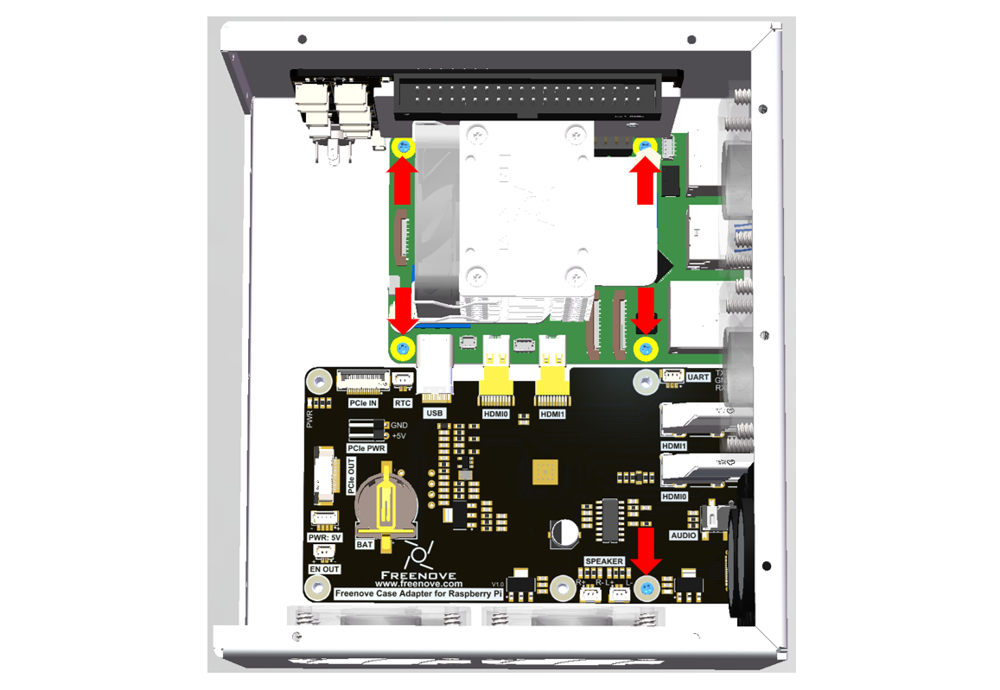
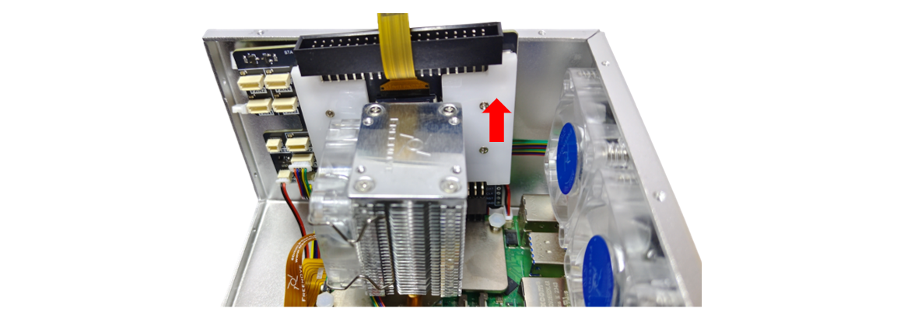
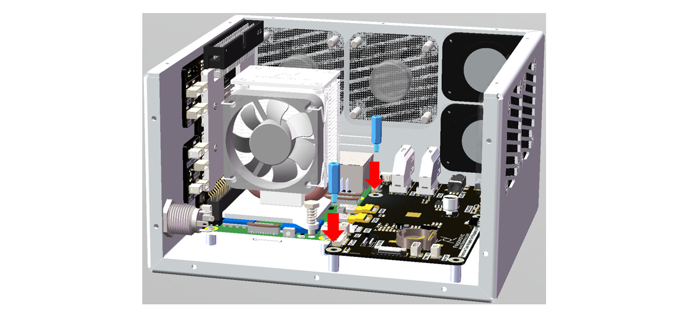
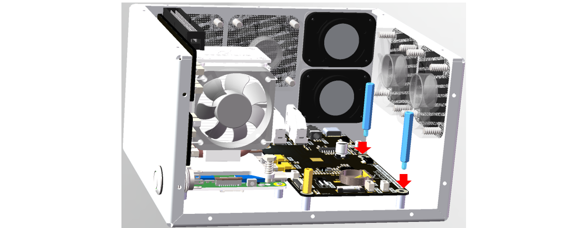

2.2.5 Connecting Cables
================================

.. table::
    :align: center
    :class: table-line
    
    +----------------------------------------------------------------------------------------------------------------------------------------------------------------------------------------------------------------------------------------------------------------------------------------------------------------------------------------------------------------------------------------------------------------------------------------+
    | Step 1: Connect the quick-disconnect terminal end of the 7cm SH1.0mm to quick-disconnect terminal cable (red/black) to the 12mm LED Power Switch. (:red:`Note: The red wire connects to the switch's '+' terminal, and the black wire connects to the '-' terminal.`) Then, connect the other end to the SW LED interface on the GPIO Board. (:red:`For a physical wiring reference, please see the actual installation photo below.`) |
    |                                                                                                                                                                                                                                                                                                                                                                                                                                        |
    | |Chapter02_33|                                                                                                                                                                                                                                                                                                                                                                                                                         |
    +----------------------------------------------------------------------------------------------------------------------------------------------------------------------------------------------------------------------------------------------------------------------------------------------------------------------------------------------------------------------------------------------------------------------------------------+
    | Step 2: Connect the two speakers to the **SPEAKER interface** of the Audio-Video Board.                                                                                                                                                                                                                                                                                                                                                |
    |                                                                                                                                                                                                                                                                                                                                                                                                                                        |
    | |Chapter02_34|                                                                                                                                                                                                                                                                                                                                                                                                                         |
    +----------------------------------------------------------------------------------------------------------------------------------------------------------------------------------------------------------------------------------------------------------------------------------------------------------------------------------------------------------------------------------------------------------------------------------------+
    | Step 3: Divide the four fans into two groups: FAN1/2 as one group, and FAN3/4 as the other. Connect the rear fans to the FAN3/4 interface, and connect the bottom fans to the FAN1/2 interface. (:red:`Note: Please insert carefully to avoid bending the pins. . Use tweezers to gently straighten any bent pins.`)                                                                                                                   |
    |                                                                                                                                                                                                                                                                                                                                                                                                                                        |
    | |Chapter02_35|                                                                                                                                                                                                                                                                                                                                                                                                                         |
    +----------------------------------------------------------------------------------------------------------------------------------------------------------------------------------------------------------------------------------------------------------------------------------------------------------------------------------------------------------------------------------------------------------------------------------------+

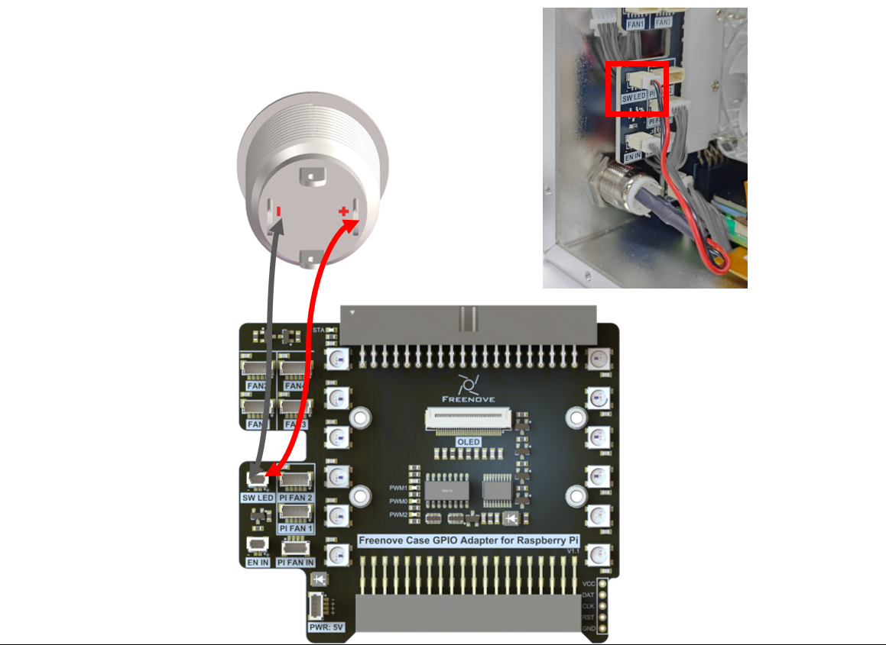
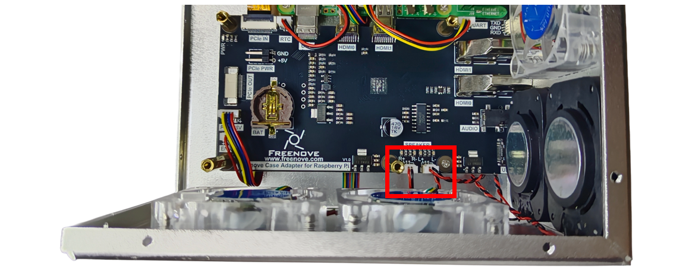
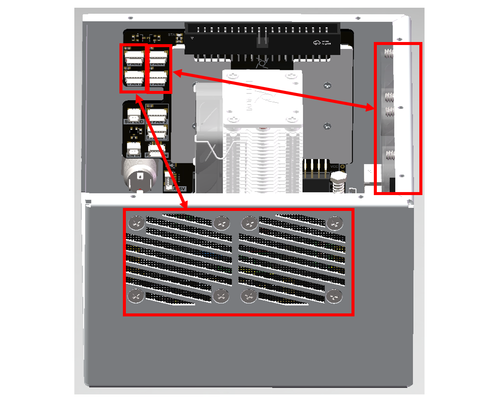

2.2.6 Connecting Switch Board
======================================

.. table::
    :align: center
    :class: table-line
    
    +------------------------------------------------------------------------------------------------------------------------------------------------------------------------------------------------------------------+
    | Step 1: Install the M2.5x12 brass standoff to the middle positioning location on the Switch Board, noting the orientation.                                                                                       |
    |                                                                                                                                                                                                                  |
    | |Chapter02_36|                                                                                                                                                                                                   |
    +------------------------------------------------------------------------------------------------------------------------------------------------------------------------------------------------------------------+
    | Step 2 : Align the pogo pin with the **J2 pad** located between the RPi 5's Type-C and HDMI0 ports, and then gently press the Switch Board into place.                                                           |
    |                                                                                                                                                                                                                  |
    | |Chapter02_37|                                                                                                                                                                                                   |
    |                                                                                                                                                                                                                  |
    | Secure the inner side of the Switch Board with M2.5x5 Countersunk Head Screws. Then, fasten the outer side with the M2.5x12+4 Brass Standoffs.                                                                   |
    |                                                                                                                                                                                                                  |
    | |Chapter02_38|                                                                                                                                                                                                   |
    +------------------------------------------------------------------------------------------------------------------------------------------------------------------------------------------------------------------+
    | Step 3: Insert the **terminal end** of the 7cm 1.25mm-to-2.8 quick-disconnect terminal cable (yellow-yellow) into the 12mm LED Power Switch. Then, insert the other end into the interface on the Switch Board.  |
    |                                                                                                                                                                                                                  |
    | |Chapter02_39|                                                                                                                                                                                                   |
    +------------------------------------------------------------------------------------------------------------------------------------------------------------------------------------------------------------------+

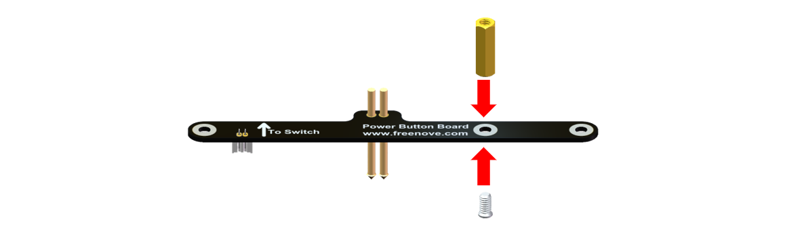
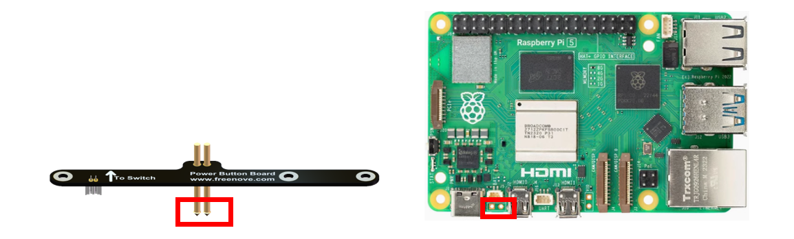
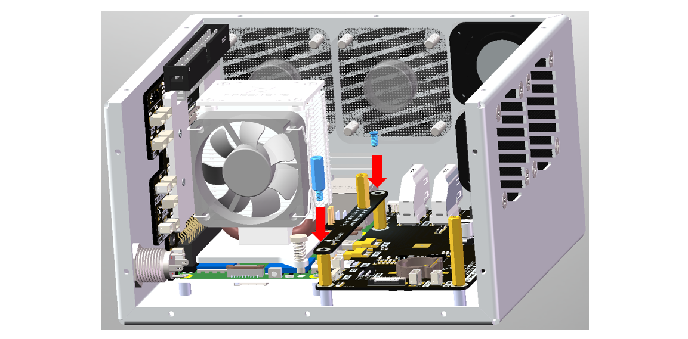
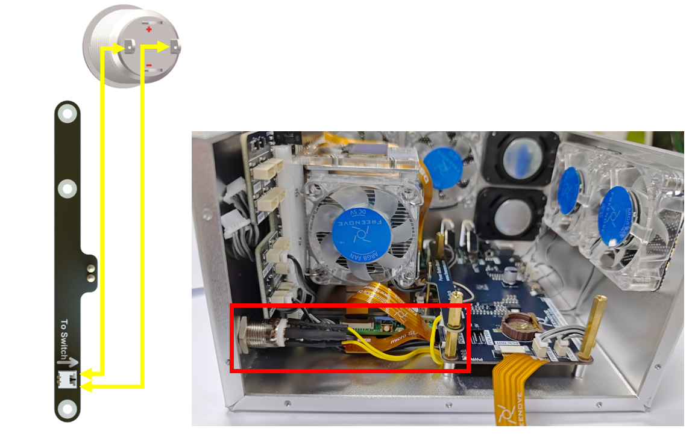

2.2.7 Installing the NVMe Adapter Board
==========================================

Please select your product model below to view the corresponding installation instructions for the NVMe Adapter Board.

For **FNK0107A/H/P/U**: NVMe Adapter Board

For **FNK0107B/K/Q/V**: Dual-NVMe Adapter Board

For **FNK0107C/L/R/W**: Quad-NVMe Adapter Board

Installing NVMe Adapter Board
----------------------------------------

.. table::
    :align: center
    :class: table-line
    
    +------------------------------------------------------------------------------------------------------------------------------------------------------------------------------------------------------------------------------------------+
    | Step 1: Based on the physical dimensions of your SSD, install the M2.5x3+3 brass standoff into the mounting hole corresponding to the 2230/2242/2260/2280 specification. Secure it from the reverse side using an M2.5 nut.              |
    |                                                                                                                                                                                                                                          |
    | |Chapter02_40|                                                                                                                                                                                                                           |
    +------------------------------------------------------------------------------------------------------------------------------------------------------------------------------------------------------------------------------------------+
    | Step 2: Tilt the SSD to insert it into the NVMe slot, and then secure it using an M2.5x2.5x5 flat-head screw.                                                                                                                            |
    |                                                                                                                                                                                                                                          |
    | |Chapter02_41|                                                                                                                                                                                                                           |
    +------------------------------------------------------------------------------------------------------------------------------------------------------------------------------------------------------------------------------------------+
    | Step 3: Connect one end of the NVMe cable to the PCIe OUT interface on the Audio-Video Board (contacts facing up), then connect the other end to the FPC interface on the reverse side of the NVMe Adapter Board (contacts facing down). |
    |                                                                                                                                                                                                                                          |
    | |Chapter02_42|                                                                                                                                                                                                                           |
    +------------------------------------------------------------------------------------------------------------------------------------------------------------------------------------------------------------------------------------------+
    | Step 4: Secure the NVMe Adapter Board with M2.5x5Countersunk Head Screws                                                                                                                                                                 |
    |                                                                                                                                                                                                                                          |
    | |Chapter02_43|                                                                                                                                                                                                                           |
    +------------------------------------------------------------------------------------------------------------------------------------------------------------------------------------------------------------------------------------------+

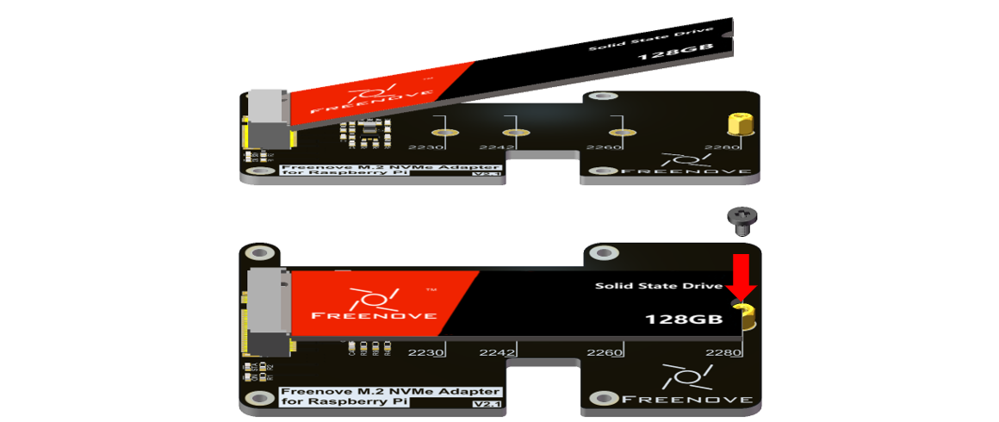
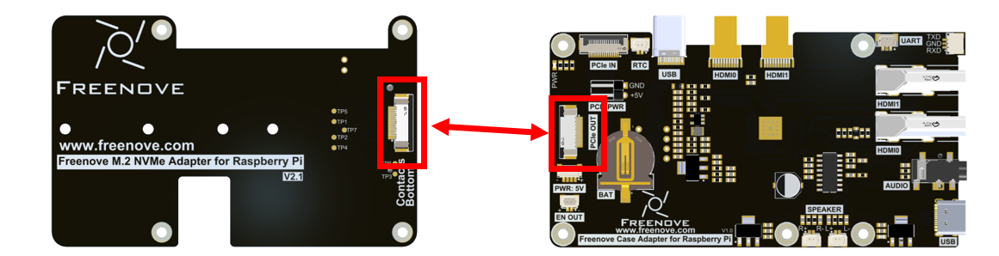
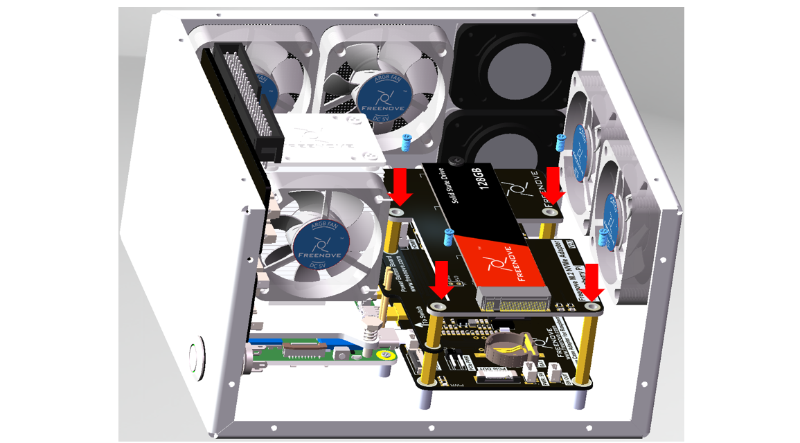

Installing Dual-NVMe Adapter Board
--------------------------------------

.. table::
    :align: center
    :class: table-line
    
    +--------------------------------------------------------------------------------------------------------------------------------------------------------------------------------------------------------------------------------------------------------------------------------------------------------------------------------------------------------------------+
    | Step 1: Based on the physical dimensions of your SSD, install two M2.5x3+3 brass standoffs into the mounting hole corresponding to the 2230/2242/2260/2280 specification. Secure them from the reverse side with M2.5 nuts.                                                                                                                                        |
    |                                                                                                                                                                                                                                                                                                                                                                    |
    | |Chapter02_44|                                                                                                                                                                                                                                                                                                                                                     |
    +--------------------------------------------------------------------------------------------------------------------------------------------------------------------------------------------------------------------------------------------------------------------------------------------------------------------------------------------------------------------+
    | :red:`Note: This Adapter Board supports up to two SSDs. Install 0 to 2 SSDs based on your preference.`                                                                                                                                                                                                                                                             |
    |                                                                                                                                                                                                                                                                                                                                                                    |
    | Step 2: Tilt the SSDs to inster them into the two NVMe slots, and then secure them using M2.5x2.5x5 flat-head screws.                                                                                                                                                                                                                                              |
    |                                                                                                                                                                                                                                                                                                                                                                    |
    | |Chapter02_45|                                                                                                                                                                                                                                                                                                                                                     |
    +--------------------------------------------------------------------------------------------------------------------------------------------------------------------------------------------------------------------------------------------------------------------------------------------------------------------------------------------------------------------+
    | Step 3: Connect one end of the NVMe cable to the PCIe OUT interface on the Audio-Video Board (:red:`contacts facing up`), then connect the other end to the FPC interface on the reverse side of the NVMe Adapter Board (:red:`contacts facing toward the board`).                                                                                                 |
    |                                                                                                                                                                                                                                                                                                                                                                    |
    | |Chapter02_46|                                                                                                                                                                                                                                                                                                                                                     |
    +--------------------------------------------------------------------------------------------------------------------------------------------------------------------------------------------------------------------------------------------------------------------------------------------------------------------------------------------------------------------+
    | Step 4: Connect two female-to-female jumper wires. Attach one end to the **PCIe PWR interface** on the Audio-Video Board, and the other end to the **pin headers** on the Dual-NVMe Adapter Board. (:red:`Caution: The red wire must connect to the 5V pin, and the black wire to the GND pin. Incorrect wiring may cause a short circuit and damage the device.`) |
    |                                                                                                                                                                                                                                                                                                                                                                    |
    | |Chapter02_47|                                                                                                                                                                                                                                                                                                                                                     |
    |                                                                                                                                                                                                                                                                                                                                                                    |
    | **Generally, connecting the two jumper wires is not required. However, for SSDs with higher power consumption, it is necessary to connect them to ensure adequate power supply and stable operation.**                                                                                                                                                             |
    +--------------------------------------------------------------------------------------------------------------------------------------------------------------------------------------------------------------------------------------------------------------------------------------------------------------------------------------------------------------------+
    | Step 5: Secure the Dual-NVMe Adapter Board with M2.5x5Countersunk Head Screws.                                                                                                                                                                                                                                                                                     |
    |                                                                                                                                                                                                                                                                                                                                                                    |
    | |Chapter02_48|                                                                                                                                                                                                                                                                                                                                                     |
    +--------------------------------------------------------------------------------------------------------------------------------------------------------------------------------------------------------------------------------------------------------------------------------------------------------------------------------------------------------------------+

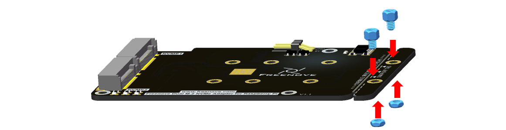
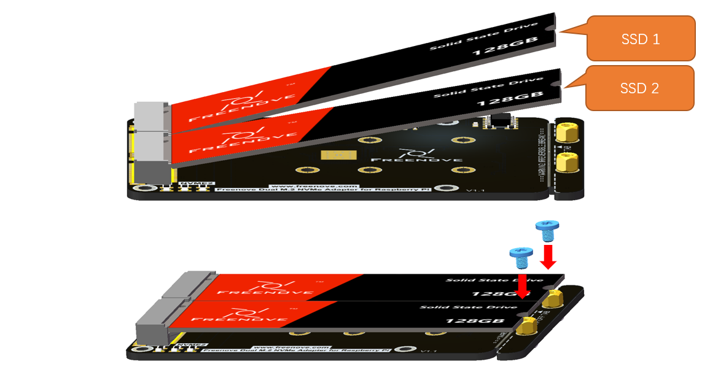
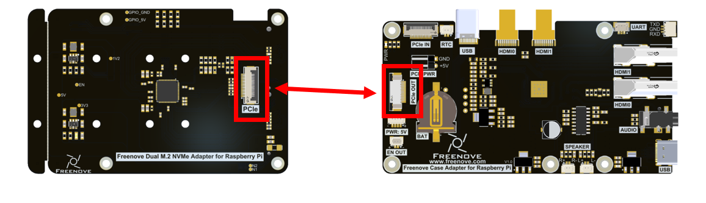
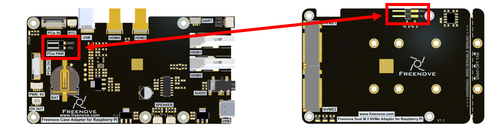
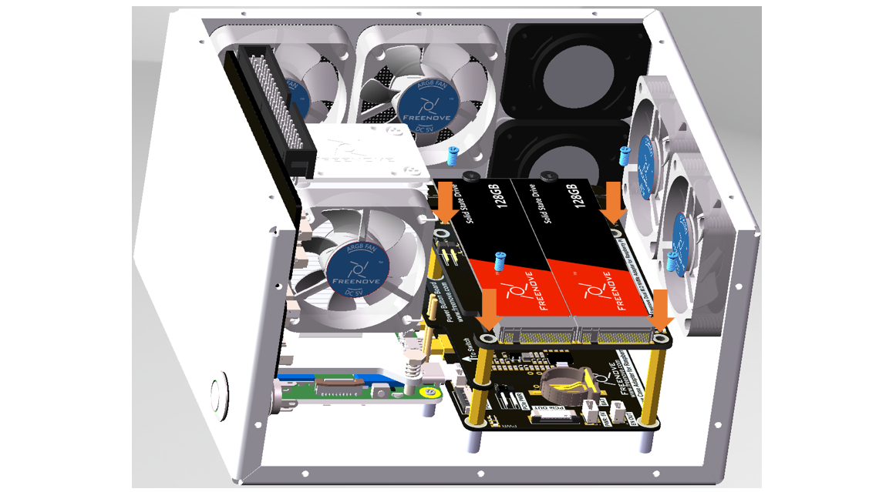

Installing Quad-NVMe Adapter Board
--------------------------------------

.. table::
    :align: center
    :class: table-line
    
    +--------------------------------------------------------------------------------------------------------------------------------------------------------------------------------------------------------------------------------------------------------------------------------------------------------------------------------------------------------------------+
    | Step 1: Based on the physical dimensions of your SSD, install four M2.5x3+3 brass standoffs into the mounting hole corresponding to the 2230/2242/2260/2280 specification. Secure them from the reverse side with M2.5 nuts. It is recommended that you install standoffs to all the four mounting holes.                                                          |
    |                                                                                                                                                                                                                                                                                                                                                                    |
    | |Chapter02_49|                                                                                                                                                                                                                                                                                                                                                     |
    +--------------------------------------------------------------------------------------------------------------------------------------------------------------------------------------------------------------------------------------------------------------------------------------------------------------------------------------------------------------------+
    | :red:`Note: This Adapter Board supports up to four SSDs. Install 0 to 4 SSDs based on your preference.`                                                                                                                                                                                                                                                            |
    |                                                                                                                                                                                                                                                                                                                                                                    |
    | Step 2: Tilt the SSDs to inster them into the two NVMe slots on the front side, and then secure them using M2.5x2.5x5 flat-head screws.                                                                                                                                                                                                                            |
    |                                                                                                                                                                                                                                                                                                                                                                    |
    | |Chapter02_50|                                                                                                                                                                                                                                                                                                                                                     |
    |                                                                                                                                                                                                                                                                                                                                                                    |
    | Step 2: Tilt the SSDs to inster them into the two NVMe slots on the back side, and secure them using M2.5x2.5x5 flat-head screws.                                                                                                                                                                                                                                  |
    |                                                                                                                                                                                                                                                                                                                                                                    |
    | |Chapter02_51|                                                                                                                                                                                                                                                                                                                                                     |
    +--------------------------------------------------------------------------------------------------------------------------------------------------------------------------------------------------------------------------------------------------------------------------------------------------------------------------------------------------------------------+
    | Step 3: Connect one end of the NVMe cable to the **PCIe OUT interface** on the Audio-Video Board (:red:`contacts facing up`), and connect the other end to the **PCIe interface** on the reverse side of the Quad-NVMe Adapter Board (:red:`contacts facing toward the board`).                                                                                    |
    |                                                                                                                                                                                                                                                                                                                                                                    |
    | |Chapter02_52|                                                                                                                                                                                                                                                                                                                                                     |
    +--------------------------------------------------------------------------------------------------------------------------------------------------------------------------------------------------------------------------------------------------------------------------------------------------------------------------------------------------------------------+
    | Step 4: Connect two female-to-female jumper wires. Attach one end to the **PCIe PWR interface** on the Audio-Video Board, and the other end to the **pin headers** on the Quad-NVMe Adapter Board. (:red:`Caution: The red wire must connect to the 5V pin, and the black wire to the GND pin. Incorrect wiring may cause a short circuit and damage the device.`) |
    |                                                                                                                                                                                                                                                                                                                                                                    |
    | |Chapter02_53|                                                                                                                                                                                                                                                                                                                                                     |
    |                                                                                                                                                                                                                                                                                                                                                                    |
    | Generally, connecting the two jumper wires is not required. However, for SSDs with higher power consumption, it is necessary to connect them to ensure adequate power supply and stable operation.                                                                                                                                                                 |
    +--------------------------------------------------------------------------------------------------------------------------------------------------------------------------------------------------------------------------------------------------------------------------------------------------------------------------------------------------------------------+
    | Step 5: Secure the Dual-NVMe Adapter Board with M2.5x5Countersunk Head Screws.                                                                                                                                                                                                                                                                                     |
    |                                                                                                                                                                                                                                                                                                                                                                    |
    | |Chapter02_54|                                                                                                                                                                                                                                                                                                                                                     |
    +--------------------------------------------------------------------------------------------------------------------------------------------------------------------------------------------------------------------------------------------------------------------------------------------------------------------------------------------------------------------+

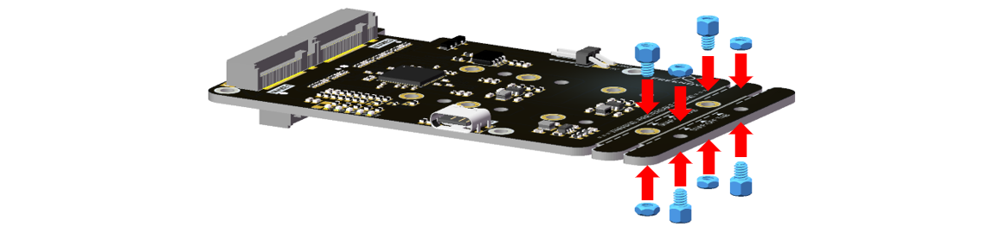
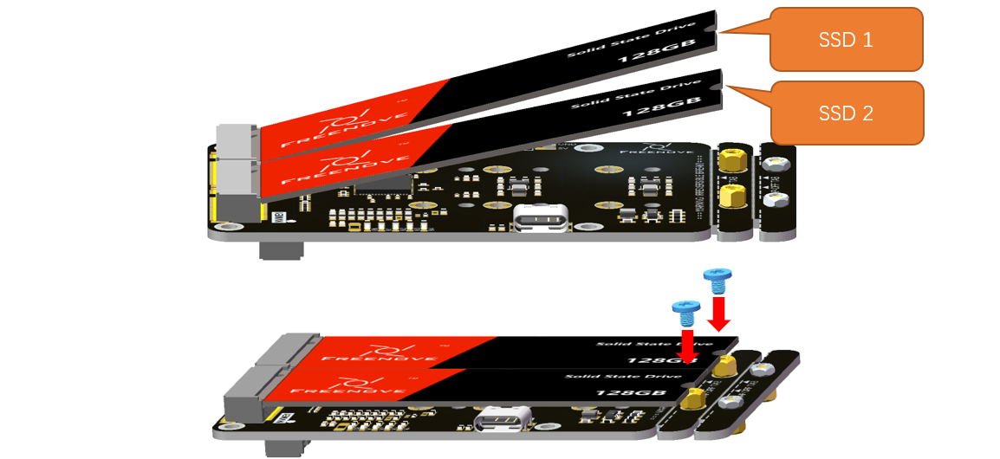
.. |Chapter02_51| image:: ../_static/imgs/2_Case_Assembly/Chapter02_51.png
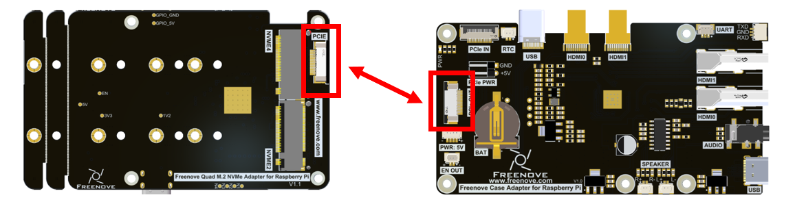
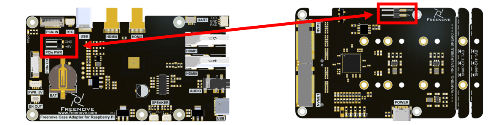
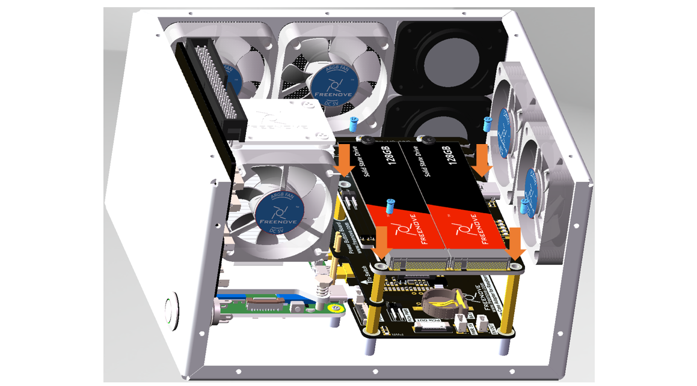

2.3 Installing Acrylic Parts and 4.3'' Touchscreen
********************************************************

2.3.1 Installing OLED's Acrylic 
===================================================

.. table::
    :align: center
    :class: table-line
    
    +-------------------------------------------------------------------------------------------------------------------------------------------------------------------------------+
    | Step 1: Mount the acrylic part for the OLED to the top of the tower cooler with M2.5x5 countersunk head screws. Ensure the acrylic notch faces the GPIO Board.                |
    |                                                                                                                                                                               |
    | |Chapter02_55|                                                                                                                                                                |
    +-------------------------------------------------------------------------------------------------------------------------------------------------------------------------------+
    | Step 2: Remove the white film from the 3M adhesive on the back of the OLED, align it with the center of the four screw holes, and press it into place.                        |
    |                                                                                                                                                                               |
    | |Chapter02_56|                                                                                                                                                                |
    |                                                                                                                                                                               |
    | :red:`Note: The glass on the 0.96-inch OLED display is fragile. Ensure it is properly aligned before applying. Repeated attachment and removal may cause the glass to crack.` |
    +-------------------------------------------------------------------------------------------------------------------------------------------------------------------------------+

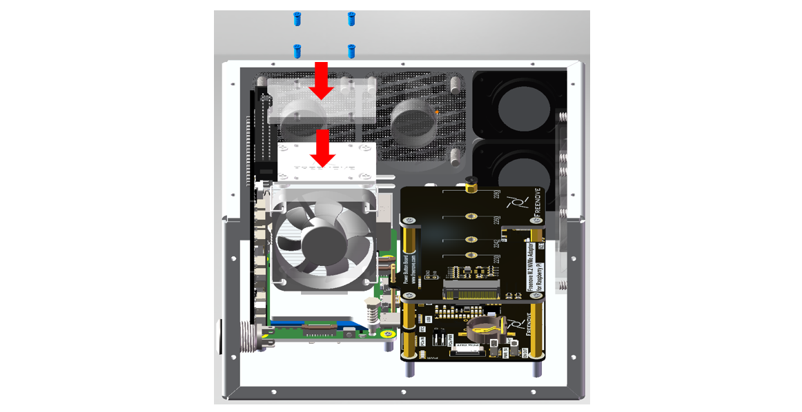
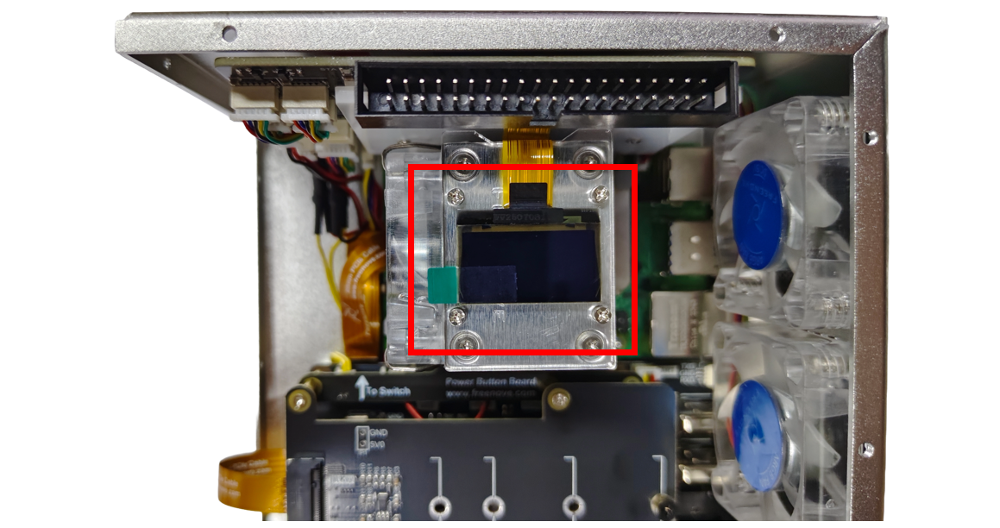

2.3.2 Installing Case Acrylic
====================================================

* **For models without a 4.3-inch Screen (Model numbers: FNK0107A/B/C/H/K/L):**

    If you have purchased one of the models listed above, your kit does not include a 4.3-inch Screen. To view the installation details for the corresponding acrylic case, please click here: :ref:`Installation without Screen <fnk0107/codes/tutorial/2_case_assembly:installation without screen>`

* **For models equipped with a 4.3-inch Screen (Model numbers: FNK0107P\Q\R\U\V\W):**

    If you have purchased one of the models listed above, your kit includes a 4.3-inch Screen and two sets of acrylic case parts with different structures, supporting both landscape and portrait orientations. Please choose your preferred installation method: :ref:`Landscape Mounting <fnk0107/codes/tutorial/2_case_assembly:landscape mounting>` or :ref:`Portrait Mounting <fnk0107/codes/tutorial/2_case_assembly:portrait mounting>`.

Installation without Screen
------------------------------------------

.. table::
    :align: center
    :class: table-line
    
    +----------------------------------------------------------------------------------------------------------------------------------------------------------------------------------------------------------------------------------------------------+
    | Step 1: Align the top acrylic platel with the GPIO headers, and secure it using M2.5x5 countersunk head screws.                                                                                                                                    |
    |                                                                                                                                                                                                                                                    |
    | |Chapter02_57|                                                                                                                                                                                                                                     |
    |                                                                                                                                                                                                                                                    |
    | Note: Owing to the machining precision limitations of sheet metal parts, if you notice that certain screw holes do not align properly, this is not an indication of an error. In such cases, you can apply force to bend and align them as needed. |
    |                                                                                                                                                                                                                                                    |
    | |Chapter02_58|                                                                                                                                                                                                                                     |
    +----------------------------------------------------------------------------------------------------------------------------------------------------------------------------------------------------------------------------------------------------+
    | Step 2: Secure the side acylic plate with M2.5x5 countersunk head screws.                                                                                                                                                                          |
    |                                                                                                                                                                                                                                                    |
    | |Chapter02_59|                                                                                                                                                                                                                                     |
    +----------------------------------------------------------------------------------------------------------------------------------------------------------------------------------------------------------------------------------------------------+
    | Now you have finished assembling the case without the touchscreen.                                                                                                                                                                                 |
    |                                                                                                                                                                                                                                                    |
    | |Chapter02_60|                                                                                                                                                                                                                                     |
    +----------------------------------------------------------------------------------------------------------------------------------------------------------------------------------------------------------------------------------------------------+

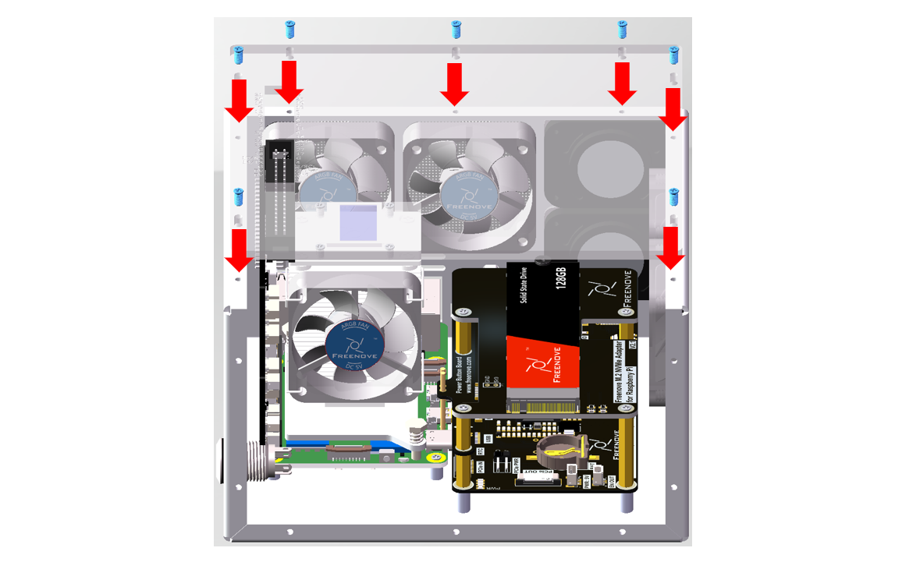

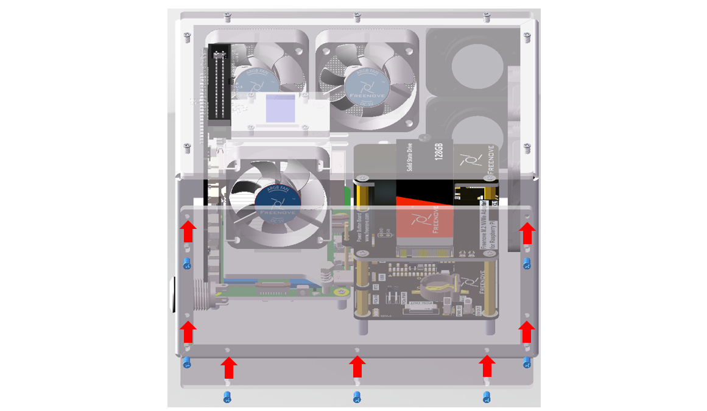
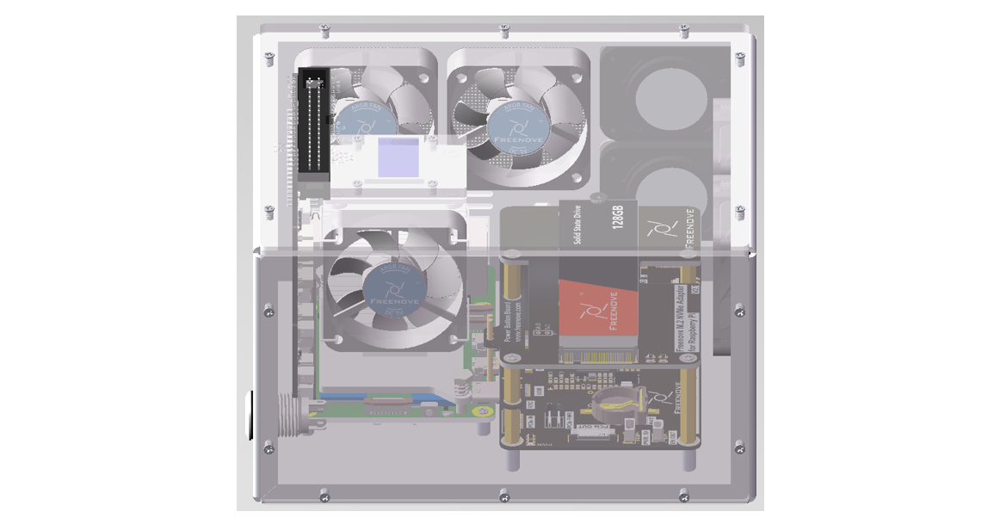

Landscape Mounting
----------------------------------

.. table::
    :align: center
    :class: table-line
    
    +----------------------------------------------------------------------------------------------------------------------------------------------------------------------------------------------------------------------------------------------------+
    | Step 1: Secure the **landscape display bracket** to the back of the 4.3-inch display using M2.5x5 countersunk head screws. The fixing holes are the **inner set of holes** on the bracket.                                                         |
    |                                                                                                                                                                                                                                                    |
    | |Chapter02_61|                                                                                                                                                                                                                                     |
    +----------------------------------------------------------------------------------------------------------------------------------------------------------------------------------------------------------------------------------------------------+
    | Step 2: Secure the M2.5x9 brass standoff to the landscape display bracket using M2.5x5 countersunk head screwS. Use the **outer set of holes** on the bracket.                                                                                     |
    |                                                                                                                                                                                                                                                    |
    | |Chapter02_62|                                                                                                                                                                                                                                     |
    +----------------------------------------------------------------------------------------------------------------------------------------------------------------------------------------------------------------------------------------------------+
    | Step 3: Align the pre-assembled 4.3-inch screen with the mounting holes on the top acrylic plate, and secure it using M2.5x5 countersunk head screws.                                                                                              |
    |                                                                                                                                                                                                                                                    |
    | |Chapter02_63|                                                                                                                                                                                                                                     |
    +----------------------------------------------------------------------------------------------------------------------------------------------------------------------------------------------------------------------------------------------------+
    | Step 4: Connect the other end of the 160mm DSI FPC cable to the connector on the back of the 4.3-inch screen, :red:`ensuring the contacts are facing inward toward the display.`                                                                   |
    |                                                                                                                                                                                                                                                    |
    | |Chapter02_64|                                                                                                                                                                                                                                     |
    +----------------------------------------------------------------------------------------------------------------------------------------------------------------------------------------------------------------------------------------------------+
    | Step 5: Align the top acrylic platel with the GPIO headers, and secure it using M2.5x5 countersunk head screws.                                                                                                                                    |
    |                                                                                                                                                                                                                                                    |
    | |Chapter02_65|                                                                                                                                                                                                                                     |
    |                                                                                                                                                                                                                                                    |
    | Note: Owing to the machining precision limitations of sheet metal parts, if you notice that certain screw holes do not align properly, this is not an indication of an error. In such cases, you can apply force to bend and align them as needed. |
    |                                                                                                                                                                                                                                                    |
    | |Chapter02_66|                                                                                                                                                                                                                                     |
    +----------------------------------------------------------------------------------------------------------------------------------------------------------------------------------------------------------------------------------------------------+
    | Step 6: Secure the side acylic plate with M2.5x5 countersunk head screws.                                                                                                                                                                          |
    |                                                                                                                                                                                                                                                    |
    | |Chapter02_67|                                                                                                                                                                                                                                     |
    +----------------------------------------------------------------------------------------------------------------------------------------------------------------------------------------------------------------------------------------------------+
    | Now, you have finished assembling the case with a lanscape-oriented display.                                                                                                                                                                       |
    |                                                                                                                                                                                                                                                    |
    | |Chapter02_68|                                                                                                                                                                                                                                     |
    +----------------------------------------------------------------------------------------------------------------------------------------------------------------------------------------------------------------------------------------------------+

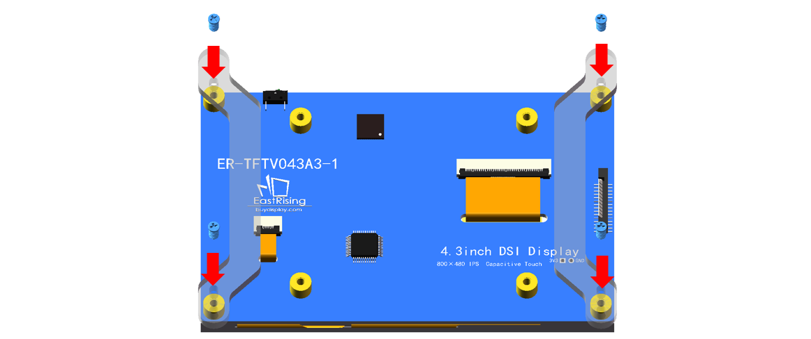
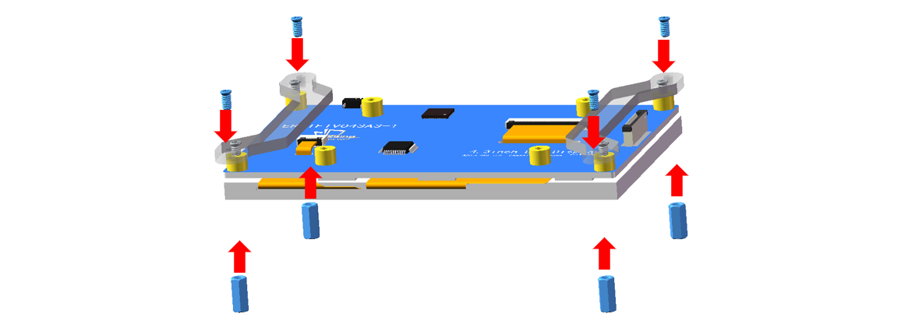
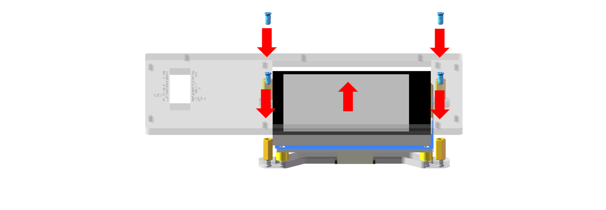
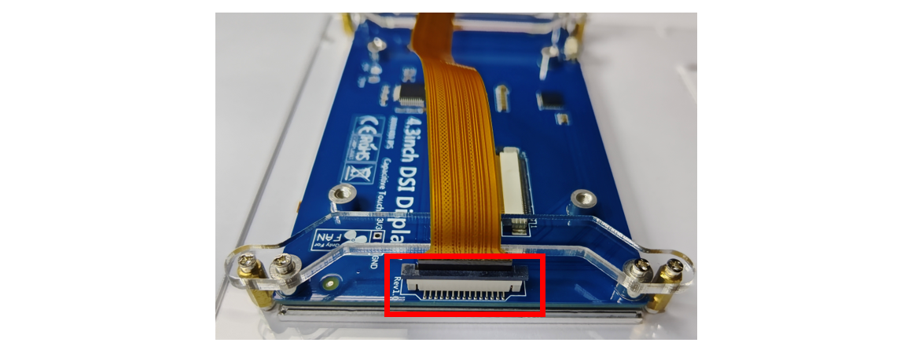
.. |Chapter02_65| image:: ../_static/imgs/2_Case_Assembly/Chapter02_65.png

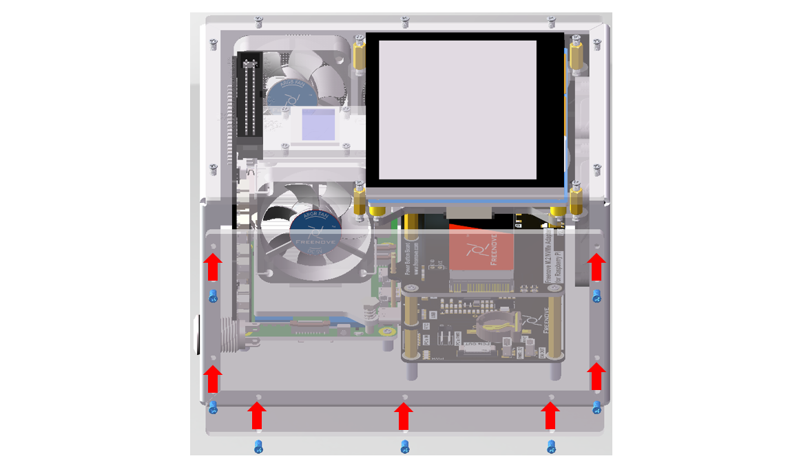
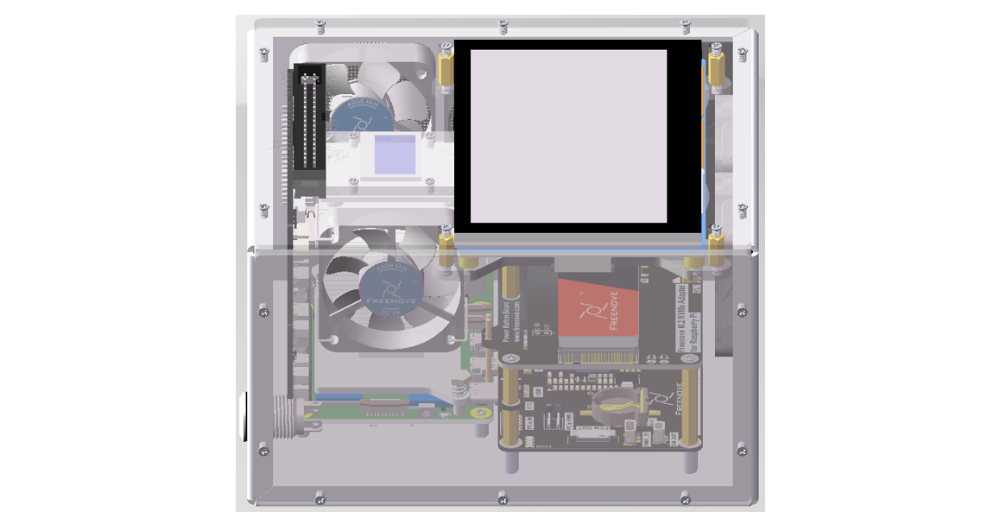

Portrait Mounting
--------------------------------------

.. table::
    :align: center
    :class: table-line
    
    +----------------------------------------------------------------------------------------------------------------------------------------------------------------------------------------------------------------------------------------------------+
    | Step 1: Align the top acrylic platel with the GPIO headers, and secure it using M2.5x5 countersunk head screws.                                                                                                                                    |
    |                                                                                                                                                                                                                                                    |
    | |Chapter02_69|                                                                                                                                                                                                                                     |
    |                                                                                                                                                                                                                                                    |
    | Note: Owing to the machining precision limitations of sheet metal parts, if you notice that certain screw holes do not align properly, this is not an indication of an error. In such cases, you can apply force to bend and align them as needed. |
    |                                                                                                                                                                                                                                                    |
    | |Chapter02_70|                                                                                                                                                                                                                                     |
    +----------------------------------------------------------------------------------------------------------------------------------------------------------------------------------------------------------------------------------------------------+
    | Step 2: Secure the portrait display bracket to the back of the 4.3-inch display using M2.5x5 countersunk head screws. The fixing holes are the inner set of holes on the bracket.                                                                  |
    |                                                                                                                                                                                                                                                    |
    | |Chapter02_71|                                                                                                                                                                                                                                     |
    +----------------------------------------------------------------------------------------------------------------------------------------------------------------------------------------------------------------------------------------------------+
    | Step 3: Secure the M2.5x9 brass standoff to the portrait display bracket using M2.5x5 countersunk head screws. Use the outer set of holes on the bracket.                                                                                          |
    |                                                                                                                                                                                                                                                    |
    | |Chapter02_72|                                                                                                                                                                                                                                     |
    +----------------------------------------------------------------------------------------------------------------------------------------------------------------------------------------------------------------------------------------------------+
    | Step 4: Align the pre-assembled 4.3-inch screen with the mounting holes on the top acrylic plate, and secure it using M2.5x5 countersunk head screws.                                                                                              |
    |                                                                                                                                                                                                                                                    |
    | |Chapter02_73|                                                                                                                                                                                                                                     |
    +----------------------------------------------------------------------------------------------------------------------------------------------------------------------------------------------------------------------------------------------------+
    | Step 5: Connect the other end of the 160mm DSI FPC cable to the connector on the back of the 4.3-inch screen, ensuring the contacts are facing inward toward the display.                                                                          |
    |                                                                                                                                                                                                                                                    |
    | |Chapter02_74|                                                                                                                                                                                                                                     |
    +----------------------------------------------------------------------------------------------------------------------------------------------------------------------------------------------------------------------------------------------------+
    | Step 6: Secure the side acylic plate with M2.5x5 countersunk head screws.                                                                                                                                                                          |
    |                                                                                                                                                                                                                                                    |
    | |Chapter02_75|                                                                                                                                                                                                                                     |
    +----------------------------------------------------------------------------------------------------------------------------------------------------------------------------------------------------------------------------------------------------+
    | Now, you have finished assembling the case with a portriat-oriented display                                                                                                                                                                        |
    |                                                                                                                                                                                                                                                    |
    | |Chapter02_76|                                                                                                                                                                                                                                     |
    +----------------------------------------------------------------------------------------------------------------------------------------------------------------------------------------------------------------------------------------------------+

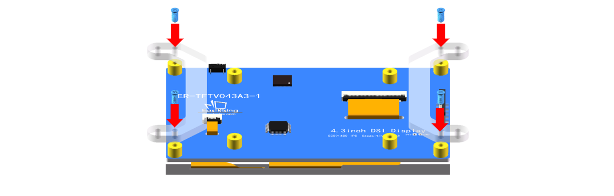
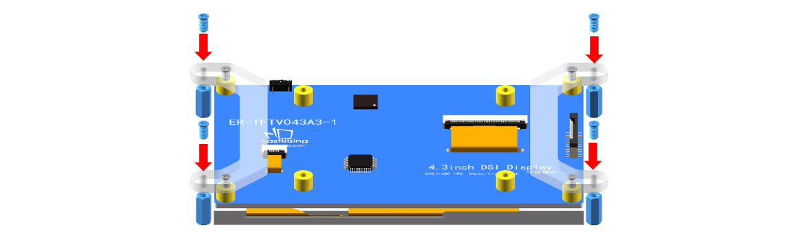
.. |Chapter02_73| image:: ../_static/imgs/2_Case_Assembly/Chapter02_73.png
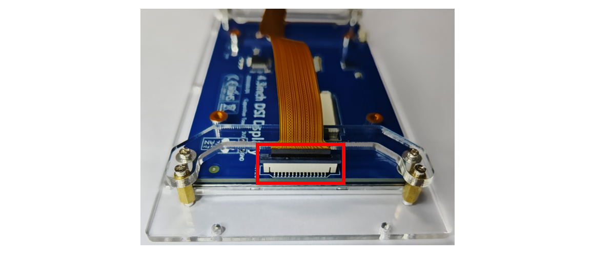
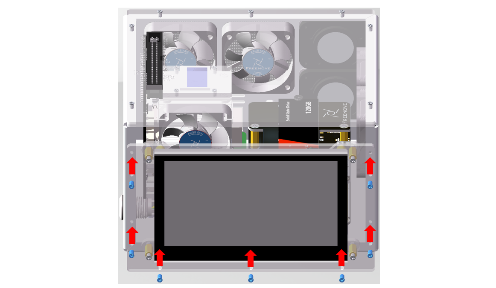
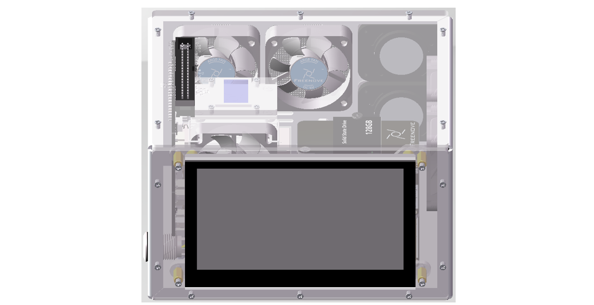

2.3.3 Attaching Non-Slip Foot Pad
===========================================

.. table::
    :align: center
    :class: table-line
    
    +-------------------------------------------------------------------------------------------------------------------------------------------------+
    | Peel off the white backing from the 3M adhesive on the black non-slip feet and apply one to each of the four corners on the bottom of the case. |
    |                                                                                                                                                 |
    | |Chapter02_77|                                                                                                                                  |
    +-------------------------------------------------------------------------------------------------------------------------------------------------+

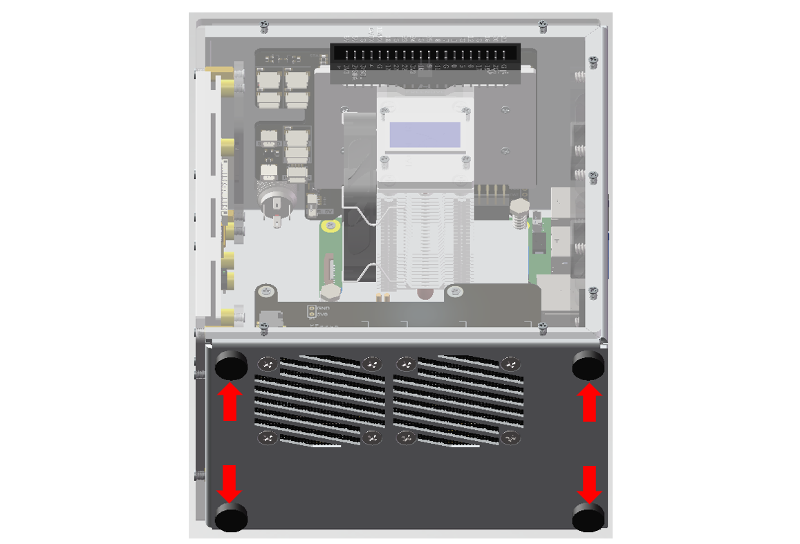