##############################################################################
Chapter 3 Installing Raspberry Pi OS
##############################################################################

After the assembly is complete, we will start installing the system for the Raspberry Pi. Regardless of whether you want to install the system on the NVMe SSD or not, you need to install the system on an SD card or USB flash drive first.

**Analysis**

1.	First of all, make sure you can enter the Raspberry Pi OS via SD card or U drive.

2.	After booting the Raspberry Pi, you can use it to flash the OS image directly onto the NVMe SSD. Alternatively, you can purchase an NVMe SSD to USB adapter and flash the image using USB on Windows or macOS, much like you would for an SD card or USB drive.

3.	With this analysis in mind, we can systematically carry out the necessary steps.

Raspberry Pi models manufactured at different times might not boot up in the same way as described, but that's okay; just follow our guide to proceed.

There are various ways to burn the Raspberry Pi OS to SSD, each requiring different hardware tools.

.. table::
    :align: center
    :class: table-line
    
    +------+------------------------------------------------------------------------------------------------------------------------------------------------------------------------+-------------------------------------------------------------+
    | Ways | Ways of burning                                                                                                                                                        | Requirements                                                |
    +------+------------------------------------------------------------------------------------------------------------------------------------------------------------------------+-------------------------------------------------------------+
    | 1    | Use Raspberry Pi to burn the OS. This requires that you can successfully boot up the Raspberry Pi via SD card or U disk. (**Recommended, described in this tutorial**) | An SD card or a U disk that can access the Raspberry Pi OS. |
    +------+------------------------------------------------------------------------------------------------------------------------------------------------------------------------+-------------------------------------------------------------+
    | 2    | Purchase an NVMe SSD to USB adapter and flash the image just like you would with an SD card or USB drive.                                                              | NVME SSD to USB adapter (need to be bought separately)      |
    +------+------------------------------------------------------------------------------------------------------------------------------------------------------------------------+-------------------------------------------------------------+
    | 3    | If there are spare M.2 NVME interface on the motherboard of your PC, you can insert the SSD to it to flash the OS.                                                     | PC with M.2 NVME interface                                  |
    +------+------------------------------------------------------------------------------------------------------------------------------------------------------------------------+-------------------------------------------------------------+

**Caution: Incompatible SSDs**

The recognition and read/write operations of the NVMe SSD are handled by the drivers of the Raspberry Pi 5. If you find that your SSD cannot be recognized by Pi 5 or is not readable/writable, please try to find a driver suitable for your SSD and install it on the Raspberry Pi, or replace the SSD, or purchase the adapter kit that comes with the SSD.

3.1 Flashing OS to SD Card or USB Drive
*****************************************************

Based on the analysis above, our first step should be to install the Raspberry Pi operating system onto an SD card or USB drive, with a capacity of at least 16GB. If you are already able to boot the Raspberry Pi using an SD card or USB drive, you can :ref:`skip this section and move on to the next section. <fnk0107/codes/tutorial/3_installing_raspberry_pi_os:3.2 flashing os to nvme ssd>`

3.1.1 Component List
===============================

Required Components
--------------------------------

.. table::
    :align: center
    :class: table-line
    
    +----------------------+---------------------------------------------------------------------------------------------------------------------+
    | Raspberry Pi 5 x 1   | One 27W power adapter (:red:`or a power adapter compatible with Raspberry Pi official one that can output 5.1V/5A`) |
    |                      |                                                                                                                     |
    | |Chapter03_00|       | |Chapter03_01|                                                                                                      |
    +----------------------+---------------------------------------------------------------------------------------------------------------------+
    | Micro SD Card(TF Card)x1, Card Reader x1                                                                                                   |
    |                                                                                                                                            |
    | |Chapter03_02|                                                                                                                             |
    +--------------------------------------------------------------------------------------------------------------------------------------------+

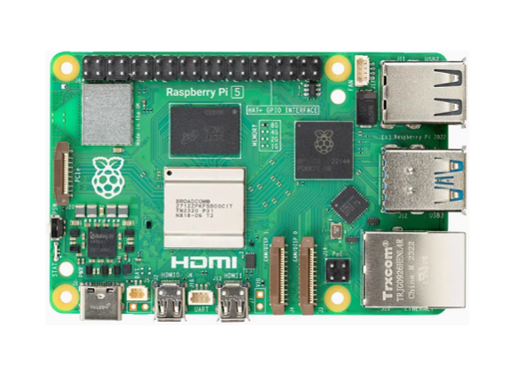

3.1.2 Raspberry Pi OS
===============================

**Without Screen - Use Raspberry Pi - under Windows PC**

.. raw:: html

    <iframe style="display: block; margin: 0 auto;" height="421.875" width="750" src="https://www.youtube.com/embed/XpiT_ezb_7c" frameborder="0" allowfullscreen></iframe>

**With Screen - Use Raspberry Pi - under Windows PC**

.. raw:: html

    <iframe style="display: block; margin: 0 auto;" height="421.875" width="750" src="https://www.youtube.com/embed/HEywFsFrj3I" frameborder="0" allowfullscreen></iframe>

Automatically Method (Recommended)
----------------------------------------

You can follow the official method to install the system for raspberry pi via visiting link below:

https://projects.raspberrypi.org/en/projects/raspberry-pi-setting-up/2

In this way, the system will be downloaded automatically via the application. 

Manually Methed
----------------------------------------

After installing the Imager Tool in the **link above**. You can **also** download the system **manually** first. (Note: :red:`Unless necessary, it is not recommended to manually download the offline installation package.`)

Visit https://www.raspberrypi.com/software/operating-systems/  

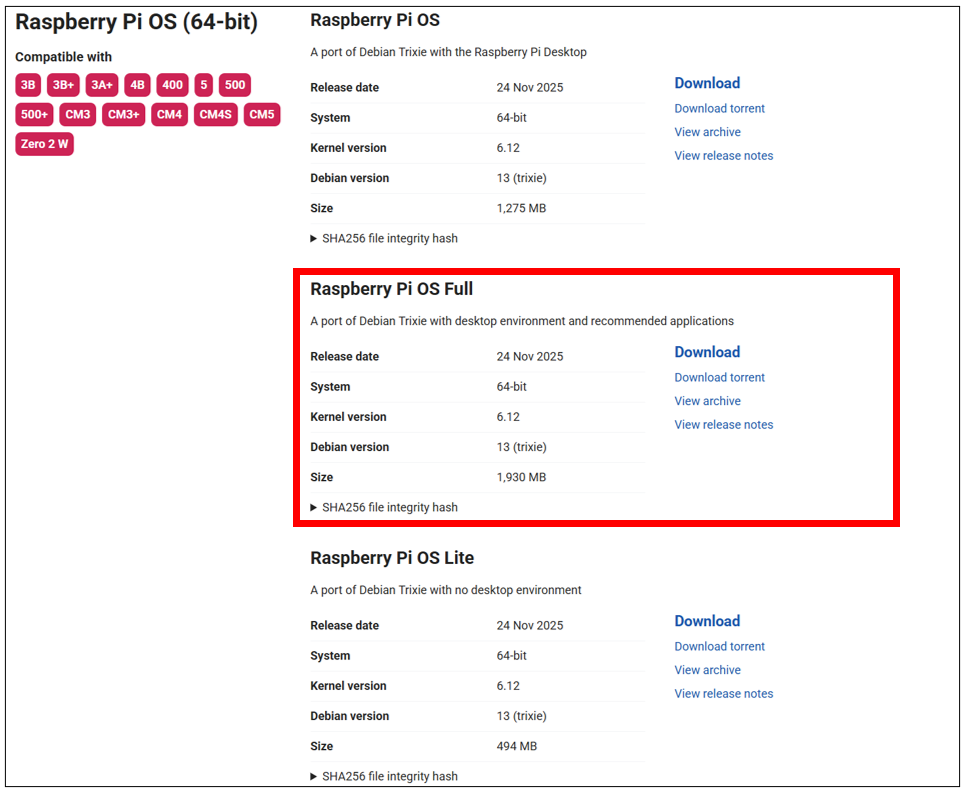

Choose Raspberry Pi Device
------------------------------------------

First, put your Micro **SD card** into card reader and connect it to USB port of PC. 

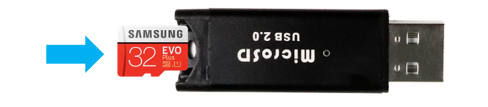

Open Raspberry Pi Imager. 

Select **Raspberry Pi 5** under Device, and then click NEXT.

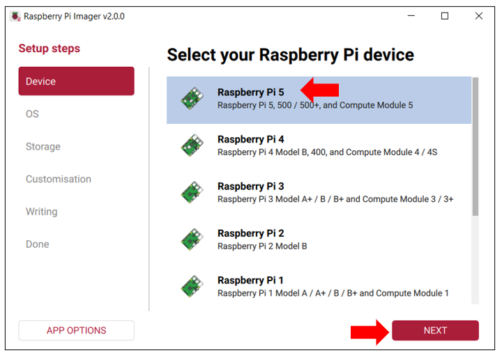

Choose Operating System
--------------------------------------

Click OS, scroll down to **locate and click Raspberry Pi OS (other)**, and then select **Raspberry Pi OS Full(64-bit)**. Click NEXT.

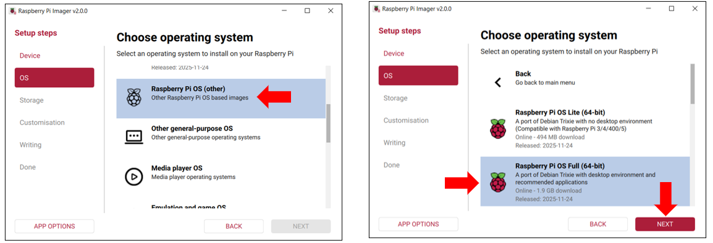

Choose Storage Devide
--------------------------------------

Choose the SD card and click on Next. 

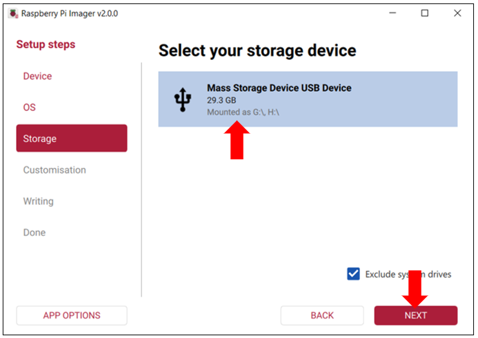

Customisation
--------------------------------------

Step 1: Input the hostname, which is **“raspberrypi”** by default. Then click NEXT.

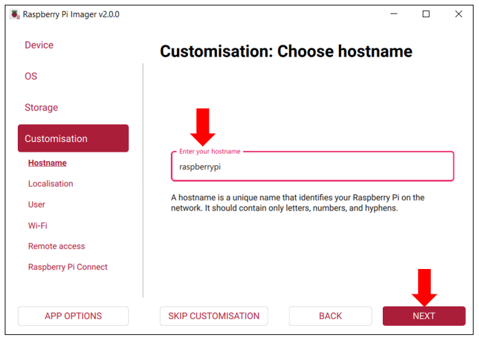

Step 2: Select your location, timezone and keyboard layout. Then click NEXT.

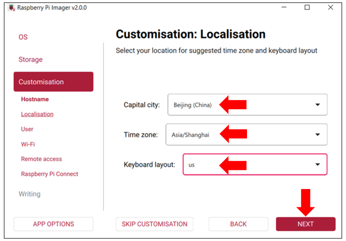

Step 3: Configure your username and passowrd. The password needs to re-enter to confirm. The default username is **pi** and the default password is **raspberry**. Then click NEXT.

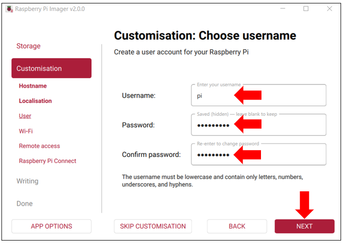

Step 4: Input the SSID and password of your wireless network. The passwords needs to re-enter to confirm. Then click NEXT.

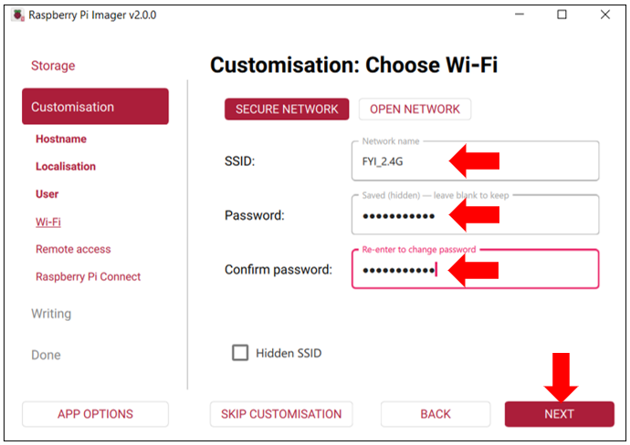

Step 5: Enable SSH for ssh remote and click NEXT.

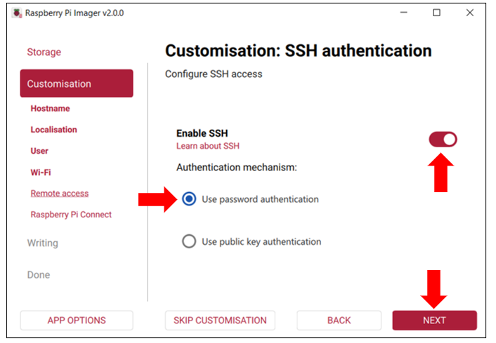

Step 6: Click NEXT.

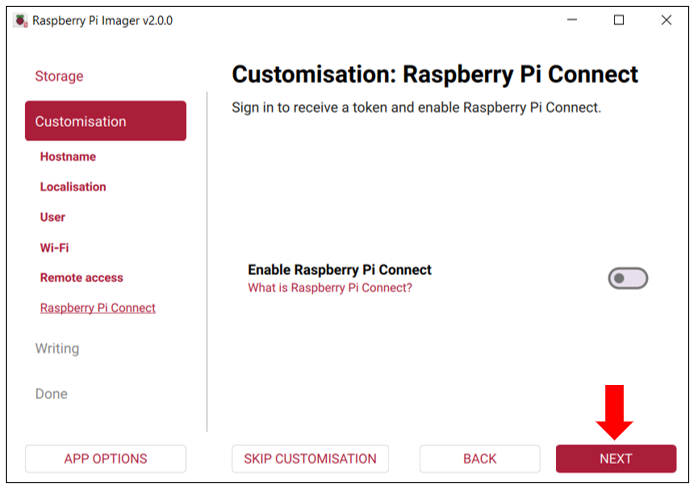

Writing System to Micro SD Card
--------------------------------------

After finishing customisation configuration, the interface will show all the configuration you have made. Click WRITE to write the OS to your SD card after confirming everything is correct.

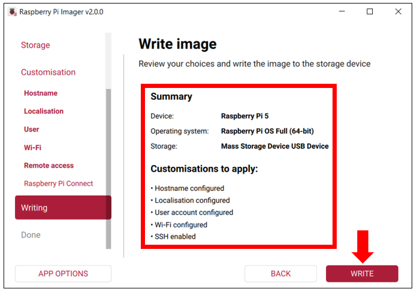

:combo:`red font-bolder:Warning: Before starting the write process, ensure you have backed up all data on the storage device. This operation will permanently erase all data on the device. If you have completed the backup, click I UNDERSTAND, ERASE AND WRITE to continue.`

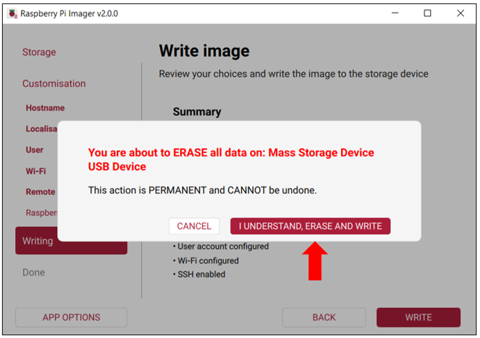

Wait for it to finish writing and verifying.

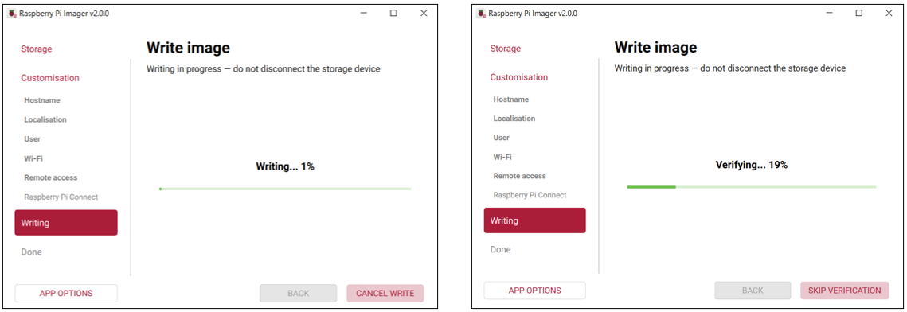

Done
--------------------------------------

Congratulations! The Raspberry Pi OS has been successfully written to the SD card. All your custom configurations have taken effect. Click FINISH to complete the process.

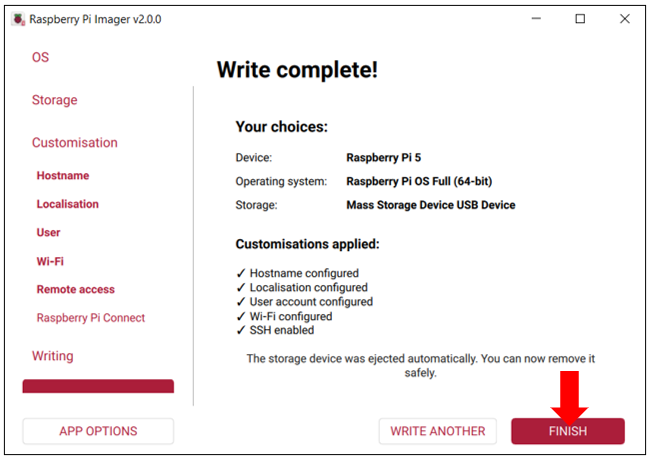

3.1.3 How to Insert and Take out SD Card
=================================================

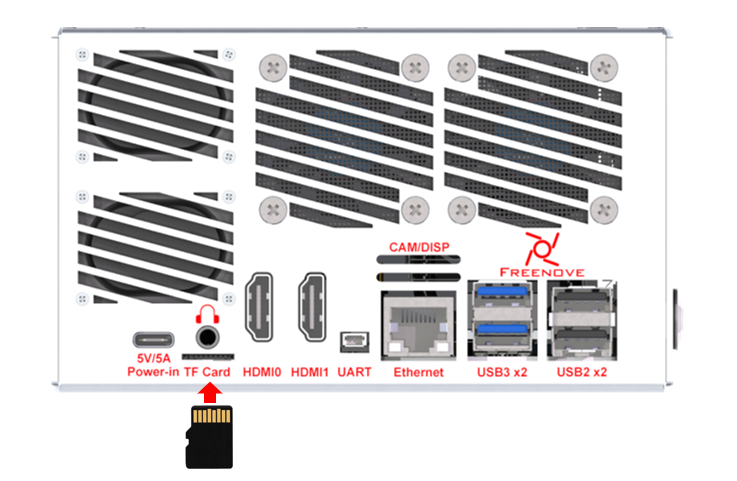

Remove the SD card with the written system from the card reader. 

Insert it into the self-ejecting TF card slot on the back of the case :red:`with the gold contacts facing up.`

Push the SD card in until you hear a click, indicating it is securely locked in place. 

To eject the SD card, press it in again until you hear a click, and the card will pop out.

If you have a display ready, please continue reading the tutorial below.

If not, please skip directly to the :ref:`Remote desktop & VNC <fnk0107/codes/tutorial/3_installing_raspberry_pi_os:3.1.6 remote desktop & vnc>` section.

3.1.4 DSI Touchscreen Desktop
=================================================

If your model is equipped with a 4.3-inch Screen (Models: **FNK0107P\Q\R\U\V\W**), after connecting the power and booting up the RPi 5, you will see the following interface. 

The system will automatically detect and enable the DSI touchscreen functionality. You can directly use your finger to tap icons, swipe through pages, and perform other operations. To change the screen orientation, you can configure it via **Preferences > Screen Configuration**.

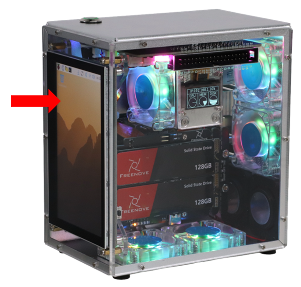

3.1.5 HDMI Monitor desktop
=================================================

Connect the Raspberry Pi 5 to your display via the HDMI interface, attach your mouse and keyboard through the USB ports, and finally, connect your power supply (making sure that it meets the specifications required by your RPi Module Version. Your RPi should start (power up). Later, after setup, you will need to enter your user name and password to login. The default user name: pi; password: raspberry. After login, you should see the following screen.

.. image:: ../_static/imgs/3_Installing_Raspberry_Pi_OS/Chapter03_20.png
    :align: center

Congratulations! You have successfully installed the RASPBERRY PI OS on your RPi.

Raspberry Pi 5 integrates a Wi-Fi adaptor. You can use it to connect to your Wi-Fi. Then you can use the wireless remote desktop to control your RPi. This will be helpful for the following work. 

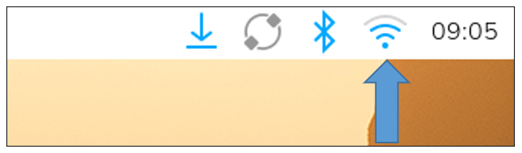

3.1.6 Remote desktop & VNC
=================================================

If you don't have a spare display, mouse and keyboard for your RPi, you can use a remote desktop to share a display, keyboard, and mouse with your PC. Below is how to use: 

:ref:`MAC OS remote desktop <fnk0107/codes/tutorial/3_installing_raspberry_pi_os:mac os remote desktop>` and :ref:`Windows OS remote desktop <fnk0107/codes/tutorial/3_installing_raspberry_pi_os:windows os remote desktop>`.

Mac OS Remote desktop
--------------------------------------

Open the terminal and type following command.

If you have set your own hostname during writing the OS, please modify it accordingly.

:red:`If this command doesn't work, please move to next page.`

.. code-block:: console
    
    ssh pi@raspberrypi.local

The password is :blue:`raspberry` by default, case sensitive.

.. image:: ../_static/imgs/3_Installing_Raspberry_Pi_OS/Chapter03_22.png
    :align: center

You may need to type **yes** during the process.

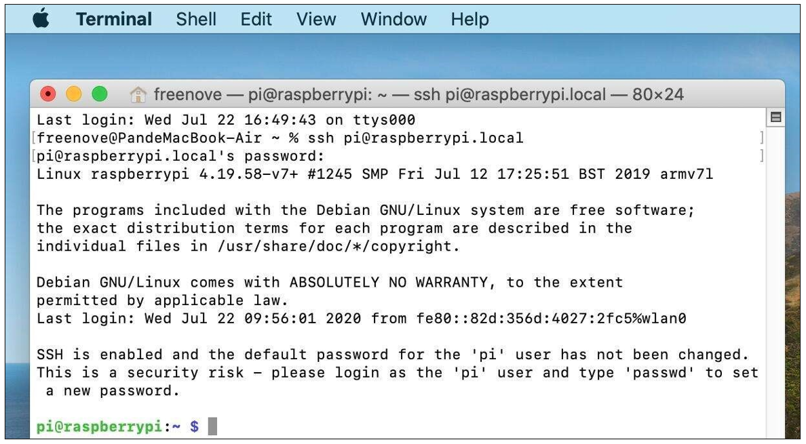

You can also use the IP address to log in Pi. 

Enter **router** client to **inquiry IP address** named “raspberry pi”. For example, I have inquired to **my RPi IP address, and it is “192.168.1.131".**

Open the terminal and type following command.

.. code-block:: console
    
    ssh pi@192.168.1.131

When you see :green:`pi@raspberrypi`:blue:`:~ $`, you have logged in Pi successfully. Then you can skip to next section.

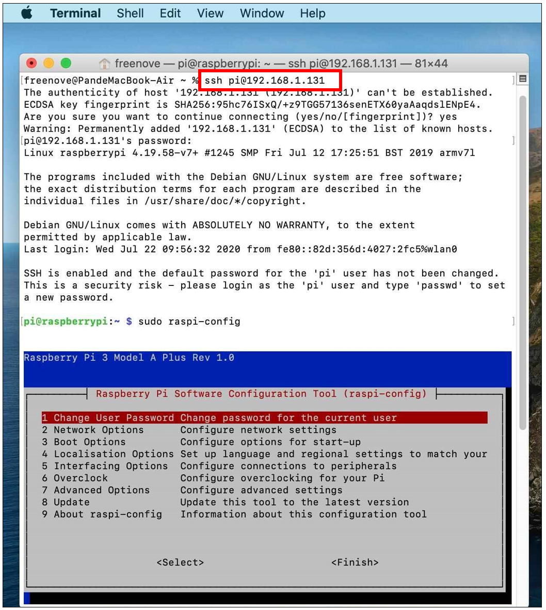

**Then you can skip to** :ref:`VNC Viewer <fnk0107/codes/tutorial/3_installing_raspberry_pi_os:3.1.7 vnc viewer & vnc>`.

Windows OS remote desktop
---------------------------------------

**If you are using win10, you can use follow way to login Raspberry Pi without desktop.**

Press **Win+R**. Enter cmd. Then use this command to check IP:

.. code-block:: console
    
    ping -4 raspberrypi.local

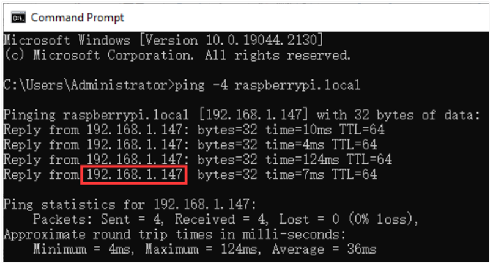

Then 192.168.1.147 is my Raspberry Pi IP.

Or enter **router** client to **inquiry IP address** named **“raspberrypi”**. For example, I have inquired to **my RPi**

**IP address, and it is “192.168.1.147".**

.. code-block:: console
    
    ssh pi@xxxxxxxxxxx(IP address)

Enter the following command:

.. code-block:: console
    
    ssh pi@192.168.1.147

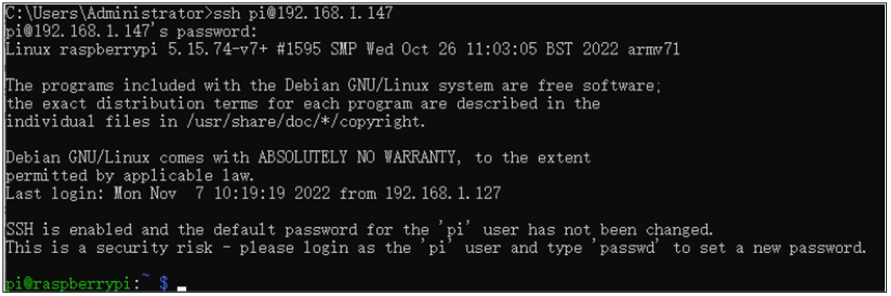

3.1.7 VNC Viewer & VNC
==================================

Enable VNC
-------------------------------

Enter the following commands: select Interface Options -> I3 VNC -> Enter -> Yes -> OK. You may need to restart the Raspberry Pi 5 here, select OK, and then open the VNC interface.

.. code-block:: console
    
    sudo raspi-config

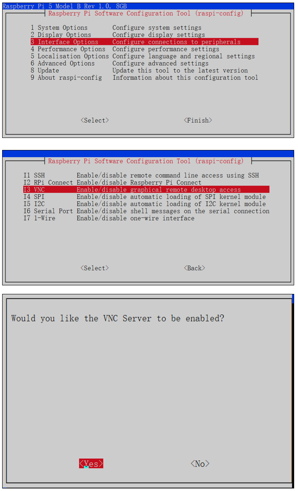

Set Resolution
-------------------------------

You can also set other resolutions. If you don't know what to set, you can set it as 800x600 first.

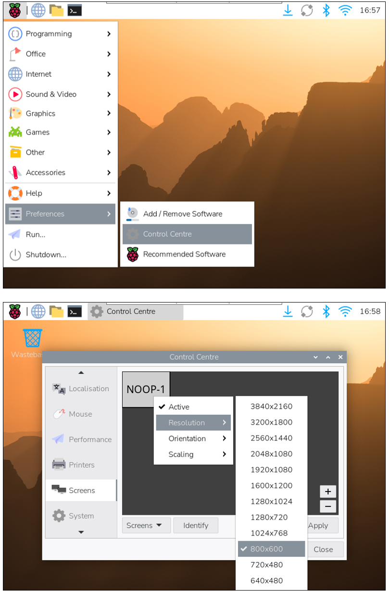

Then download and install VNC Viewer according to your computer system by click following link:

https://www.realvnc.com/en/connect/download/viewer/

After installation is completed, open VNC Viewer. And click File -> New Connection. Then the interface is shown below.

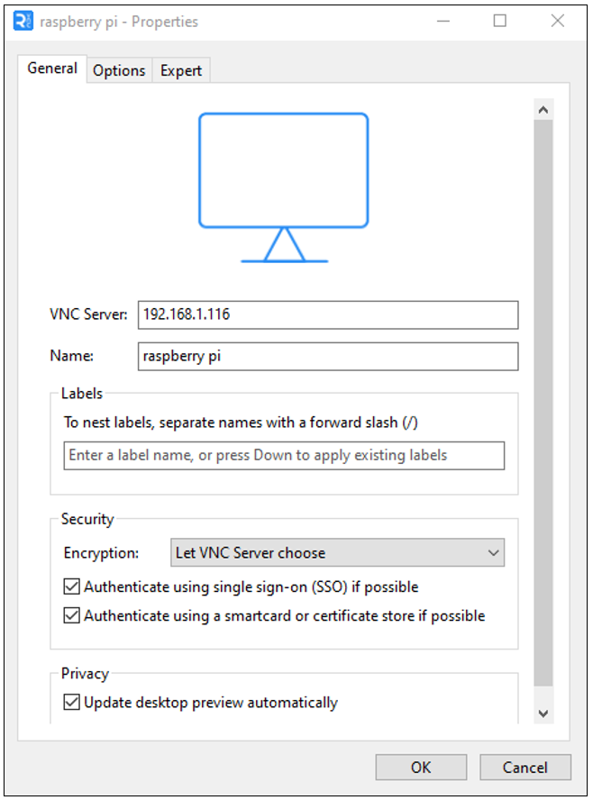

Enter ip address of your Raspberry Pi and fill in a name. Then click OK.

Then on the VNC Viewer panel, double-click new connection you just created, 

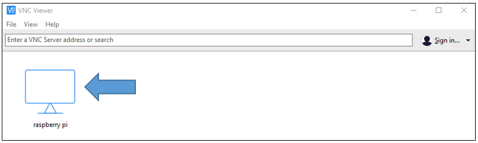

Then the following dialog box pops up.

Enter username: **pi** and Password: **raspberry**. 

If you have set your own username and password, please input them accordingly. Then click OK.

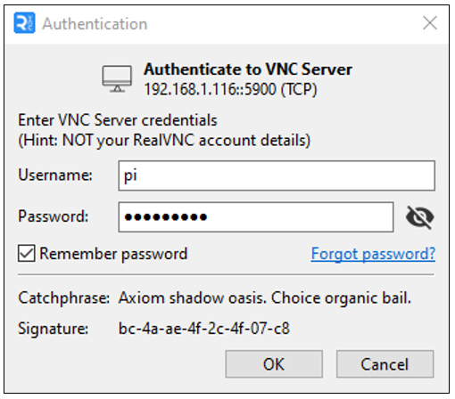

Here, you have logged in to Raspberry Pi successfully by using VNC Viewer.

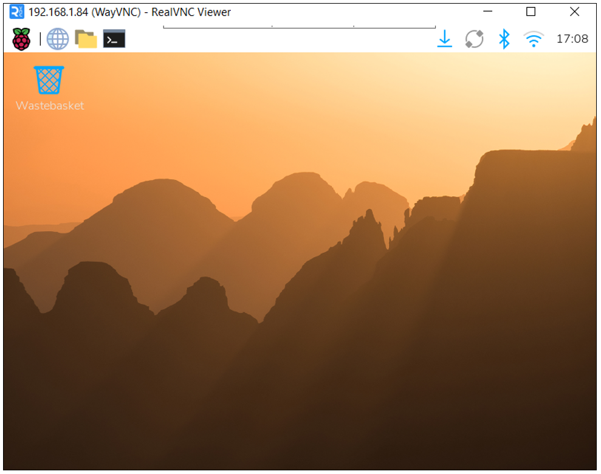

If there is black window, please :ref:`set another resolution. <fnk0107/codes/tutorial/3_installing_raspberry_pi_os:set resolution>`

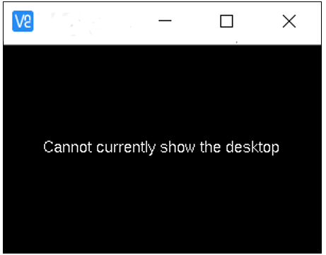

In addition, your VNC Viewer window may zoom your Raspberry Pi desktop. You can change it. On your VNC View control panel, click right key. And select Properties->Options label->Scaling. Then set proper scaling. 

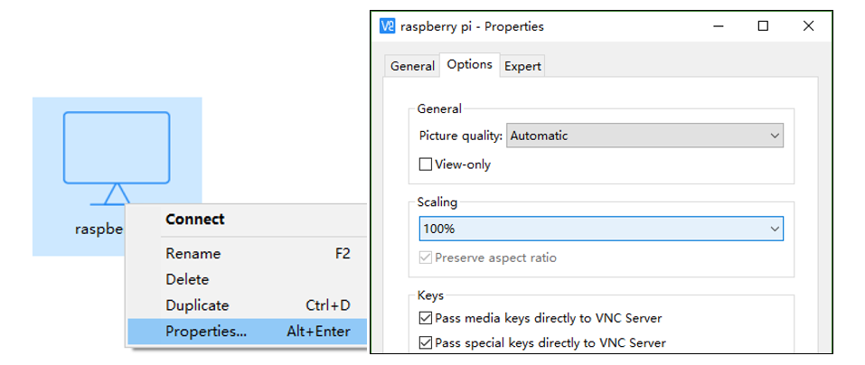

Here, you have logged in to Raspberry Pi successfully by using VNC Viewer and operated proper setting.

Raspberry Pi 5 integrates a Wi-Fi adaptor.If you did not connect Pi to WiFi. You can connect it to wirelessly control the robot.

3.2 Flashing OS to NVMe SSD
******************************************

This step is to install the Raspberry Pi OS into the NVME SSD.

If you do not use SSD or if you do not want to install the Raspberry Pi OS into the SSD, you can skip to the Chapter 4.

3.2.1 SSD Detecyion
==================================

(Note: Not all SSDs are supported by Pi5.)

**Booting the Rpi 5 from SD card**, and run the following command in the Terminal to check whether SSD is detected.

**Note that the information varies among SSDs.**

.. code-block:: console
    
    lspci

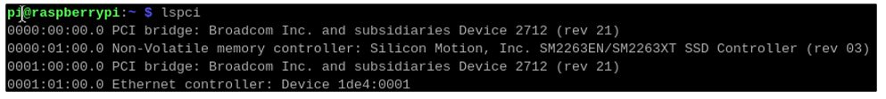

.. code-block:: console
    
    lsblk

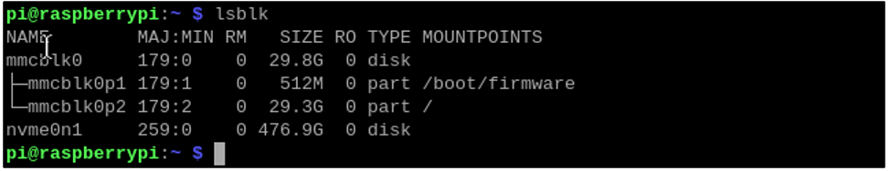

As shown in the figure above, the device 'nvme0n1' with a capacity of 476.9GBytes shows up, indicating that the SSD has been correctly recognized. The detected capacity will depend on the size of your SSD. If your drive has been previously partitioned, you may also see some partition information displayed.

**Please note: Installing the system will format the SSD, erasing all data. If necessary, please back up any data on your SSD before proceeding.**

3.2.2 Enable PCIe 3.0(on OS written into SD Card)
==========================================================

:red:`Note: This section does not apply to the Dual-NVMe Adapter Board or the Quad-NVMe Adapter Board, as they do not support the PCIe 3.0 protocol.`

If your SSD with Phison controller, you may need to enable PCIE 3.0. (This step is strongly recommended; without this step, the later process may fail.) 

If it is not with Phison controller, you do not need to enable PCIE 3.0. :ref:`You may skip this section. <fnk0107/codes/tutorial/3_installing_raspberry_pi_os:3.2.3 ssd partitioning and formatting>`

Run the command **lspci** to check the controller.

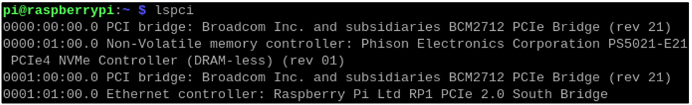

(The above screenshot is the result of a 128GB SSD with Phison as main controller.)

Enable PCIe Gen 3.0
-------------------------------

Add the line ``dtparam=pciex1_gen=3`` to /boot/firmware/config.txt to enable PCIe Gen3.0.

As shown below, enter the command to open the file.

.. code-block:: console
    
    sudo nano /boot/firmware/config.txt

Add the line ``dtparam=pciex1_gen=3`` to the end of the file, as shown below:

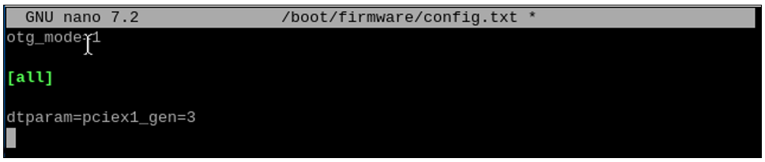

Press Ctrl-O to save the file, Enter to confirm, and Ctrl-X to exit.

Reboot your Raspberry Pi.

.. code-block:: console

    sudo reboot

3.2.3 SSD Partitioning and Formatting
================================================

**This step is not a must-do, but it can further test whether the SSD perform normally on Raspberry Pi** to ensure smooth performance in later steps.

At this point, the hard drive cannot be seen in the file manager as the disk has not been partitioned yet.

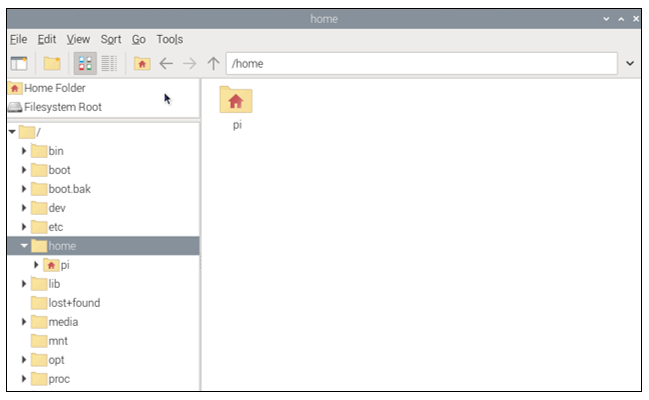

Install a disk management tool with the following command:

.. code-block:: console

    sudo apt-get install gparted

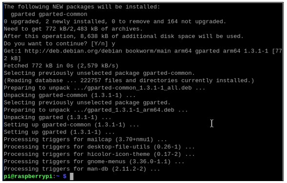

Open gparted with the command:

.. code-block:: console

    sudo gparted

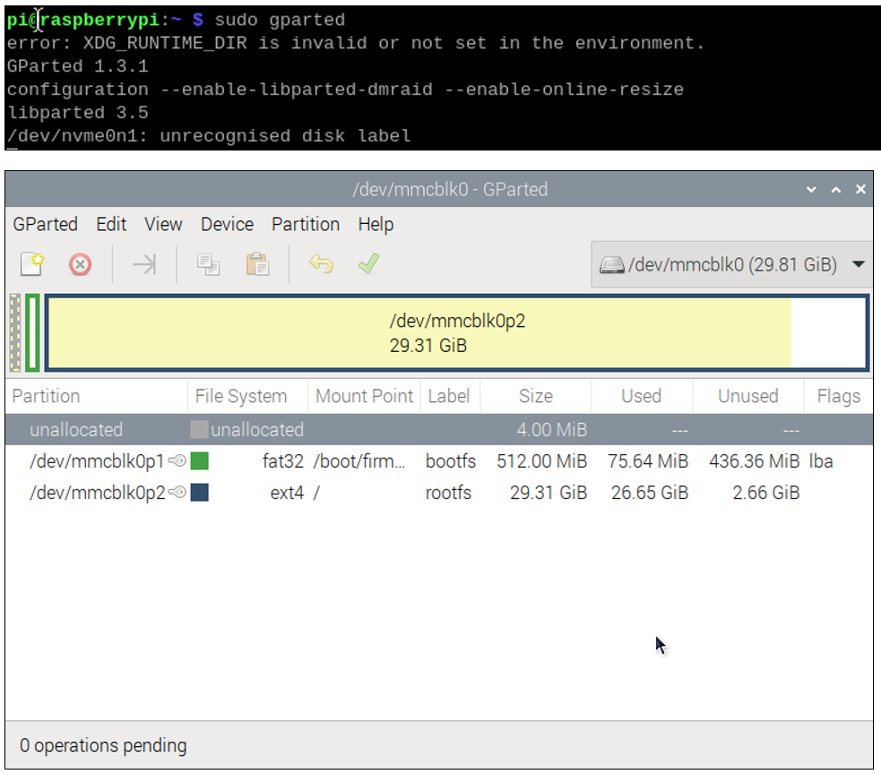

Click on the dropdown menu in the upper right corner and switch to NVME SSD.

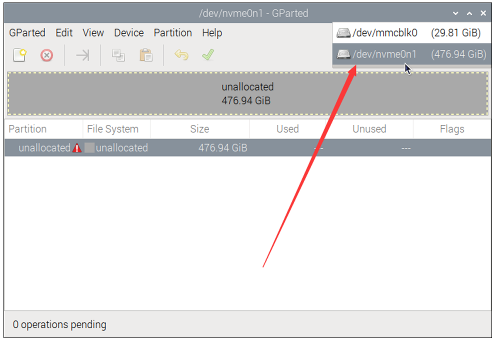

Click Device on the menu bar and select Create Partition Table.

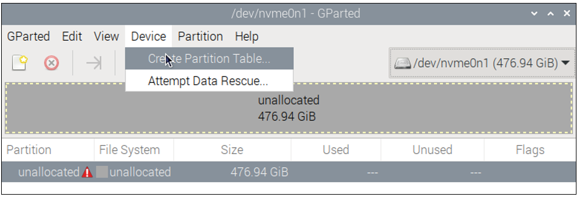

You will see the prompt that data will be erased. It is recommended to select gpt for partition table type. Click Apply.

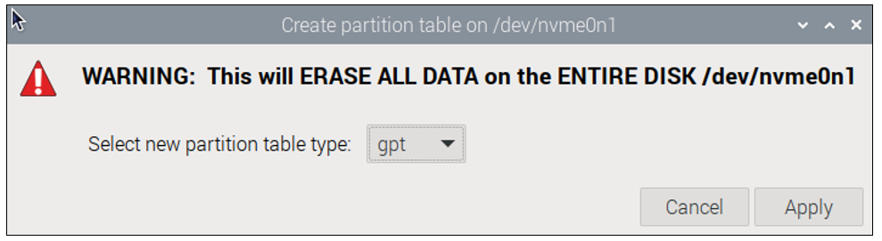

Click Partition on the menu bar, choose New.

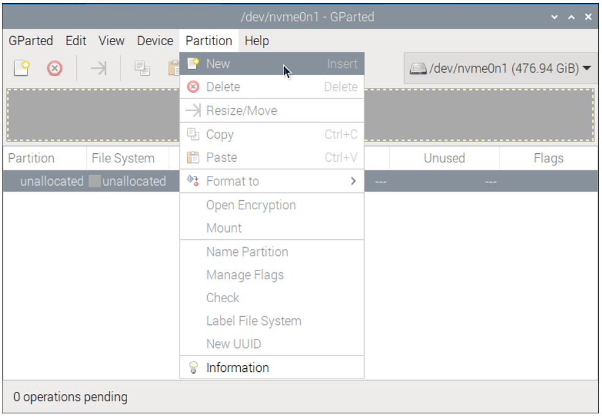

As shown in the figure below, the size of partition can be adjusted by dragging the mouse left and right, or by entering the size directly. The other options can be left as default setting. Here, we allocate all the capacity to a single partition. Click on Add.

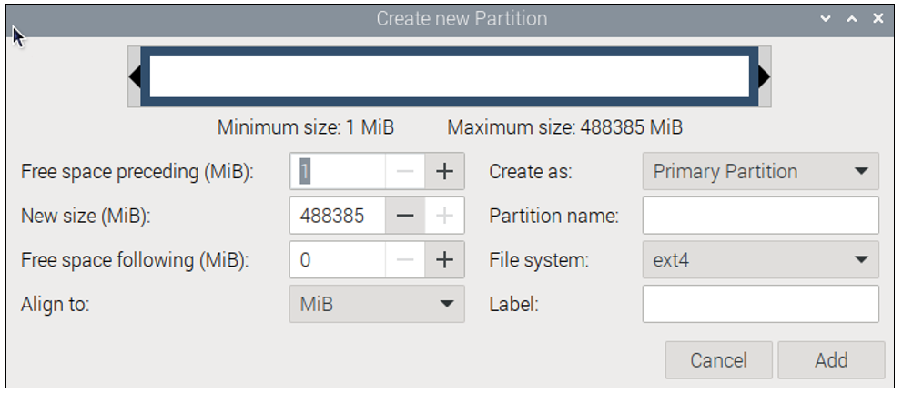

Click the check icon ✔ to save the partition just built, as illustrated below.

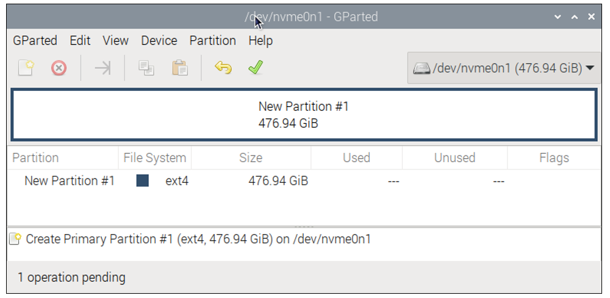

Click on Apply.

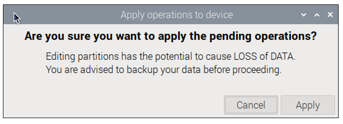

Wait for it to complete and click on Close.

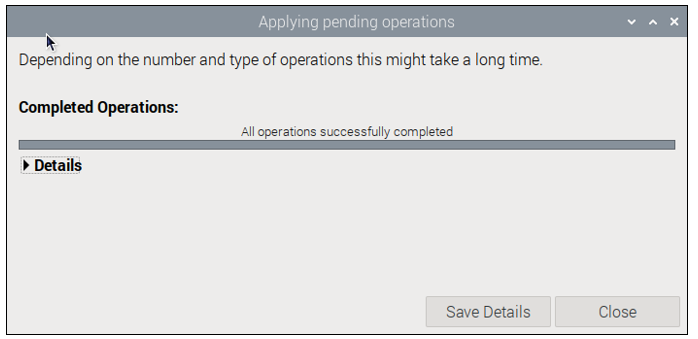

At this point, you can mount the disk using the mount command and then access the disk space through the file manager. Use the following command to mount the SSD:

.. code-block:: console

    mkdir pi
    sudo mount /dev/nvme0n1p1 /media/pi

Open the file manager, as shown below.

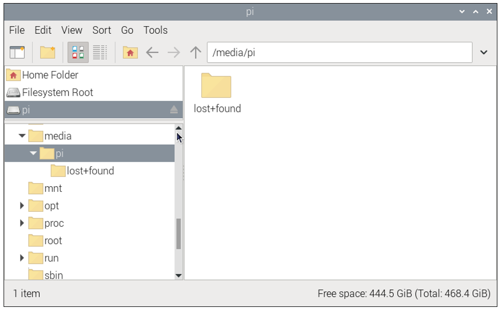

If you plan to use the SSD as a standard storage device, you can conclude the process here. However, if you want to further proceed with installing an operating system on the SSD, please read on.

3.2.4 Flashing the OS
=====================================

Install the OS to SSD with the method similar to that in the previous section on installing a system onto an SD card. This time, operate on the Raspberry Pi.

Install rpi-imager with the following command:

.. code-block:: console

    sudo apt install rpi-imager

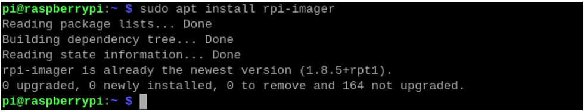

Open rpi-imager:

.. code-block:: console

    sudo rpi-imager

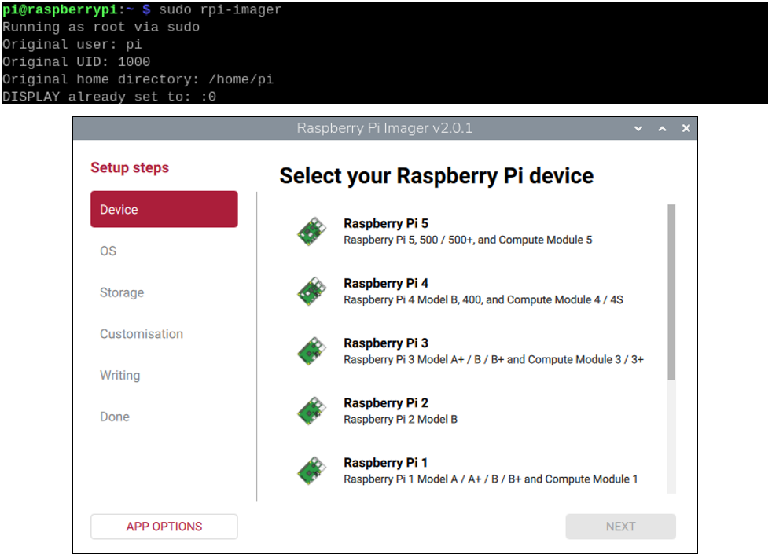

By this point, you should be quite familiar with the process.

Select the Raspberry Pi 5 as your device and choose the online download for the operating system. (It is recommended to use a 64-bit Raspberry Pi system with recommended software). Choose your NVME SSD as the storage device. Click NEXT.

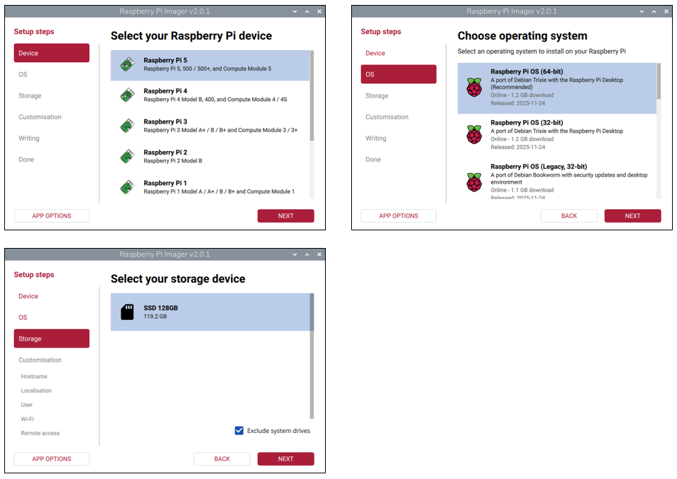

Enter the hostname.

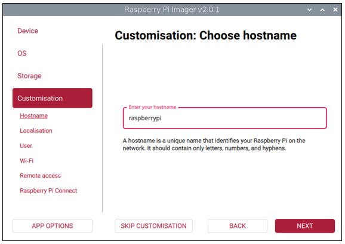

Select your location, timezone and keyboard layout. Then click NEXT.

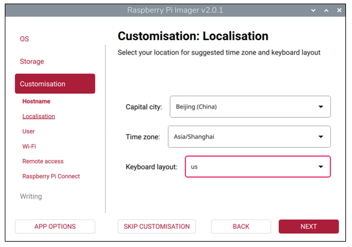

Configure your username and passowrd. The password needs to re-enter to confirm. 

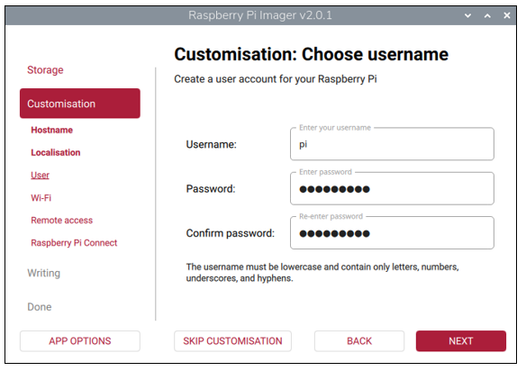

Step 4: Input the SSID and password of your wireless network. The passwords needs to re-enter to confirm. Then click NEXT.

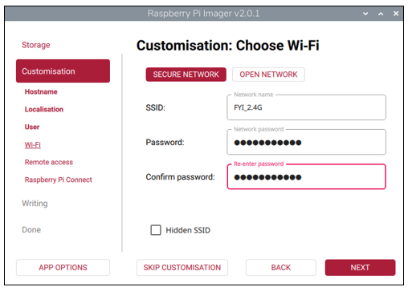

Enable SSH for ssh remote and click NEXT.

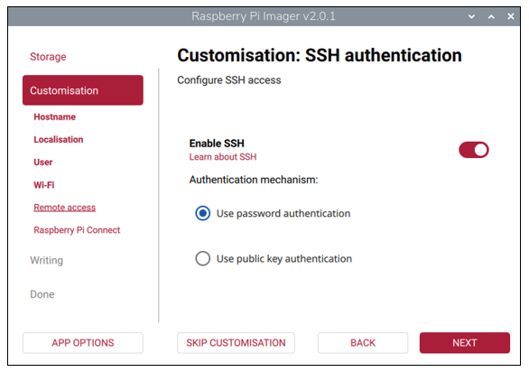

After finishing customisation configuration, the interface will show all the configuration you have made. Click WRITE to write the OS to your SD card after confirming everything is correct.

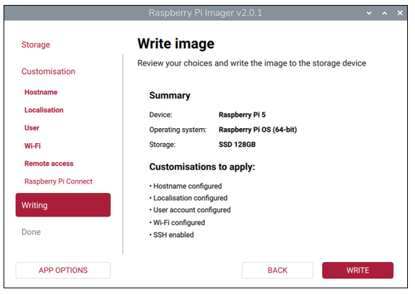

:red:`Warning: Before starting the write process, ensure you have backed up all data on the storage device. This operation will permanently erase all data on the device. If you have completed the backup, click I UNDERSTAND, ERASE AND WRITE to continue.`

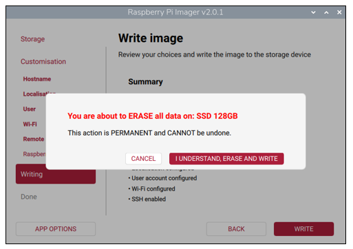

Wait for it to finish writing and verifying.

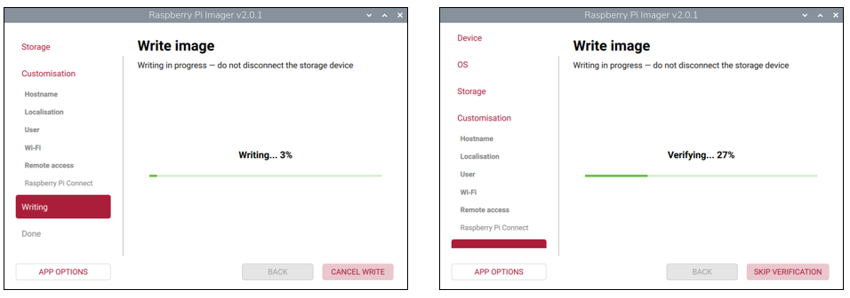

Congratulations! You have done the trickiest and the time-consuming part. Now that you have successfully installed the operating system onto the NVMe SSD, you are very close to achieving a triumph. 

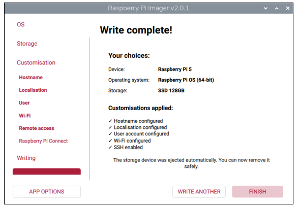

Next, boot into the system from SSD.

3.2.5 Enable PCIe 3.0 (on system written into SSD)
=========================================================

:red:`Note: This section does not apply to the Dual-NVMe Adapter Board or the Quad-NVMe Adapter Board, as they do not support the PCIe 3.0 protocol. If enabled, it may fail to boot from SSD.`

If you have confirmed that SSD is with Phison controller in :ref:`fnk0107/codes/tutorial/3_installing_raspberry_pi_os:3.2.2 enable pcie 3.0(on os written into sd card)`, then you also need to enable PCIE3.0 on the system written into SSD.

If the controller of your SSD is not from Phison, you can skip this section.

The operation is as below:

Run the command ``lsblk`` to check the partitions of the SSD with Raspberry Pi OS written, as shown below:

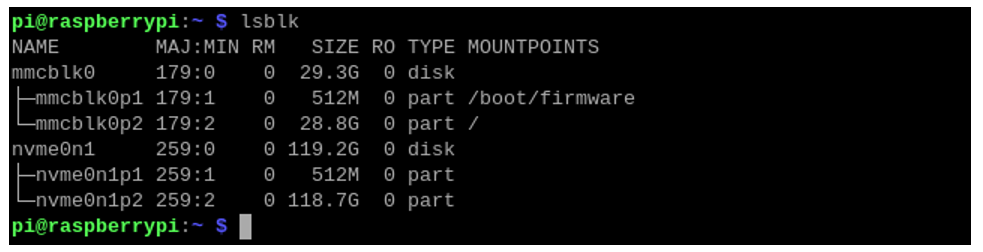

(The above screenshot is the result of a 128GB SSD with Phison as main controller.)

Run the following commands one by one to mount partition 1 of the SSD to the directory of /media/pi.

.. code-block:: console

    sudo mkdir /media/pi
    sudo mount /dev/nvme0n1p1 /media/pi

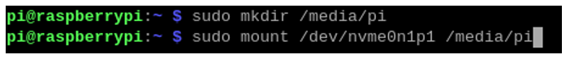

If it mounts successfully, you'll see the following disk icon on the desktop.

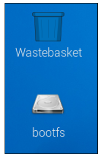

Open and modify the config.txt file with the following command.

.. code-block:: console

    sudo nano /media/pi/config.txt

Add the line ``dtparam=pciex1_gen=3`` to the end of the file, as shown below:

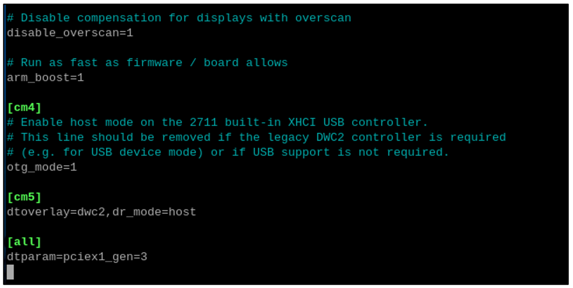

Press Ctrl-O to save the file, Enter to confirm, and Ctrl-X to exit.

3.2.6 Booting from SSD
==================================

After finishing flashing the OS to SSD, shutdown Raspberry Pi, **remove the power supply, and remove the SD card. Then connect the power, the Raspberry Pi will boot from SSD.**

The default boot order of Raspberry Pi is SD card -> SSD -> USB, Therefore, when the SD card is removed, the Raspberry Pi cannot detect the SD card, it will boot from SSD. By far, the Raspberry Pi can boot successfully from NVME SSD.

.. image:: ../_static/imgs/3_Installing_Raspberry_Pi_OS/Chapter03_70.png
    :align: center

If you want the Raspberry Pi to boot from the SSD first, please continue with the following steps to modify the boot order. The boot order is saved in the Pi’s EEPROM, so it does not matter whether you modify the boot order on SD card system or SSD system.

:ref:`If you do not want to change the boot order, please skip this chapter. <fnk0107/codes/tutorial/4_功能测试:chapter 4>`

Configuring the Boot Order
---------------------------------------

Type the following command in the Terminal.

.. code-block:: console

    sudo raspi-config

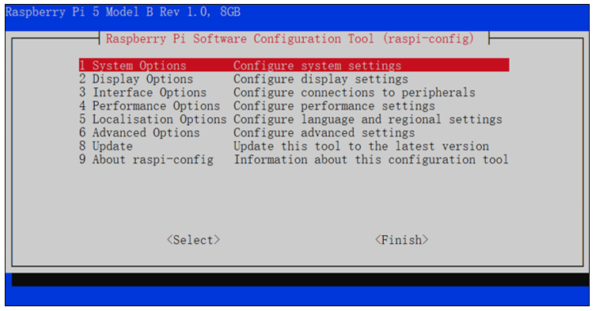

Using the keyboard's arrow keys and the Enter key, select the options in sequence.

”6 Advanced Options”  -> ”A4 Boot Order” -> ”B2 NVME/USB Boot …” 

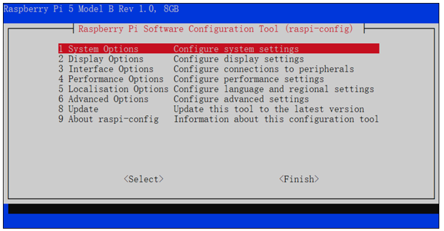

Select “OK” -> ”Finish” -> ”Yes”, and reboot your Raspberry Pi.

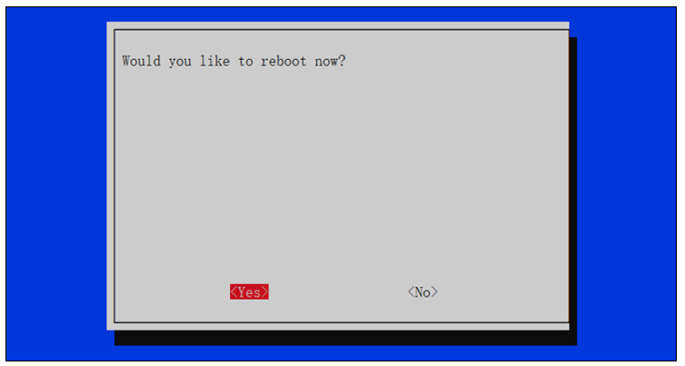

At this point, upon restarting, the Raspberry Pi will boot from the NVME SSD first. If you are using an external monitor, you will see that the Raspberry Pi has booted up correctly. If your SD card is still inserted, you will also see an icon on the desktop as shown below. 

With this, the process of booting the Raspberry Pi from the NVME SSD has been fully completed.

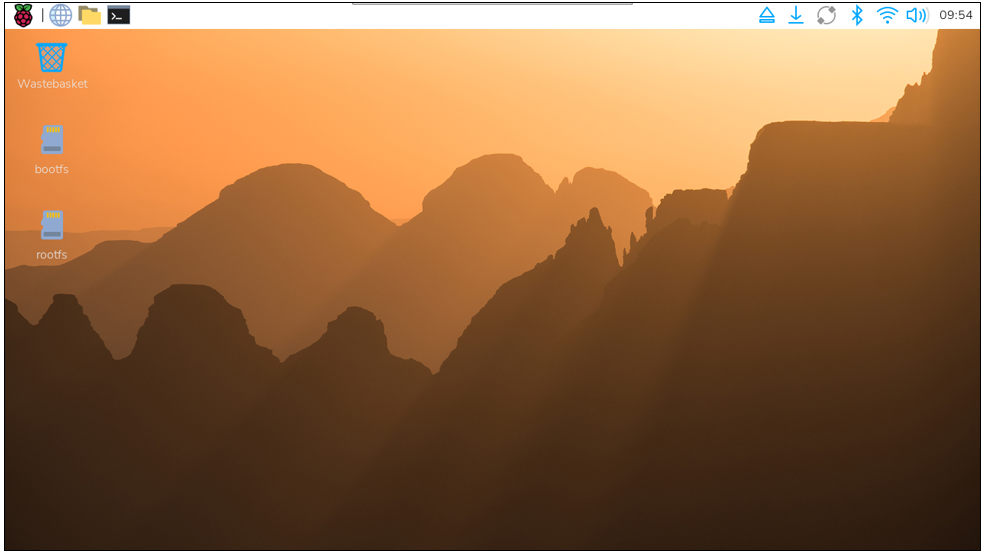

If you use VNC viewer, you will need to repeat the previous steps to activate the VNC service as it is not yet enabled in the new system on the SSD. Here, we take Windows as an example.

Run the following command:

.. code-block:: console

    ssh pi@raspberrypi.local

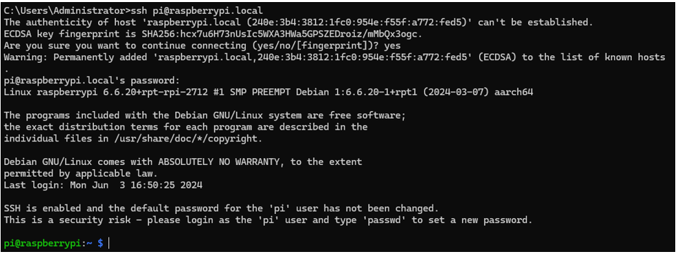

Once successfully ssh into Raspberry Pi, run the following command to open the configuration and enable VNC.

.. code-block:: console

    sudo raspi-config

Select “3 Interface Options” -> ”I2 VNC” -> ”Yes” -> ”Finish”.

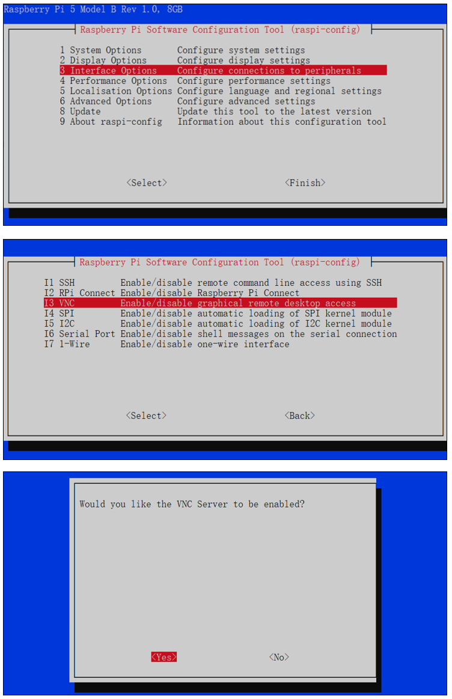

Now you should be able to access Raspberry Pi via VNC.