##############################################################################
Chapter 4 APP Control
##############################################################################

Before powering on the Freenove Computer Case Kit Pro for Raspberry Pi, please make sure that all cable connections are correct.

:red:`Due to its multiple functions, this case requires an adequate power supply. We highly recommend using the official Raspberry Pi 5.1V / 5A power adapter (https://www.raspberrypi.com/products/27w-power-supply ).`

:red:`Failure to do so may result in the Freenove Computer Case Kit Pro for Raspberry Pi being unusable or causing damage to components.`

4.1 Boot Behavior & Environment Settings
**************************************************

4.1.1 What to Expect on First Startup
==================================================

When you first power on the assembled chassis, the Raspberry Pi does not talk to the GPIO adapter board. This causes the board to operate on its own in a default mode, and you will observe the following.

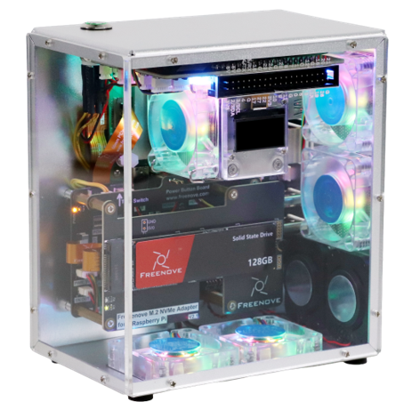

1.	The case RGB lights will operate in rainbow mode.

2.	During initial startup, the fan will run at maximum speed for 3 seconds. After this period, the system switches to temperature-controlled mode, where fan speed is regulated by the thermal sensor on the GPIO adapter board

3.	The screen will remain off during this phase - this is normal and expected.

**Troubleshooting Guide:**

If the RGB lights fail to illuminate, or if the fan doesn't perform the 3-second full-speed initialization, please:

Immediately power off the system

* Verify proper alignment and connection between the GPIO adapter board and Raspberry Pi

* Check all relevant power and data connections

:red:`If you have any questions of the above, please contact us at support@freenove.com`

4. RPi 5 Status LED: The green STAT LED will remain steadily illuminated. If this LED is not lit or displays any pattern other than a steady green light, it indicates that the Raspberry Pi operating system has not booted successfully. In this case, please check your Raspberry Pi hardware and OS installation separately.

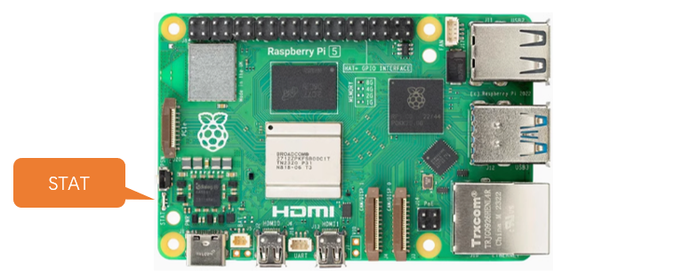

5. The PWR indicator light on the Audio-Video Board remains steadily lit.

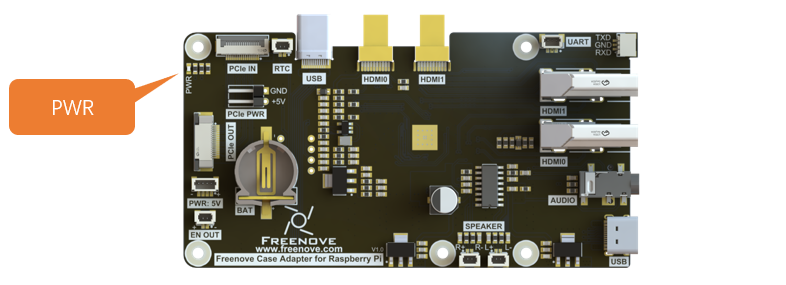

6.	NVMe Adapter Board Indicators:

ON LED: Steadily lit.

STA LED: Blinks in sync with the SSD's built-in activity light.

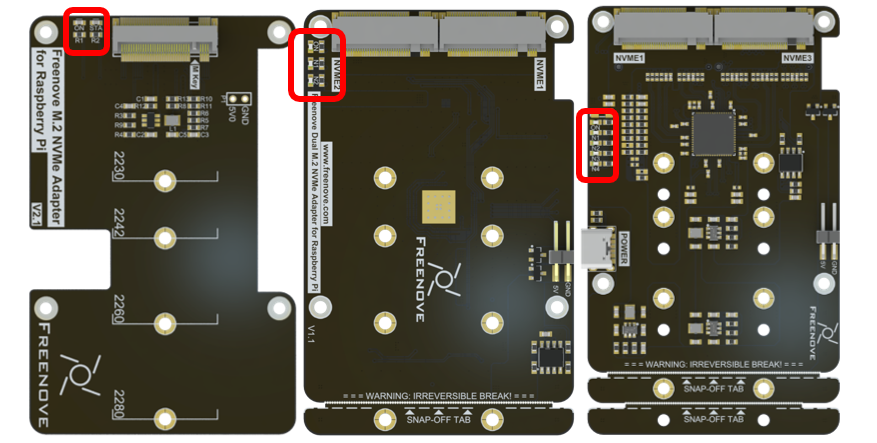

Should the ON indicator fail to illuminate, please check the cable connection.

Important: It is imperative to utilize the onboard pin header for supplemental power when operating multiple solid-state drives to mitigate risks associated with inadequate power supply.

If all components behaves as expected, then your computer case is correctly assembled and functioning well.

In this case, you can connect a screen to your Raspberry Pi or access it via VNC viewer. 

:red:`If you have any questions of the above, please contact us at support@freenove.com`

4.1.2 Software Setup
======================================

Code downloading
-----------------------------------

Open the Raspberry Pi Terminal, type the following two commands one by one to download the code for the case.

.. code-block:: console

    cd
    git clone https://github.com/Freenove/Freenove_Computer_Case_Kit_Pro_for_Raspberry_Pi.git

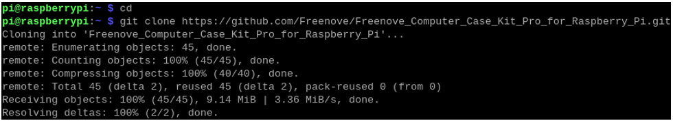

Software Packages Update
-----------------------------------

Run the following command on the terminal to update your Raspberry Pi's package list to the latest version.

.. code-block:: console

    sudo apt update

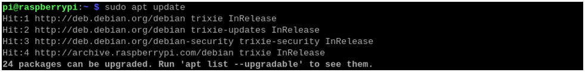

OLED Library Installation (Important)
---------------------------------------------------

Run the following command to install the OLED library. Fail to do so will result in software malfunction.

.. code-block:: console

    sudo apt install python3-luma.oled

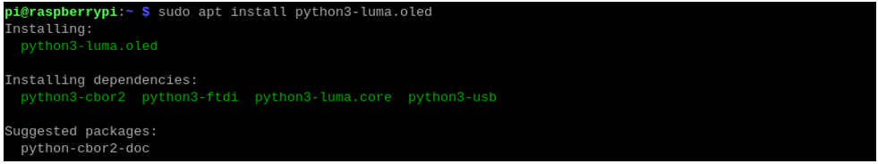

Enable I2C (Important)
-----------------------------------

The I2C function must be enabled, as it is required for communication between the Raspberry Pi, the OLED display, and the GPIO adapter board. Without it, the chassis software will fail to operate.

Run the following command to open the Raspberry Pi configuration interface.

.. code-block:: console

    sudo raspi-config

Navigate to Interface Options and press Enter. 

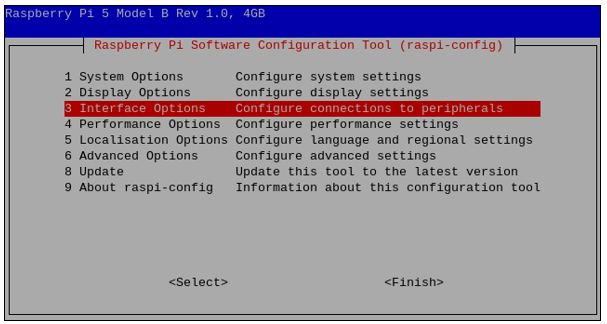

Select I2C and press Enter to enable it.

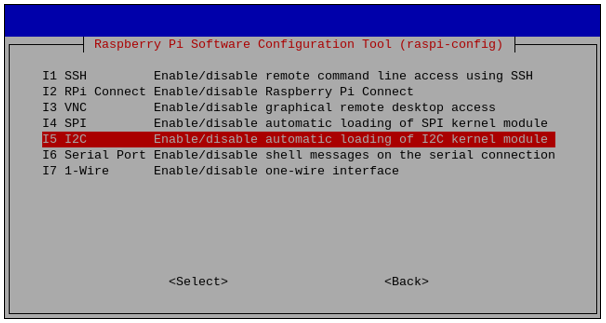

Select Yes, and press Enter.

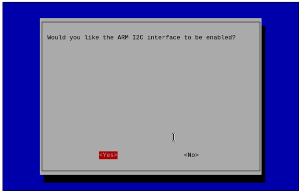

Select Finish to save the change and exit the configuration inferface.

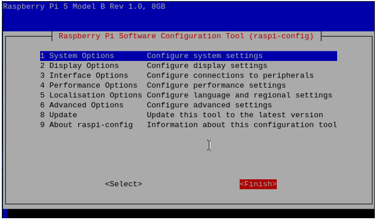

Creating Desktop Shortcut 
---------------------------------

Run the following two commands one by one in the Raspberry Pi terminal to create a desktop shortcut for the case control software.

.. code-block:: console

    cd Freenove_Computer_Case_Kit_Pro_for_Raspberry_Pi/Code/
    sudo python create_desktop_shortcut.py

.. image:: ../_static/imgs/4_APP_Control/Chapter04_11.png
    :align: center

:red:`If you are interested in the code implementation, you can explore the files in the Freenove_Computer_Case_Kit_Pro_for_Raspberry_Pi/Code directory.`

:red:`Should you wish to modify the code, please ensure you back it up first to avoid potential software malfunctions caused by unintended changes.`

4.2 About the Case Control Software
***********************************************

With the environment configured from the previous chapter, the accompanying host software can now be used to manage case functions including ARGB lighting, the OLED display, and fan control. 

This chapter provides a detailed guide on the software's usage. For insight into the interface design, the app_ui.py file is available in the Freenove_Computer_Case_Kit_Pro_for_Raspberry_Pi/Code directory.

Double click the software with Freenove logo on RPi's desktop, and a window will pop up. Click "**Execute**" to run the program.

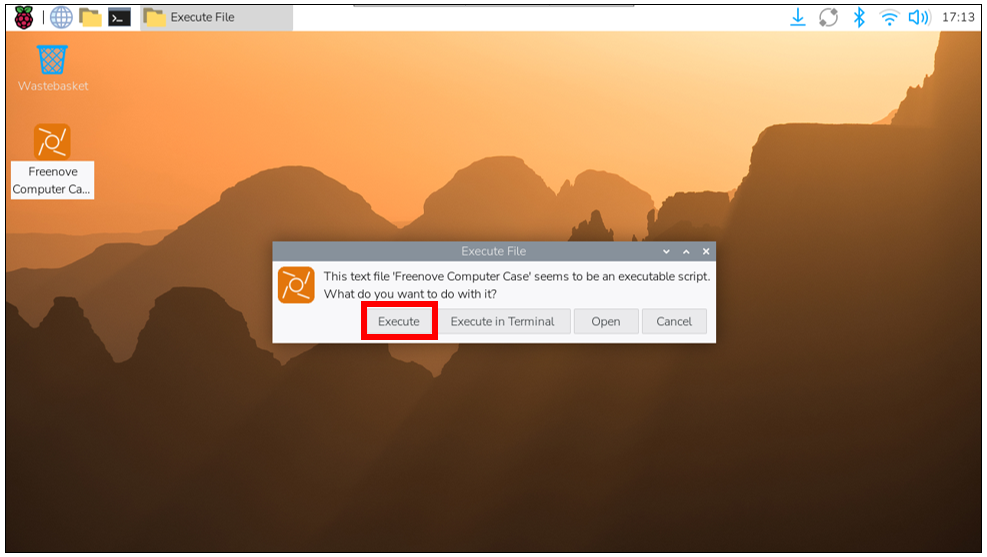

The software interface is as shown below.

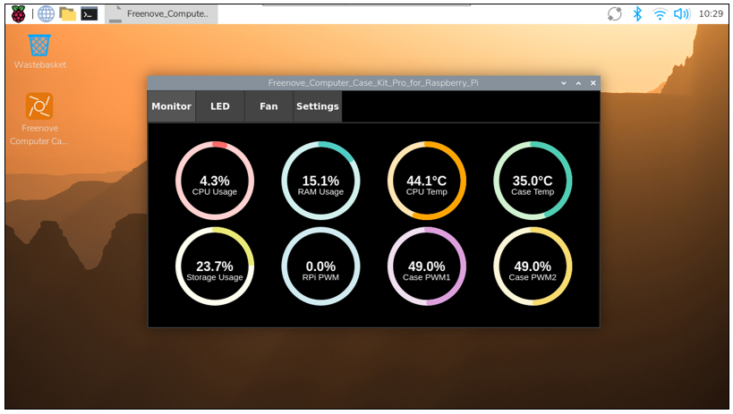

4.2.1 Dashboard Monitoring
===================================================

The dashboard provides live monitoring of key RPi 5 and case component stats, giving you an at-a-glance view of the system status.

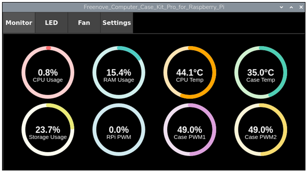

Below is a detailed explanation of the parameters displayed on the monitoring interface:

* **CPU Usage:** Current processor utilization percentage of the Raspberry Pi 5

* **RAM Usage:** Current system memory utilization percentage of the Raspberry Pi 5

* **CPU TEMP:** The internal temperature of the Raspberry Pi 5's SoC (System on Chip)

* **Case Temp:** The temperature inside the chassis, provided by the temperature sensor on the GPIO Board

* **Storage Usage:** The total storage space utilization. This value reflects the usage of the SD card if one is used. If single or multiple SSDs are installed, it calculates the aggregate usage across all drives.

* **RPi PWM:** PWM duty cycle for the Raspberry Pi's active cooler fan

* **Case PWM1:** PWM duty cycle for case fan group 1 (FAN1/FAN2)

* **Case PWM2:** PWM duty cycle for case fan group 2 (FAN3/FAN4)

**Data Source & Troubleshooting:**

**CPU Usage, RAM Usage, CPU Temp, Storage Usage, and RPi PWM** are retrieved directly from the Raspberry Pi. If any of these values are missing, check the Raspberry Pi for faults.

**Case Temp, Case PWM1, and Case PWM2** are read from the GPIO Board via I2C communication with Raspberry Pi 5.

If these data cannot be obtained consistently, please contact us by email: support@freenove.com

:red:`For those interested in the interface implementation, please refer to the files api_systemInfo.py and api_expansion.py in the Freenove_Computer_Case_Kit_Pro_for_Raspberry_Pi/Code directory.`

4.2.2 LED Control Interface
===================================================

This is the control interface for the case ARGB lights. You can select different modes to display various lighting effects.

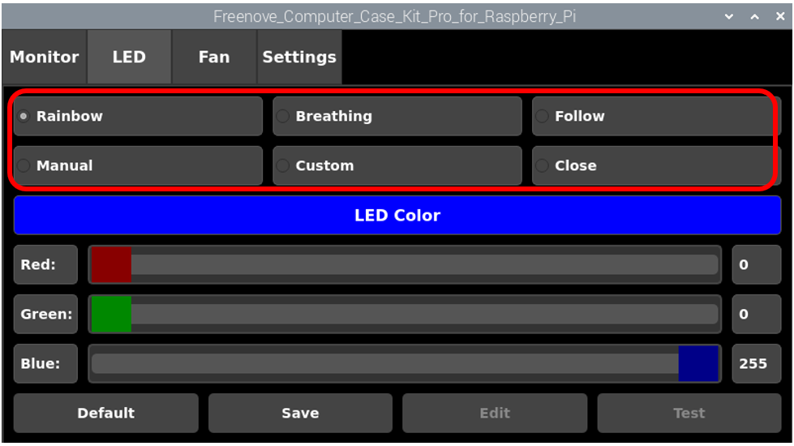

It is set to rainbow mode by default, as shown below.

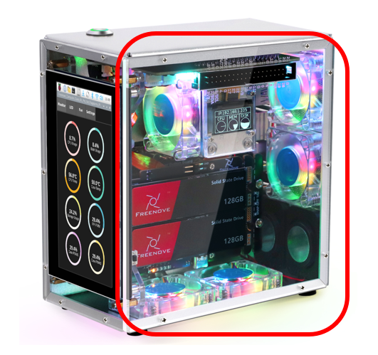

There are four preset lighting modes available: **Rainbow**、**Breathing**、**Follow**、**Manual**. You can select the corresponding option to switch among the modes.

Note: Only in Breathing, Follow, and Manual modes can the color of the RGB lights be controlled using the slider below. In other modes, the color of the RGB lights cannot be adjusted.

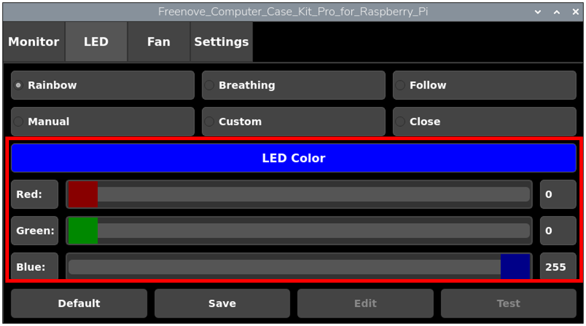

If you do not turn ON the RGB lights, you can select the Close mode to turn off them.

Please note: Any lighting mode you select is temporary. The case will revert to its default mode after a shutdown and restart.

To set a new default mode, select your desired mode and click the ”**Save**” button. 

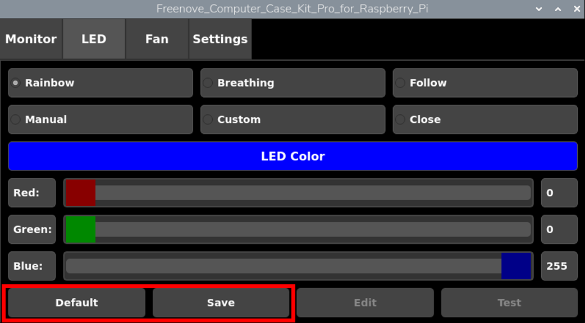

To restore the RGB lights and sliders to their default settings, click the ”Default” button once. 

If the four preset lighting modes do not meet your needs, you can use the ”Custom” mode for personalized settings.

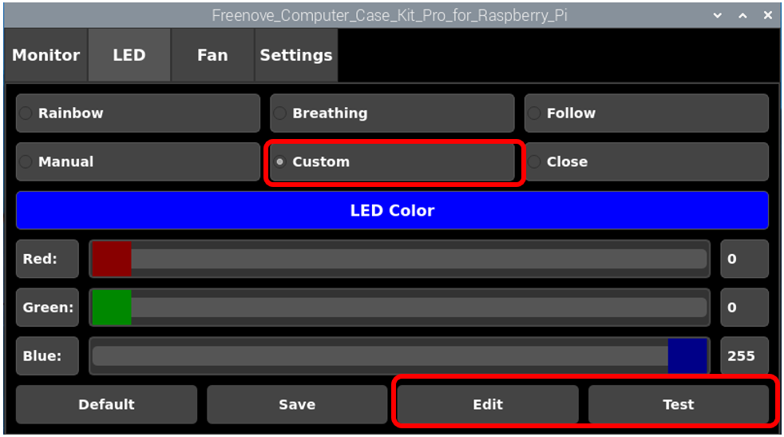

Click "**Edit**" will open the “task_led.py” file. You can modify the code in the editor.

Click "**Test**" will create a temporary thread and run task_led.py, allowing you to quickly debug and observe the LED light effects.

You can also view the source code directly: 

Freenove_Computer_Case_Kit_Pro_for_Raspberry_Pi/Code/task_led.py

For more about LED control interface, you can refer to the source file: 

Freenove_Computer_Case_Kit_Pro_for_Raspberry_Pi/Code/api_expansion.py

**Important Notes:**

1.	Back up the source code before making any modifications.

2.	Custom mode is an advanced feature. Modifying the code in task_led.py requires a basic understanding of Python programming. If you are not familiar with programming, we do not recommend editing this file.

3.	The "Test" button only runs the code in the current state. The code will not automatically run after rebooting the Raspberry Pi.

4.	If the LED lights show no response after you modify the code and click "Test," it indicates an error in your code preventing it from running properly. Please review your code.

5.	If you want the Custom mode code to execute automatically on every startup, please refer to the instructions in the ":ref:`4.2.4 Settings Interface <fnk0107/codes/tutorial/4_app_control:4.2.4 settings interface>`" Section.

4.2.3 Fan Control Interface
======================================

This is the case fan control interface for convenient fan management. The interface will change when you select different modes: Follow Case, Follow RPi, or Manual mode.

.. table::
    :align: center
    :class: table-line
    
    +------------------+
    | Follow Case Mode |
    |                  |
    | |Chapter04_20|   |
    +------------------+
    | Follow RPi Mode  |
    |                  |
    | |Chapter04_21|   |
    +------------------+
    | Manual Mode      |
    |                  |
    | |Chapter04_22|   |
    +------------------+

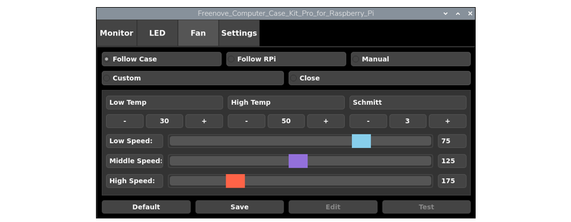
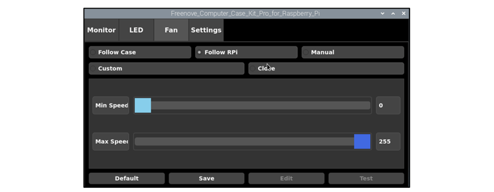
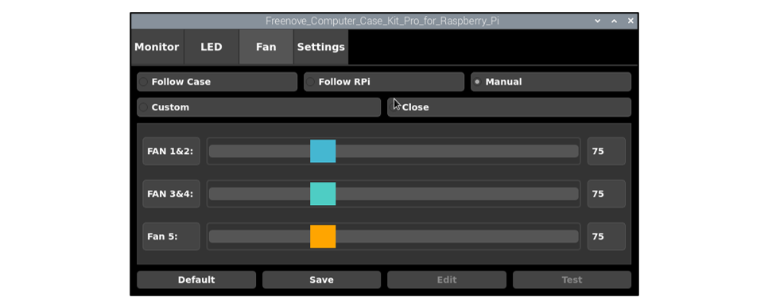

The following diagram illustrates the locations of the case fan connectors and the temperature sensor.

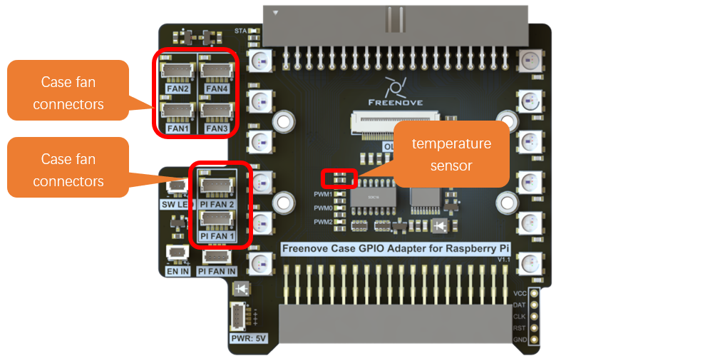

The fan connectors controll by GPIO Adapter board are divideded into three groups:

* Group 1: FAN1 + FAN2

* Group 2: FAN3 + FAN4

* Group 3: PI FAN 2

For the RPi 5' active cooler, it is recommended that it connect connect to PI FAN 1. In  this way, it  is controlled by Raspberry Pi.

If connecting to PI FAN 2 connector, it will be controlled by the GPIO Adapter Board.

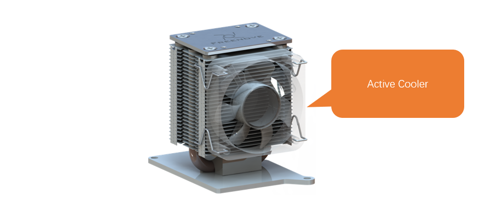

Next, we will walk you through the different fan modes to help you better understand the case fan control interface.

Follow Case
-----------------------------

In Follow Case mode, the GPIO Adapter board samples the temperature sensor at regular intervals and regulates the fan PWM signal based on the readings. 

The specific control logic governing this process is depicted in the following figure.

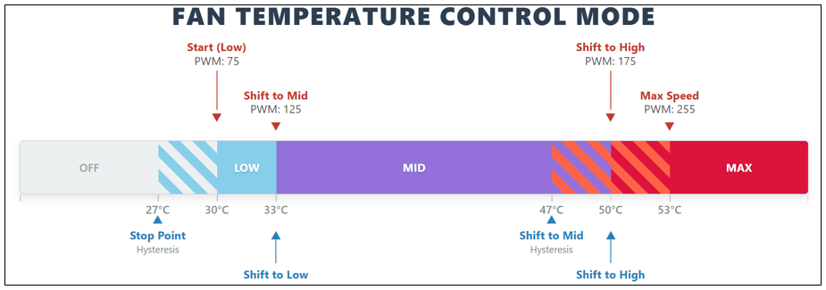

The diagram uses various colors to represent different temperature zones. All values shown are configurable defaults.

* Heating Phase:

  - When temperature ≥ **Low Temp** (default: 30°C), the fans start at **Low Speed** (default: 75).

  - When temperature ≥ **Low Temp** + **Schmitt** (default: 30 + 3 = 33°C), the fan speed increases to Middle Speed (default: 125).

  - When temperature ≥ **High Temp** (default: 50°C), the fan speed increases to **High Speed** (default: 175).

  - When temperature ≥ **High Temp**+ **Schmitt** (default: 50 + 3 = 53°C), the fan runs at **full speed** (255).

* Cooling Phase:

  - When temperature < **High Temp** (default: 50°C), the fan speed drops back to **High Speed** (default: 175).

  - When temperature < **High Temp**- **Schmitt** (default: 50 - 3 = 47°C), the fan speed decreases to **Middle Speed** (default: 125).

  - When temperature < **Low Temp** + **Schmitt** (default: 30 + 3 = 33°C), the fan speed decreases to **Low Speed** (default: 75).

  - When temperature < **Low Temp**- **Schmitt** (default: 30 - 3 = 27°C), the fan stops.

You can configure the following parameters via the software.

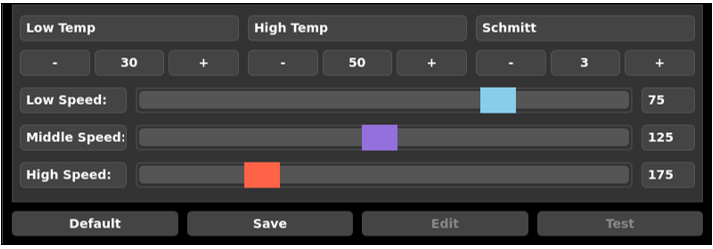

* **Low Temp:** The minimum temperature threshold to activate the case fans. Once reached, the fans begin spinning to accelerate airflow and expel warm air from the case.

* **High Temp:** A higher temperature threshold indicating significant heat buildup. When reached, the fans operate at a higher speed to enable rapid cooling of the system.

* **Schmitt (Hysteresis):** A hysteresis value that prevents the fans from frequently switching on/off or changing speeds near a temperature threshold. It is recommended to keep it at the default value.

* **Low Speed:** The PWM duty cycle applied when the temperature first exceeds the Low Temp threshold. This low speed provides a quiet and power-efficient means of initial cooling.

* **Middle Speed:** The medium PWM duty cycle used when the temperature is between the Low Temp and High Temp thresholds. This speed ensures stable thermal conditions for the Raspberry Pi during sustained workloads, preventing performance fluctuations caused by rapid speed changes.

* **High Speed:** The high PWM duty cycle activated when the temperature exceeds the High Temp threshold. This is critical during heavy computational loads to maximize cooling efficiency, expel heat rapidly, and maintain optimal Raspberry Pi performance.

Follow Rpi
--------------------------

In Follow RPi mode, the GPIO adapter board periodically samples the PWM value from the PI FAN IN interface (which originates from the Raspberry Pi, with a range of 0-255). It then calculates a new PWM value and outputs it to the FAN1-4 and PI FAN 2 connectors.

Calculation Example:

If the sampled PWM value is 100, and the software-configured limits are Min Speed = 10 and Max Speed = 150, the output PWM on the GPIO Adapter will be scaled to 64.

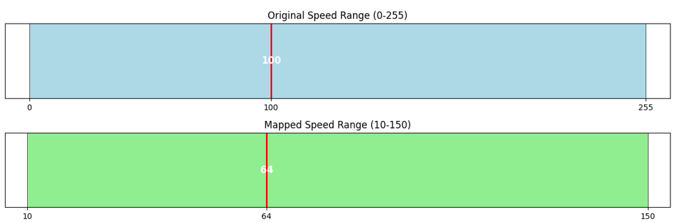

The Calculation formula is shown below:

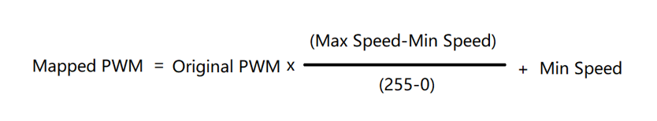

You can configure the Min Speed和Max Speed via the software.

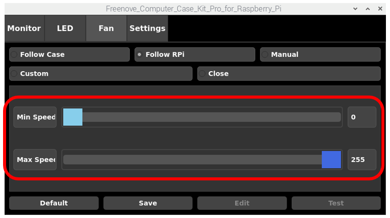

Manual
---------------------------

In Manual mode, you can directly set the PWM output for the FAN1-4 and PI FAN 2 connectors via the software.

Note: The slider labeled "**FAN 5**" in the interface controls the **PI FAN 2**. To manually adjust the speed of the Raspberry Pi 5 active cooler, it must be connected to the **PI FAN 2** header.

Custom
---------------------------

If the predefined modes do not meet your needs, you can select the **Custom** mode for advanced configuration.

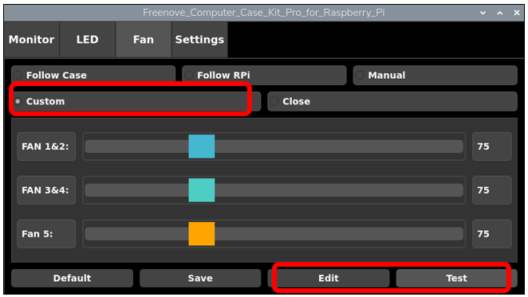

Click "**Edit**" will open the “task_fan.py” file. You can modify the code in the editor.

Click "**Test**" will create a temporary thread and run task_fan.py, allowing you to quickly debug and observe the fan effects.

You can also view the source code directly: 

Freenove_Computer_Case_Kit_Pro_for_Raspberry_Pi/Code/task_fan.py

**Important Notes:**

1.	Back up the source code before making any modifications.

2.	Custom mode is an advanced feature. Modifying the code in task_fan.py requires a basic understanding of Python programming. If you are not familiar with programming, we do not recommend editing this file.

3.	The "Test" button only runs the code in the current state. The code will not automatically run after rebooting the Raspberry Pi.

4.	If the fans do no response after you modify the code and click "Test," it indicates an error in your code preventing it from running properly. Please review your code.

5.	If you want the Custom mode code to execute automatically on every startup, please refer to the instructions in the ":ref:`4.2.4 Settings Interface <fnk0107/codes/tutorial/4_app_control:4.2.4 settings interface>`" Section.

4.2.4 Settings Interface
===============================

This interface integrates advanced customization features, allowing you to edit code, debug, and create startup tasks for the case LED lights, fans, and OLED display.

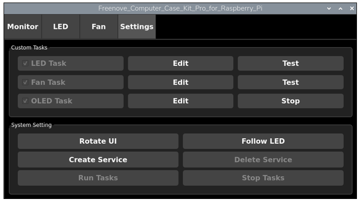

Enable Terminal Display (For Debugging)
---------------------------------------------------

Before getting started, we can configure a desktop shortcut to run the software with a visible terminal window. This will allow you to view debug messages and other code output.

Steps:

Open the terminal on your Raspberry Pi.

Run the following command to set the correct permissions for the Freenove desktop software:

.. code-block:: console

    ls -al ~/Desktop/Freenove.desktop
    sudo chmod 777 ~/Desktop/Freenove.desktop

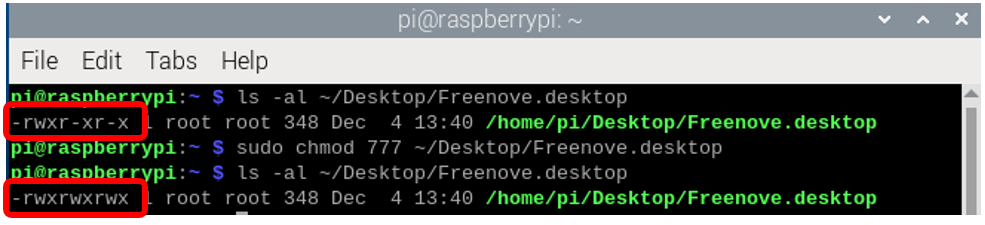

To revert to the default permissions, run the following command:

.. code-block:: console

    ls -al ~/Desktop/Freenove.desktop
    sudo chmod 755 ~/Desktop/Freenove.desktop

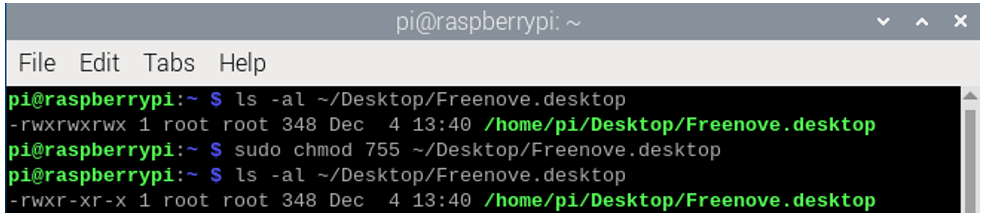

After modifying the permissions for Freenove.desktop, please follow these steps:

1. Close the current upper-computer software completely.

2. Double-click the Freenove software on the desktop to restart the application.

3. In the pop-up window, click **Open** to launch the software.

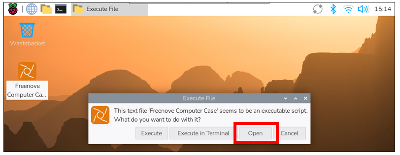

Change the parameter of **Terminal** from false to **ture**, save and clost the file.

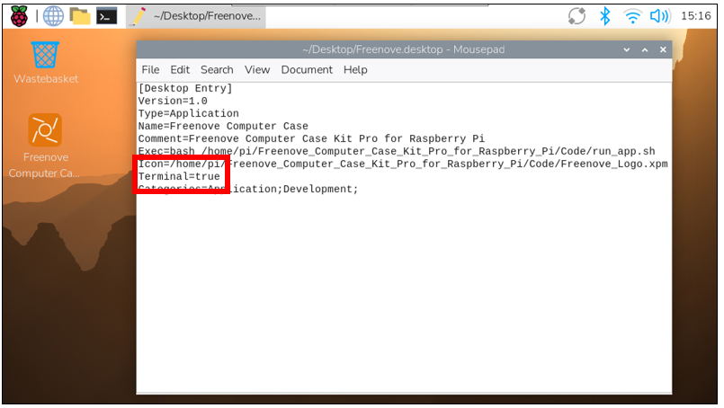

Double click Freenove software on the desktop, click “**Execute**” upon the pop-up window to launch it

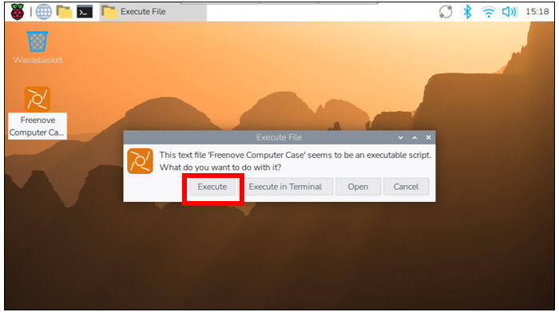

When you open the Freenove software control interface, a command terminal will automatically launch alongside it. All debug information and program logs will be displayed in this terminal window.

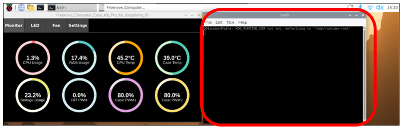

Interface Configuration
---------------------------------------

The "**Rotate UI**" button toggles the software interface instantly between landscape and portrait display modes.

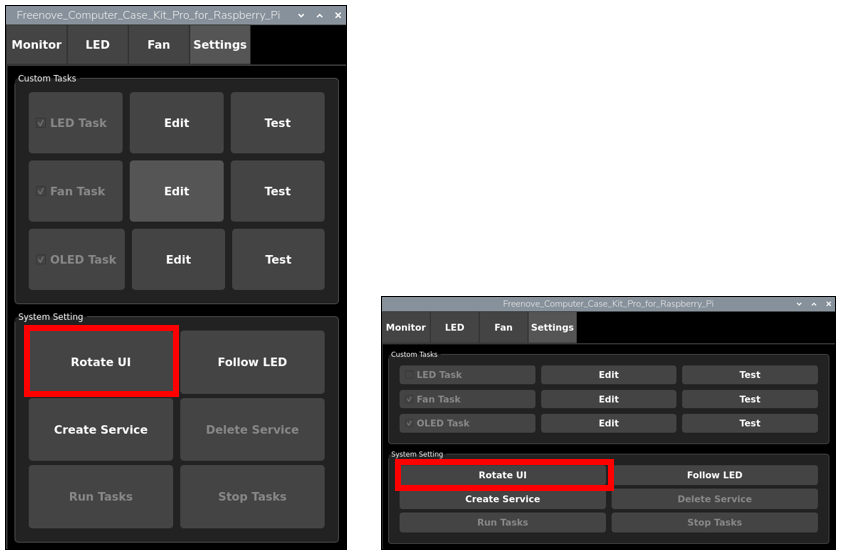

Clicking the "**Follow LED**" button activates synchronization between the LED effects and the Monitor interface. Once enabled, the color of the circular progress bar will mirror any real-time changes you make to the LED colors.

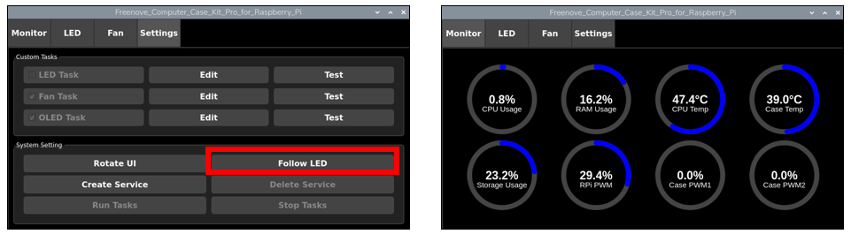

The "**Default Color**" button reverts the circular progress bar (on the Monitor interface) to its default color.

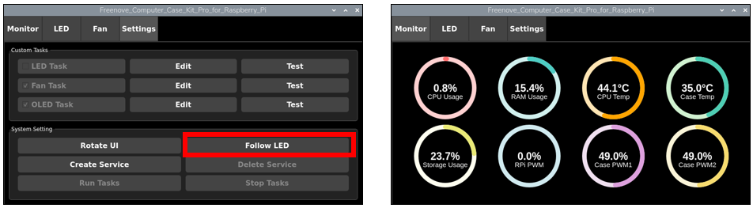

Code Editing and Testing
--------------------------------------

The Edit and Test buttons on the Settings interface allows for quick editing and testing of your code.

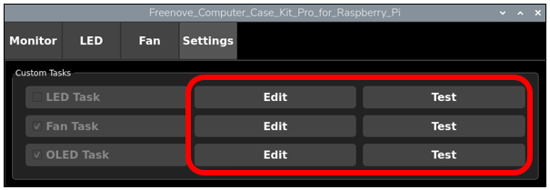

You can open and edit the task_led.py, task_fan.py, task_oled.py files by click the corresponding Edit button.

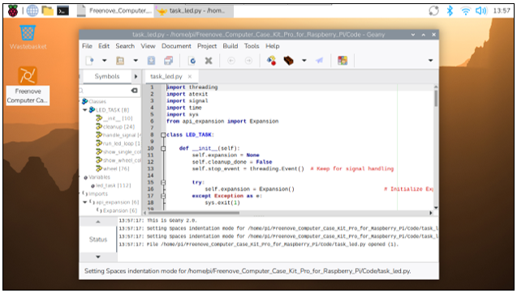

Similarly, you can click Test to quickly verify if the edited code performs as expected. Debug information will typically be printed in the terminal window.

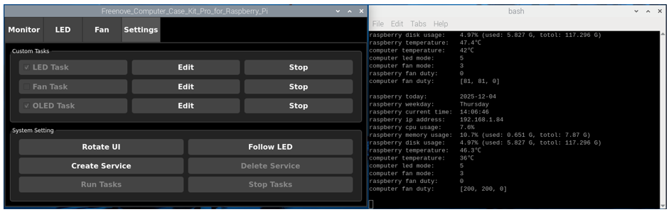

Background Task Management
-------------------------------------

This section is for comprehensive configuration. Here you can set up the software's interface features and configure background tasks for automatic operation of LEDs, fans, and the OLED display.

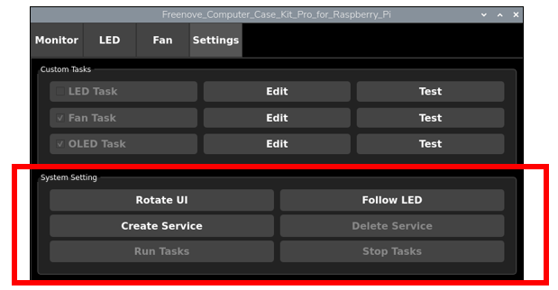

Click the "Create Service" button creates a background system service on your Raspberry Pi. This service will automatically run every time the case boots up, ensuring that your customized task_led.py, task_fan.py, and task_oled.py scripts are executed after startup. 

This service is activated with every boot of the Raspberry Pi 5.

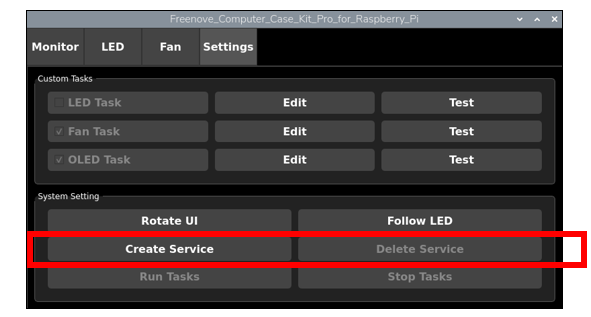

To prevent the background service from running on startup, click the **Delete Service button** to remove it.

**Delete Service:** Click to permanently remove the service. This prevents it from running automatically upon case startup.

**Run Tasks:** Click to temporarily start the service for immediate testing.

**Stop Tasks:** Click to temporarily halt the currently running service.

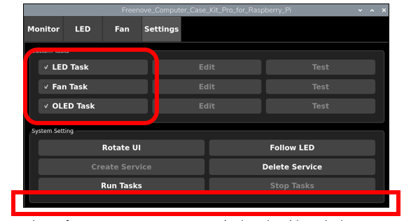

You can enable the execution of one or more custom tasks by checking their corresponding boxes

Please Note: 

When switching from the Settings interface to the LED or Fan control interface, the corresponding **LED Task** or **Fan Task** will be automatically unchecked, pausing their background operation. You can re-enable them by checking the boxes again.

To stop the custom LED task and use a built-in mode instead, simply switch from the Settings interface to the LED interface and select one of the preset modes (Rainbow, Breathing, Follow, or Manual). This action will automatically uncheck the **LED Task**.

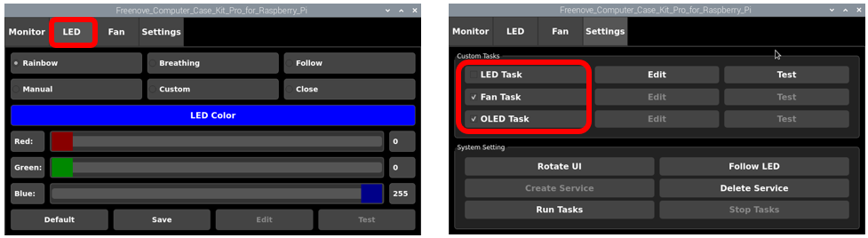

To stop the custom Fan Task and use a preset mode instead, simply switch from the Settings interface to the Fan interface and select one of the standard modes (Follow Case, Follow RPi, or Manual). This action will automatically uncheck the **Fan Task**.

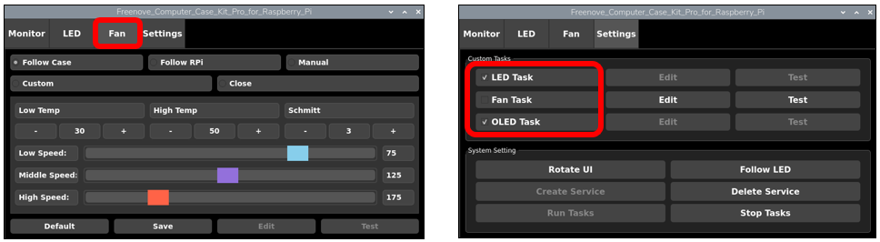