##############################################################################
Chapter 5 Speed Test
##############################################################################

This is an additional chapter for those who wish to test the read and write speeds of their SSD and SD Card. 

5.1 SD Card Speed Test
******************************

Raspberry Pi's official microSD cards support DDR50 and SDR104 bus speeds, with a maximum transfer rate of up to 104 MB/s. 

https://www.raspberrypi.com/documentation/accessories/sd-cards.html#content

https://www.sdcard.org/developers/sd-standard-overview/bus-speed-default-speed-high-speed-uhs-sd-express/

Open the terminal and enter the following command:

.. code-block:: console
    
    git clone https://github.com/TheRemote/PiBenchmarks

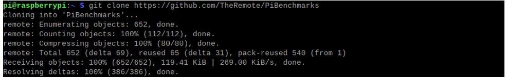

Enter the directory:

.. code-block:: console
    
    cd PiBenchmarks/

Grant executable permissions to the script:

.. code-block:: console
    
    chmod +x Storage.sh

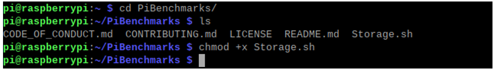

Start the speed test. Please be aware that the first execution will involve downloading the required dependencies, so the process could take a relatively long time.

.. code-block:: console
    
    sudo ./Storage.sh ~/

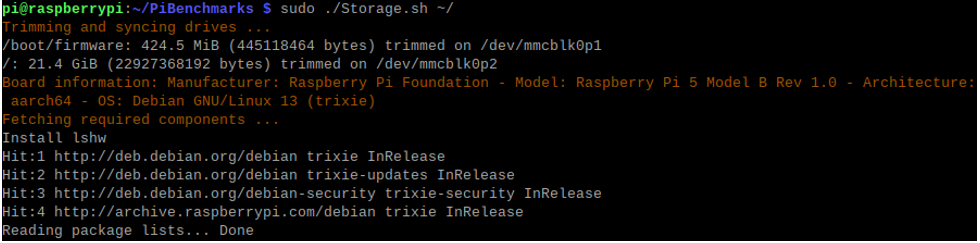

After the speed test is completed, follow the prompts to enter a description and a name for your SSD (you can use any arbitrary characters).

.. image:: ../_static/imgs/5_Speed_Test/Chapter05_03.png
    :align: center

Test result:

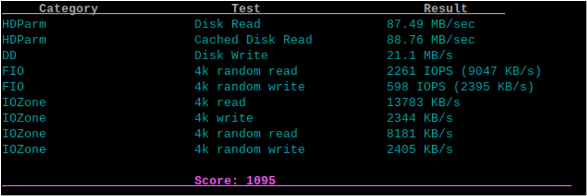

5.2 SSD Speed Test
*********************************

The Raspberry Pi 5 includes a PCIe x1 slot that is certified for PCIe Gen 2.0, providing a theoretical maximum throughput of 5GT/sec, which roughly translates to 500MB/sec for read and write operations. Although this slot is not officially certified for PCIe Gen 3.0, it is possible to force the use of Gen 3.0 for potentially higher speeds.

:combo:`red font-bolder:At the time of this writing, due to the limitation of the expansion chip, both the Dual-NVMe Adapter Board and Quad-NVMe Adapter Board only support the PCIe 2.0 protocol.`

In actual tests, it is found that most SSDs can work stably at PCIE2.0, but are slightly unstable at PCIE3.0, while others are just the opposite. Therefore, please choose PCIE2.0 or PCIE3.0 according to your actual situation.

The PCIe consortium states that the speed of PCIe Gen 3.0 x1 is up to 8GT/sec, which translates to approximately 985MB/sec.

https://en.wikipedia.org/wiki/PCI_Express#Comparison_table

https://www.raspberrypi.com/documentation/computers/raspberry-pi.html#pcie-gen-3-0

5.2.1 Mounting SSD Devices
============================================

Open the terminal, run the following commpad to get the SSD's information.

.. code-block:: console
    
    lsblk

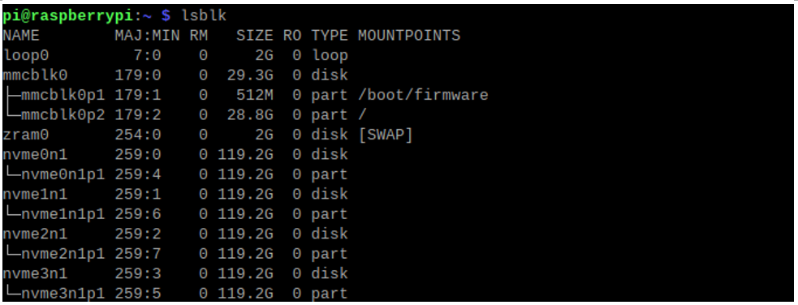

As shown in the image above, the Raspberry Pi 5 has successfully detected four NVMe SSDs, with mmcb0p1 being the system drive. Prior to this, we have already partitioned all NVMe SSD devices (click here if your SSD is not partitioned). Next, we need to mount all the SSDs so they can be used by the Raspberry Pi's file system. If you have already mounted them, click here to proceed to the next step. 

.. code-block:: console
    
    sudo mkdir -p /mnt/ssd1
    sudo mkdir -p /mnt/ssd2
    sudo mkdir -p /mnt/ssd3
    sudo mkdir -p /mnt/ssd4

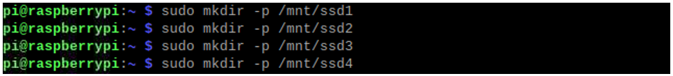

You can view the created SSD mount points (ssd1/ssd2/ssd3/ssd4) in the /mnt directory.

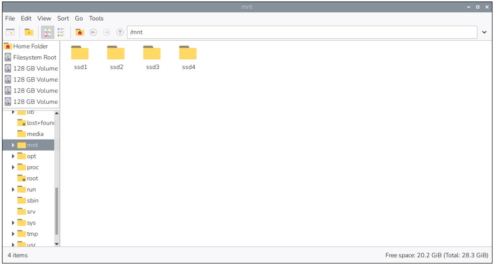

Execute the following commands to complete the mounting process.

.. code-block:: console
    
    sudo mount /dev/nvme0n1p1 /mnt/ssd1
    sudo mount /dev/nvme1n1p1 /mnt/ssd2
    sudo mount /dev/nvme2n1p1 /mnt/ssd3
    sudo mount /dev/nvme3n1p1 /mnt/ssd4

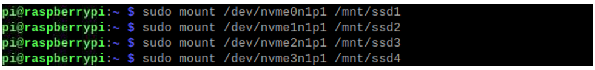

5.2.2 Speed Test
=================================

After completing the mounting of all NVMe SSD devices, execute the following command to enter the PiBenchmarks directory. We will proceed with individual device speed testing.

.. code-block:: console
    
    cd PiBenchmarks/

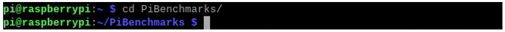

Run the following command to start the speed test for the first mounted device, ssd1.

.. code-block:: console
    
    sudo ./Storage.sh /mnt/ssd1

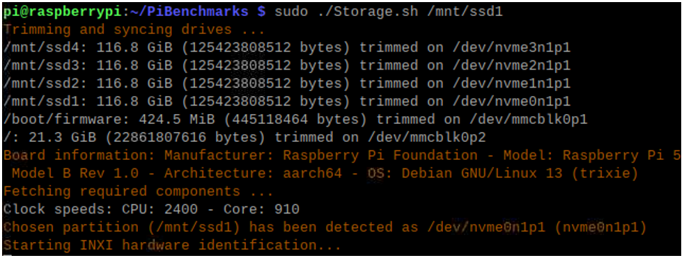

After the speed test is completed, follow the prompts to enter a description and a name for your SSD (you can use any arbitrary characters).

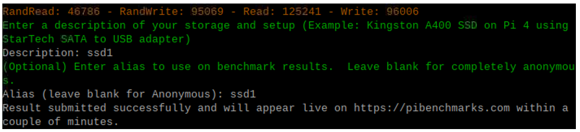

Test result:

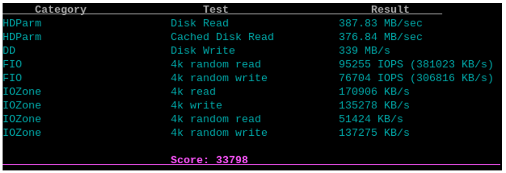

Next, we will sequentially execute the following commands to perform individual speed tests on each SSD. 

.. code-block:: console
    
    sudo ./Storage.sh /mnt/ssd2
    sudo ./Storage.sh /mnt/ssd3
    sudo ./Storage.sh /mnt/ssd4

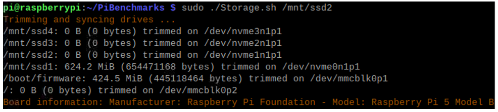

The performance varies among different SSDs, and each test may have certain error, which is normal. The following figures show the speed test results of the four SSDs.

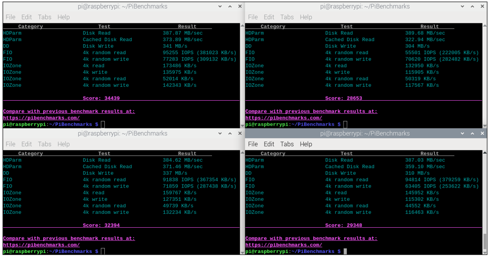

5.2.3 PCIe Gen3.0 Speed Test
=====================================

In the Preface, it is mentioned that the Raspberry Pi's PCIe Gen 3.0 has not been officially certified. While it is functional, its performance is not as reliable as desired. This chapter is presented as an exploratory section for assessing the speed capabilities of SSDs when used with PCIe Gen 3.0. **For practical applications, it is advised to opt for PCIe Gen 2.0 to ensure greater stability and dependability.**

If your kit includes an NVMe Adapter Board (Model: **FNK0107A/H/P/U**), you can enable PCIe Gen 3.0 mode. If your adapter is a different model or no adjustment is needed, please skip this step.

Enable PCIe Gen 3.0
----------------------------------------

Add the line ``dtparam=pciex1_gen=3`` to /boot/firmware/config.txt to enable PCIe Gen3.0.

As shown below, enter the command to open the file.

.. code-block:: console
    
    sudo nano /boot/firmware/config.txt

Add the line ``dtparam=pciex1_gen=3`` to the end of the file, as shown below:

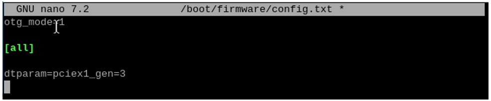

Press Ctrl-O to save the file, Enter to confirm, and Ctrl-X to exit.

Reboot your Raspberry Pi.

.. code-block:: console
    
    sudo reboot

After rebooting, test the speed again.

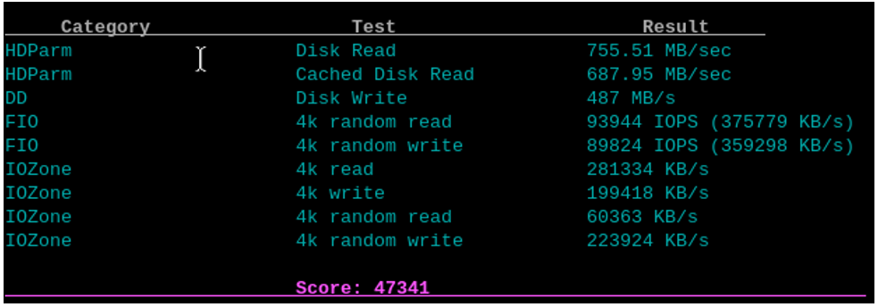

The speed of another SSD.

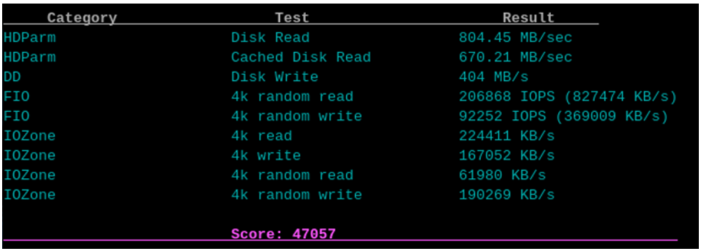

Disable PCIe Gen 3.0
--------------------------------------

Delete the line added with the previous step to disable PCIe Gen3.0.

Delete the line ``dtparam=pciex1_gen=3`` in the boot/firmware/config.txt file.

After the line is removed, it will change to PCIe Gen2.0.