##############################################################################
List
##############################################################################

Before getting started, please check the part list. If any component is missing from your kit, please email our support team at support@freenove.com 

Metal Parts
********************************

.. table::
    :class: table-line
    :align: center
    
    +-------------------+
    | Metal case x1     |
    |                   |
    | |List00|          |
    +-------------------+
    | Tower Cooler x1   |
    |                   |
    | Thermal Pad x5    |
    |                   |
    | Nylon Standoff x2 |
    |                   |
    | |List01|          |
    +-------------------+

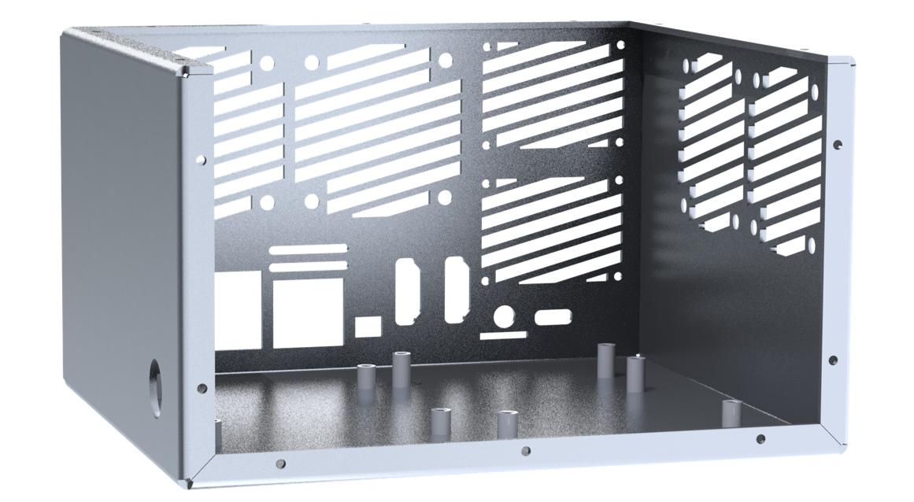
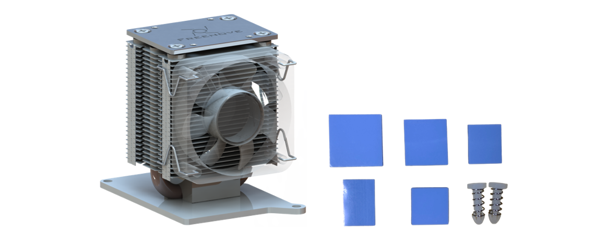

Acrylic Parts
******************************

:combo:`red font-bolder:Note: Please tear off the protective films from the acrylic parts before use.`

.. table::
    :class: table-line
    :align: center
    
    +-------------------------------+--------------------------------------------------------+
    | Acrylic Top Plate x 1         | Acrylic Top Plate x 1                                  |
    |                               |                                                        |
    | |List02|                      | Landscape Orientation Screen Bracket x 2               |
    |                               |                                                        |
    |                               | Portrait Orientation Screen Bracket x 2                |
    |                               |                                                        |
    |                               | (:red:`Only for FNK0107P\Q\R\U\V\W`)                   |
    |                               |                                                        |
    |                               | |List03|                                               |
    +-------------------------------+--------------------------------------------------------+
    | Acrylic Side Plate x 1        | Acrylic Side Plate(:red:`Only for FNK0107P\Q\R\U\V\W`) |
    |                               |                                                        |
    | |List04|                      | |List05|                                               |
    +-------------------------------+--------------------------------------------------------+
    | LED Light Diffusion Plate x 1 | Acrylic for OLED x1                                    |
    |                               |                                                        |
    | |List06|                      | |List07|                                               |
    +                               +--------------------------------------------------------+
    |                               | Speaker Acrylic Pad x2                                 |
    |                               |                                                        |
    |                               | |List08|                                               |
    +-------------------------------+--------------------------------------------------------+

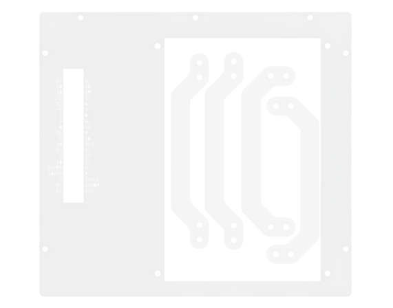

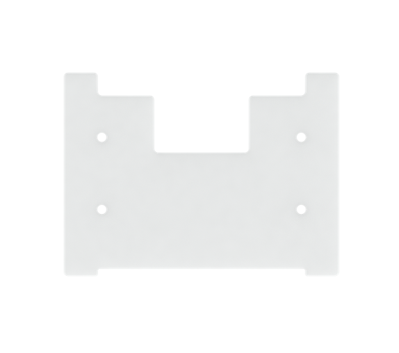

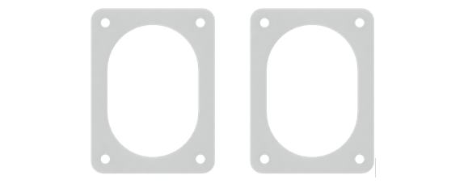

Machinery Parts
************************************

.. table::
    :class: table-line
    :align: center
    
    +----------+----------+----------+
    | |List09| | |List10| | |List11| |
    +----------+----------+----------+
    | |List12| | |List13| | |List14| |
    +----------+----------+----------+

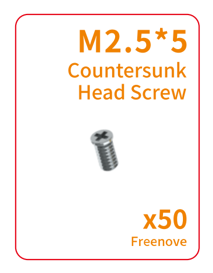
.. |List10| image:: ../_static/imgs/List/List10.png

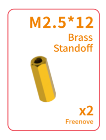
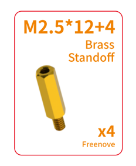
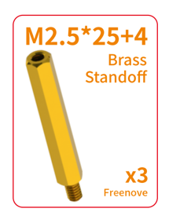

The fasteners listed below are not packaged in the same bag as those above. They are only provided with the **FNK0107P/Q/R/U/V/W** versions.

.. table::
    :class: table-line
    :align: center
    
    +----------+
    | |List15| |
    +----------+

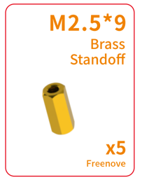

Electronic Parts
******************************

Freenove Case Adapter for Raspberry Pi
===========================================

.. table::
    :class: table-line
    :align: center
    
    +----------+----------+
    | |List16| | |List17| |
    +----------+----------+

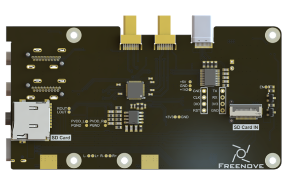
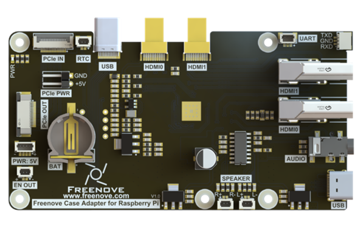

Freenove Case GPIO Adapter for Raspberry Pi
==============================================

.. table::
    :class: table-line
    :align: center
    
    +----------+----------+
    | |List18| | |List19| |
    +----------+----------+

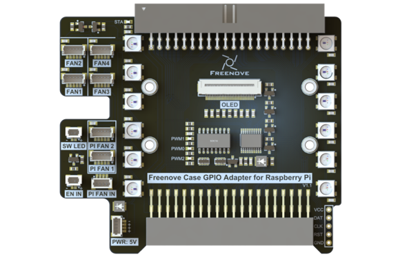
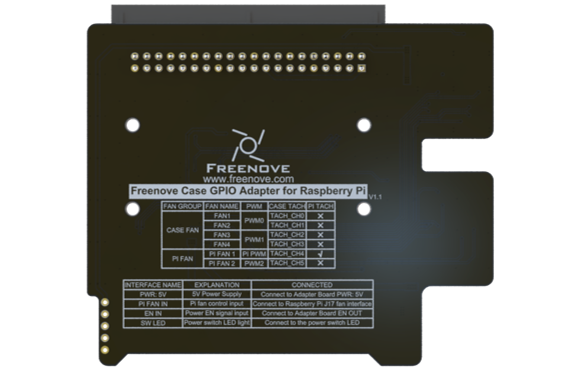

Freenove Power Button Board for Raspberry Pi
===============================================

.. table::
    :class: table-line
    :align: center
    
    +----------+----------+
    | |List20| | |List21| |
    +----------+----------+

Freenove M.2 NVMe Adapter Series for Raspberry Pi
=====================================================

:combo:`red font-bolder:Note: The components included in the NVMe Adapter Combo Pack vary by product version. Please verify that the contents match your model before installation.`

.. table::
    :class: table-line
    :align: center
    
    +-----------------------------------------------------------------------------------------+
    | Freenove M.2 Nvme Adapter for Raspberry Pi Combo Pack x1 (Only for FNK0107A/H/P/U)      |
    |                                                                                         |
    | |List22|                                                                                |
    +-----------------------------------------------------------------------------------------+
    | Freenove Dual M.2 Nvme Adapter for Raspberry Pi Combo Pack x1 (Only for FNK0107B/K/Q/V) |
    |                                                                                         |
    | |List23|                                                                                |
    +-----------------------------------------------------------------------------------------+
    | Freenove Quad M.2 Nvme Adapter for Raspberry Pi Combo Pack x1 (Only for FNK0107C/L/R/W) |
    |                                                                                         |
    | |List24|                                                                                |
    +-----------------------------------------------------------------------------------------+

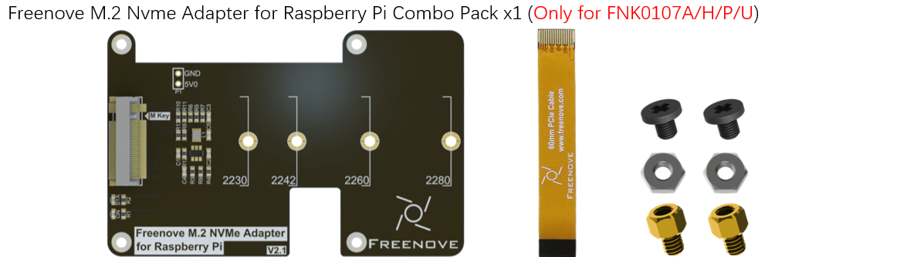
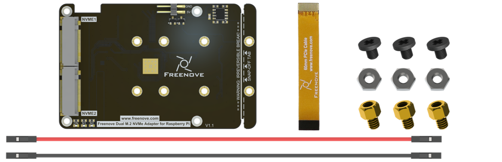
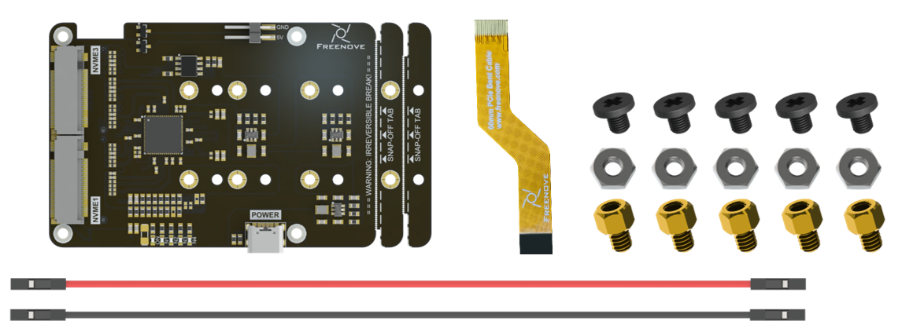

Electronic Modules
=============================

.. table::
    :class: table-line
    :align: center
    
    +-------------------------------------------------------------------------------------------------------+--------------------------+--------------------------+
    | 4.3-inch Screen x1, DSI FPC CABLE 160mm x1 (Only for FNK0107P/Q/R/U/V/W)                                                                                    |
    |                                                                                                                                                             |
    | |List25|                                                                                                                                                    |
    +-------------------------------------------------------------------------------------------------------+--------------------------+--------------------------+
    | 0.96 inch OLED display x1                                                                             | ARGB Fan x4              | Speaker x2               |
    |                                                                                                       |                          |                          |
    | |List26|                                                                                              | |List27|                 | |List28|                 |
    |                                                                                                       |                          |                          |
    | :red:`Important: The display glass is fragile - please exercise extreme caution during installation.` |                          |                          |
    +-------------------------------------------------------------------------------------------------------+--------------------------+--------------------------+

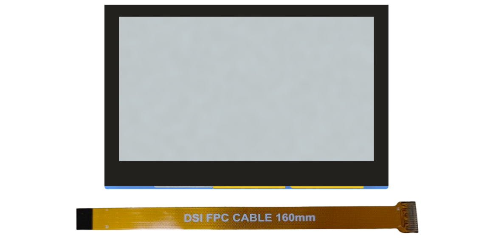
.. |List26| image:: ../_static/imgs/List/List26.png
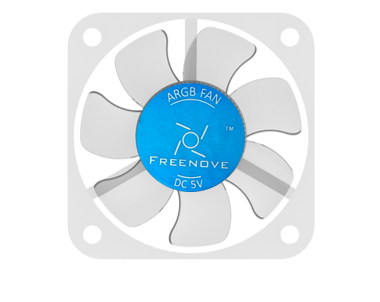
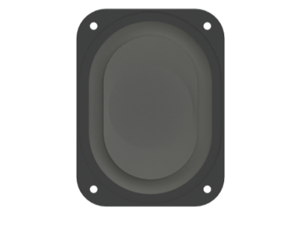

Wires
******************************

.. table::
    :class: table-line
    :align: center
    
    +------------------------------------------+------------------------------------------+
    | SH1.0mm_2P Same-Direction Cable 5cm x1                                              |
    |                                                                                     |
    | SH1.0mm_3P Same-Direction Cable 5cm x1                                              |
    |                                                                                     |
    | SH1.0mm_2P Same-Direction Cable 15cm x1                                             |
    |                                                                                     |
    | SH1.0mm_4P Same-Direction Cable 15cm x2                                             |
    |                                                                                     |
    | |List29|                                                                            |
    +------------------------------------------+------------------------------------------+
    | SH1.0mm 2-Pin to 2.8mm Quick-Disconnect Terminal Cable (Red-Black), 7cm, x 1        |
    |                                                                                     |
    | 1.25mm 2-Pin to 2.8mm Quick-Disconnect Terminal Cable (Yellow-Yellow), 7cm, x 1     |
    |                                                                                     |
    | |List30|                                                                            |
    +------------------------------------------+------------------------------------------+
    | SD Card to 0.5mm-16P FPC cable           | reverse straight cable x1                |
    |                                          |                                          |
    | |List31|                                 | |List32|                                 |
    +------------------------------------------+------------------------------------------+

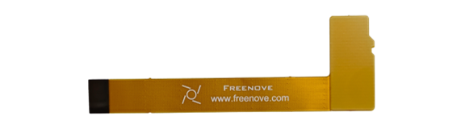
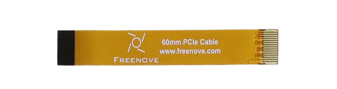

Tools
*********************************

.. table::
    :class: table-line
    :align: center
    
    +-------------------------------+
    | Screwdriver Bit Holder x 1    |
    |                               |
    | Hex Shank Phillips #2 Bit x 1 |
    |                               |
    | Hex Shank Phillips #0 Bit x 1 |
    |                               |
    | |List33|                      |
    +-------------------------------+

Others
*********************************

.. table::
    :class: table-line
    :align: center
    
    +--------------------------+--------------------+----------------------------------+----------------------+
    | 12mm LED Power Button x1 | Fan Dust Filter x4 | Round Black Non-Slip Foot Pad x5 | Masking Tape x 1     |
    |                          |                    |                                  |                      |
    | Black Sealing Gasket x1  | |List34|           | |List35|                         |  |List40|            |
    |                          |                    |                                  |                      |
    | M12 Nut x1               |                    |                                  |                      |
    |                          |                    |                                  |                      |
    | |List36|                 |                    |                                  |                      |
    +--------------------------+--------------------+----------------------------------+----------------------+

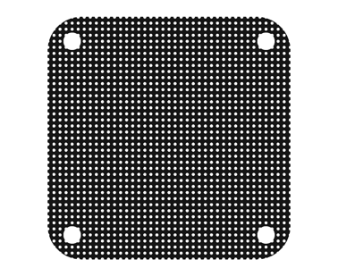
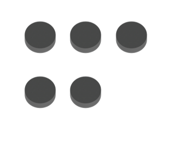
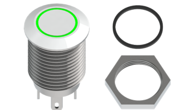
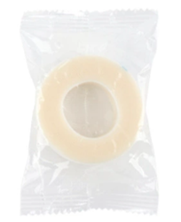

Rquired but NOT Contained Parts
*************************************

.. table::
    :class: table-line
    :align: center
    
    +--------------------------------------------------------------------------------------------------------------------+
    | Raspberry Pi 5 x 1                                                                                                 |
    |                                                                                                                    |
    | |List37|                                                                                                           |
    +--------------------------------------------------------------------------------------------------------------------+
    | 27W Power Adapter x 1(:red:`or a power adapter compatible with Raspberry Pi official one that can output 5.1V/5A`  |
    |                                                                                                                    |
    | |List38|                                                                                                           |
    +--------------------------------------------------------------------------------------------------------------------+
    | Micro SD Card (TF Card), Card Reader x 1                                                                           |
    |                                                                                                                    |
    | |List39|                                                                                                           |
    +--------------------------------------------------------------------------------------------------------------------+

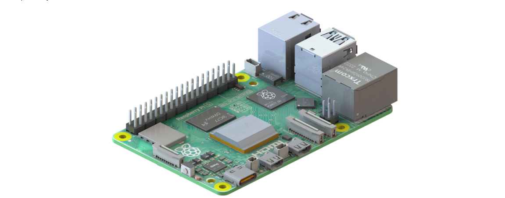
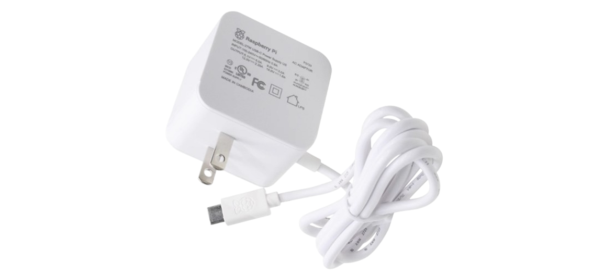

Before getting started, please check the part list. If any component is missing from your kit, do not start assembly; instead, please email our support team at support@freenove.com to get the missing parts.