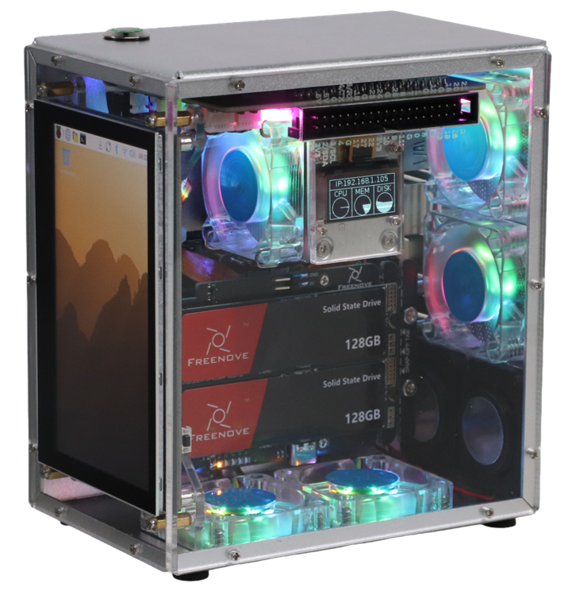

##############################################################################
Preface
##############################################################################

**Welcome to use the Freenove Computer Case Kit Pro for Raspberry Pi**

This product is exclusively designed for the RPi 5, a popular single-board computer (SBC). Follow this tutorial, you can install a sleek, multi-functional computer case kit for your Raspberry Pi 5 (RPi 5).

The RPi 5 delivers highly powerful performance with a CPU frequency of up to 2.4GHz. However, this increased power consumption also leads to significant heat generation. Without an appropriate heatsink, thermal throttling may severely limit the Raspberry Pi 5's performance. Additionally, the removal of the 3.5mm audio jack in the RPi 5 has caused inconvenience for many users.

In this context, our case kit came into being. It not only addresses these issues, but also introduces advanced features.

If you encounter any issues, feel free to contact us for prompt and free technical support.

support@freenove.com

Key Features
*********************************

This product integrates a wide range of features and supports multiple optional expansions, as detailed below:

* Standard Features:
  
  - Built-in dual 4Ω 3W speakers for audio output
  
  - Equipped with a 3.5mm JACK audio interface
  
  - Applying a tower cooler for more efficient heat dissipation 
  
  - Built-in five ARGB 4010 cooling fans for lower overall case temperature and enhanced lighting effects
  
  - Classic case design
  
  - Integrated 2x6 ARGB lights, supporting multiple lighting modes and customizable effects
  
  - Power button with indicator light
  
  - Low standby power consumption design; all lights and power can be turned off after shutdown
  
  - Integrated a 0.96-inch OLED display for real-time system information monitoring
  
  - Built-in case temperature sensor for real-time internal temperature monitoring
  
  - Featuring a 1220 RTC battery holder
  
  - Ports are uniformly arranged on the back of the case, including USB, Ethernet, UART, HDMI, 3.5mm JACK, SD card slot, and power interface for easy connection and management

* Optional Features:
  
  - Optional 4.3-inch IPS display with true-to-life colors and responsive touch control, suitable for real-time monitoring and displaying comprehensive system operation information
  
  - Supports MVMe M.2 slot expansion in 2230/2242/2260/2280 specifications; optional configurations of 1/2/4 slots to meet different storage needs
  
  - Optional 128GB SSD for basic storage requirements

Product Variants
****************************

This product is currently offered in multiple variants. The primary distinction lies in the display functionality, divided into two series: **one without a display** and **one equipped with a 4.3-inch IPS display**. 

Beyond this, further model differentiation is available based on the presence and number of SSD slots.

The table below details the specific configurations of the **non-display series**.

.. table::
    :class: zebra
    :align: center
    
    +--------------------+-----------------+---------------------+
    | non-display series | NVMe M.2 SSD x1 | Number of NVMe Slot |
    +====================+=================+=====================+
    | FNK0107A           | ✖               | 1                   |
    +--------------------+-----------------+---------------------+
    | FNK0107B           | ✖               | 2                   |
    +--------------------+-----------------+---------------------+
    | FNK0107C           | ✖               | 4                   |
    +--------------------+-----------------+---------------------+
    | FNK0107H           | ✔               | 1                   |
    +--------------------+-----------------+---------------------+
    | FNK0107K           | ✔               | 2                   |
    +--------------------+-----------------+---------------------+
    | FNK0107L           | ✔               | 4                   |
    +--------------------+-----------------+---------------------+

The table below shows the detailed configurations of the variants **equipped with the 4.3-inch IPS display**.

.. table::
    :class: zebra
    :align: center
    
    +--------------------------+-----------------+---------------------+
    | with 4.3inch IPS display | NVMe M.2 SSD x1 | Number of NVMe Slot |
    +==========================+=================+=====================+
    | FNK0107P                 | ✖               | 1                   |
    +--------------------------+-----------------+---------------------+
    | FNK0107Q                 | ✖               | 2                   |
    +--------------------------+-----------------+---------------------+
    | FNK0107R                 | ✖               | 4                   |
    +--------------------------+-----------------+---------------------+
    | FNK0107U                 | ✔               | 1                   |
    +--------------------------+-----------------+---------------------+
    | FNK0107V                 | ✔               | 2                   |
    +--------------------------+-----------------+---------------------+
    | FNK0107W                 | ✔               | 4                   |
    +--------------------------+-----------------+---------------------+